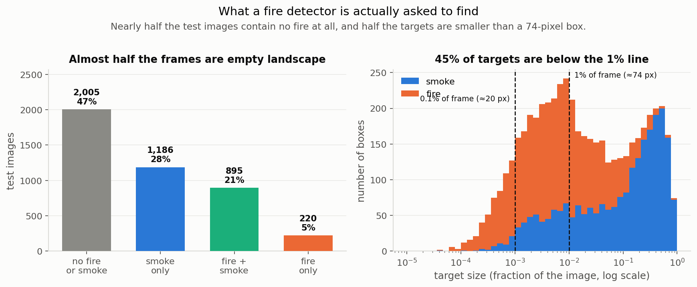
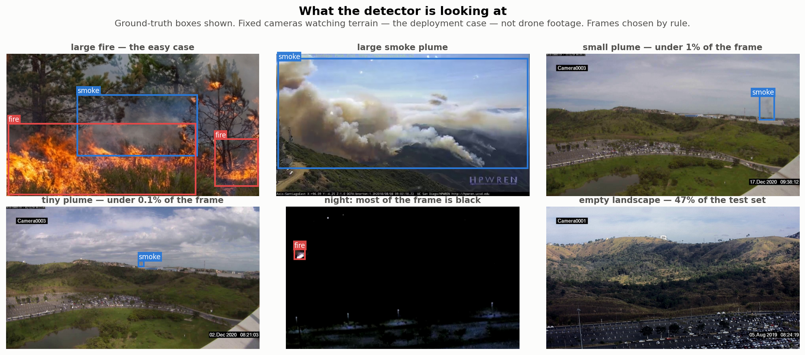
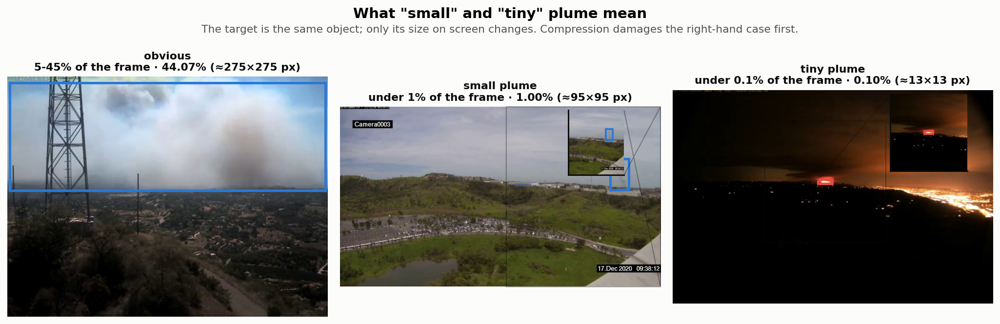

# XP0 — Foundation: data, splits, and the measuring instrument

**Question:** before measuring anything, is the data understood and the measuring
apparatus trustworthy?

**Outcome:** yes — and two things surfaced that changed the rest of the project.

## What was frozen

D-Fire (21,527 images, ground-level surveillance cameras and web photos — **not** drone
footage). The published train/test split is preserved so results stay comparable to the
literature; only a validation set is carved out, at seed 42.

| Split | Images | fire boxes | smoke boxes | checksum |
|---|---:|---:|---:|---|
| train | 15,500 | 10,593 | 8,600 | `8dea80450f1d1611` |
| val | 1,721 | 1,221 | 950 | `48c7552154b86a49` |
| test | 4,306 | 2,878 | 2,315 | `7cc103e8cbb706f5` |

Also frozen: a 500-image calibration set for later compression work, and the definition of
a "small plume".

> **What "plume" means here.** A plume is the visible smoke or flame region the detector has
> to find. Accuracy is reported separately for **small plumes** (under 1% of the frame) and
> **tiny plumes** (under 0.1%, roughly 20x20 pixels) — distant smoke, which is what early
> detection actually depends on.

## Two findings that reshaped the plan

**Half the targets are tiny.** The median box covers 1.34% of the image. The plan defined
"small plume" as anything under 1% — which turns out to sit almost exactly on the median,
selecting the *smaller half* rather than the hard cases. A second tier was added at 0.1%
(≈20×20 pixels, 10.6% of boxes). Later experiments showed the two behave completely
differently, so this mattered.

**Nearly half the frames contain nothing.** 2,005 of 4,306 test images are empty
landscape. Standard detection metrics fold false alarms on those into one aggregate number,
so a separate false-alarm rate was added — for a camera that watches nothing almost all the
time, it is arguably the metric that decides deployability.

## What nearly went wrong

- **The class labels were ambiguous.** D-Fire's docs number the classes 1/2 while the files
  use 0/1. Rather than guess, the mapping was derived from the data: observed box counts
  (11,865 / 14,692) match the published fire/smoke totals *exactly*, proving `0 = smoke,
  1 = fire`. Re-checked on every run.
- **The accuracy metric was silently undefined.** The standard COCO evaluator hard-codes an
  assumption that our configuration broke, returning `-1` — which would have been written
  to results files as though it were a score. Now computed directly.

## Limitations

- Condition labels (night / fog / backlight) don't exist in D-Fire; they are approximated
  from image brightness statistics and are stated as proxies wherever used.
- Splits are frozen against these checksums. Changing them invalidates every result.

## Next

XP1 measures the published baselines through this harness.
