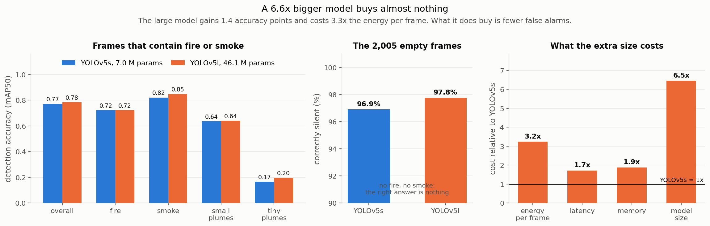

# XP1. Baselines: what a good fire detector costs today

**Question:** what accuracy is achievable on this dataset, and what does a bigger model buy
over a smaller one?

**Outcome:** almost nothing. The large model costs 6.6× the size for 1.4 accuracy points.

## The models

**We did not train these.** They are the D-Fire dataset authors' own published detectors,
used exactly as released.

| | YOLOv5s | YOLOv5l |
|---|---|---|
| Architecture | YOLOv5 small | YOLOv5 large |
| Parameters | 7.03 M | 46.14 M |
| File size | 14.4 MB | 92.8 MB |
| Input resolution | 640 × 640 | 640 × 640 |
| Classes | `0 = smoke`, `1 = fire` | `0 = smoke`, `1 = fire` |
| Trained on | D-Fire official train split (17,221 images) | same |

- **Who made them:** Pedro Vinícius Almeida Borges de Venâncio and colleagues, the same
  group that built the D-Fire dataset (Gaia, solutions on demand).
- **Where to get them:** [github.com/pedbrgs/Fire-Detection](https://github.com/pedbrgs/Fire-Detection).
  The weights sit behind OneDrive links in that repo's README and need a browser to
  download; scripted requests get a 403.
- **Licence:** their code is MIT. The YOLOv5 architecture itself is Ultralytics AGPL-3.0, so
  any weights derived from it carry that too.
- **Training recipe:** not published. Epochs, augmentation and training resolution are all
  unknown, which is a real limitation of using them (noted at the bottom of this page).

**Why use someone else's weights?** They were trained on D-Fire's *official* training split,
and this project deliberately kept that split intact rather than reshuffling the dataset. So
the 4,306-image test set used here sits provably outside their training data, and the models
can be scored honestly on day one with no GPU required.

> **What "plume" means here.** A plume is the visible smoke or flame region the detector has
> to find. Accuracy is reported separately for **small plumes** (under 1% of the frame) and
> **tiny plumes** (under 0.1%, roughly 20×20 pixels), which is distant smoke, and what early
> detection actually depends on.

## Measured

Jetson Orin Nano Super, PyTorch FP16, 640×640, full 4,306-image test set.

| | YOLOv5s | YOLOv5l |
|---|---:|---:|
| **Accuracy (mAP50)** | 0.7708 | **0.7847** |
| fire / smoke | 0.7206 / 0.8210 | 0.7211 / 0.8484 |
| small plumes | 0.6365 | 0.6410 |
| tiny plumes | 0.1654 | 0.1974 |
| Correctly silent on empty frames | 96.9% | **97.8%** |
| Speed | 43.8 fps | 25.1 fps |
| Energy per 1000 frames | 232 J | 761 J |
| Memory | 375 MB | 768 MB |

## What this means

1. **The big model isn't worth it.** 6.6× the size for +1.4 accuracy points.
2. **Fire is harder to detect than smoke**, by about 10 points.
3. **What the big model actually buys is fewer false alarms**, not accuracy.

**1. The big model isn't worth it.** 46 M parameters against 7 M, for 1.4 mAP50 points and
3.3× the energy per frame. Anyone reaching for a larger model to improve a fire detector on
this data should see that number first. It also sets a low ceiling on any technique that
works by transferring knowledge from a large model into a small one, because there is very
little here that the large model knows and the small one does not.

**2. Fire is harder to detect than smoke.** 0.72 against 0.82 mAP50. Scaling the model up
6.6× improves smoke by 2.7 points and fire by 0.05, so the gap is not a capacity problem. A
plausible mechanism: smoke plumes are large, diffuse and high contrast against sky, while
flame is often small, bright and locally saturated. Fire boxes also skew smaller than smoke
boxes in this dataset, so "fire is harder" and "small targets are harder" may be the same
effect seen twice.

**3. What the big model actually buys is restraint.** On the 2,005 empty-landscape frames it
stays correctly silent 97.8% of the time against the small model's 96.9%, a 30% lower
false-alarm rate. For a camera watching nothing all day that may be worth more than the
accuracy points. Nearly half of this test set contains no fire at all, and standard
detection metrics fold those false alarms into one aggregate score, so it is reported
separately here.

## Are these numbers right?

Cross-checked against **YOLOv5's own evaluator** (`val.py`), same weights, same 4,306 images,
same thresholds:

| | this harness | YOLOv5 `val.py` |
|---|---:|---:|
| mAP50 (all) | 0.7708 | 0.7850 |
| mAP50-95 | 0.4233 | 0.4420 |
| smoke | 0.8210 | 0.8360 |
| fire | 0.7206 | 0.7340 |

The two agree to within 1.4 points, about 98% of each other, and the small gap is accounted
for. YOLOv5 silently discards 17 ground-truth boxes that this harness keeps, four of them
zero-area labels that cannot be detected and therefore count as permanent misses here. The
two also use different average-precision interpolation. Reading slightly low is the safe
direction for a project whose purpose is measuring what compression costs.

Per-class ordering is identical in both tools, smoke ahead of fire by about 10 points, so
finding 2 above does not depend on this implementation.

**Against the dataset authors' own published numbers: not verified.** Their 2022 paper is
paywalled and their code repository publishes no metrics table, so there is nothing to
compare against directly. For outside context, a 2024 paper reports an improved YOLOv8n
reaching mAP@0.5 = 0.794 on D-Fire, so stock YOLOv5s and YOLOv5l at 0.771 and 0.785 sit
where baselines should relative to that.

## What nearly went wrong

The inference library **silently substituted a different model**. Given the weights file, it
recognised the filename as a standard model name, downloaded a generic pre-trained model
from its own servers, and used that instead: 80 everyday object classes, none of them fire.
It logged a cheerful tip rather than an error. It was caught only by printing the class
names, and the loader now refuses to proceed unless the classes are exactly `smoke, fire`.

## Limitations

- These models arrived with their training recipe unpublished, so the small-versus-large
  comparison mixes architecture differences with training differences.
- No smaller control model ("just use a tiny model") is measured here. That needs a training
  run.
- One dataset, one domain: ground-level fixed cameras and web photos. Generalisation to
  other cameras, biomes or aerial views is untested.

## Next

Whether simply feeding the network a smaller image beats either of these models
([XP2](../xp02_resolution/)).
