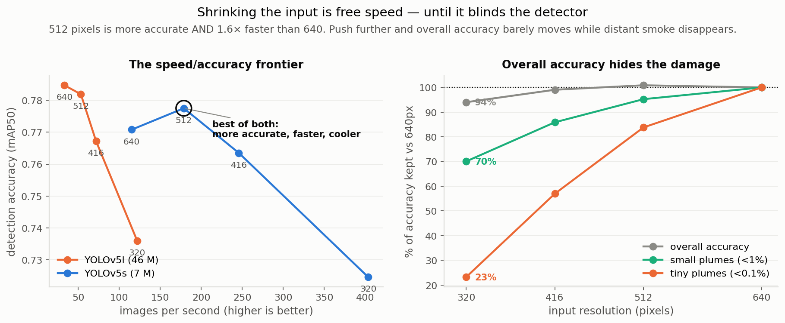
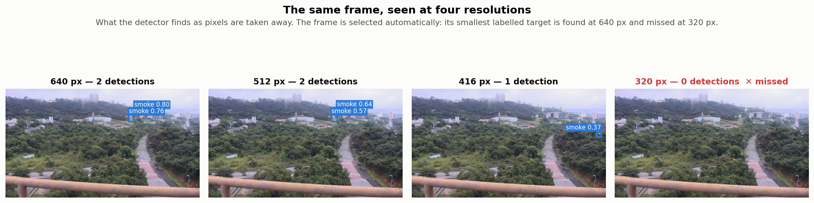

# XP2. Resolution: the cheapest knob

**Question:** input resolution is the cheapest knob available: no retraining, no tooling.
How much of the compression story does it already explain?

**Outcome:** more than expected, and it has a hard floor. For the small model, **512 pixels
is both more accurate and 1.6× faster than 640**, a free win before any sophisticated
technique was tried. Push past 320 and the trade collapses: at 160 pixels it runs 6× faster
than at 640 and finds **no distant plume at all**.

### The same thing, on one frame

Each panel is the image **as the network receives it**: letterboxed to a square at that
resolution, grey bars included. The bottom row magnifies the target.

The smoke column on the ridge is obvious to the eye. The detector holds it at 640, 512 and
320 pixels at roughly 0.7 to 0.8 confidence. At 160 pixels the target is about **35 pixels
across and the detector loses it completely.**

This is not a marginal case. That plume covers 3.5% of the frame, more than three times the
size that counts as a "small plume" here, and it still vanishes. Anything genuinely distant
is gone well before this point, which is what the tiny-plume column in the table below
records.

The frame is chosen automatically (the most visible target that is found at full resolution
and missed at the lowest) rather than picked by hand.

## The frontier

Both models, every resolution, on the full 4,306-image test set. Published weights evaluated
at resolutions they were never trained for. 160 pixels is included deliberately as a level
past the point of usefulness: without one, a reader cannot tell whether the curve ever bends.

**"Correctly silent"** is the fraction of the 2,005 empty test frames on which the detector
raises no alarm at all. Bold marks each model's most accurate setting.

### YOLOv5s, the small model: 7.0 M parameters, 14.4 MB

| resolution | accuracy | small plumes | tiny plumes | correctly silent | speed | power |
|---:|---:|---:|---:|---:|---:|---:|
| 640 | 0.7708 | 0.6365 | 0.1654 | 96.9% | 115 img/s | 10.2 W |
| **512** | **0.7775** | 0.6062 | 0.1386 | 97.4% | **179 img/s** | **8.5 W** |
| 416 | 0.7635 | 0.5466 | 0.0942 | 96.6% | 246 img/s | 7.7 W |
| 320 | 0.7246 | 0.4459 | 0.0384 | 97.0% | 404 img/s | 7.0 W |
| 256 | 0.6593 | 0.3299 | 0.0086 | 97.7% | 623 img/s | 6.6 W |
| 160 | 0.4578 | 0.0757 | **0.0000** | 93.6% | 697 img/s | 6.3 W |

### YOLOv5l, the large model: 46.1 M parameters, 92.8 MB

| resolution | accuracy | small plumes | tiny plumes | correctly silent | speed | power |
|---:|---:|---:|---:|---:|---:|---:|
| **640** | **0.7847** | 0.6410 | 0.1974 | 97.8% | 33 img/s | 19.1 W |
| 512 | 0.7819 | 0.6086 | 0.1673 | 97.9% | 53 img/s | 15.3 W |
| 416 | 0.7672 | 0.5674 | 0.1154 | 97.2% | 72 img/s | 11.4 W |
| 320 | 0.7360 | 0.4976 | 0.0569 | 96.8% | 122 img/s | 9.7 W |
| 256 | 0.6837 | 0.3705 | 0.0138 | 97.2% | 184 img/s | 8.6 W |
| 160 | 0.4871 | 0.1023 | **0.0000** | 94.8% | 337 img/s | 8.0 W |

**The two models do not peak at the same place.** The small one is most accurate at 512
pixels; the large one is most accurate at 640 and loses 0.28 points by 512. So "512 beats
640" is a fact about YOLOv5s, not a law about resolution, and it is stated that way
throughout this page. The shape below the peak is identical for both: a gentle slope to 320,
then a cliff.

> **What "plume" means here.** A plume is the visible smoke or flame region the detector has
> to find. Accuracy is reported separately for **small plumes** (under 1% of the frame) and
> **tiny plumes** (under 0.1%, roughly 20x20 pixels), which is distant smoke, and what
> early detection actually depends on.

## What this means

**The cheap knob beats the expensive model.** YOLOv5s at 512 comes within 0.7 accuracy
points of the 6.6×-larger YOLOv5l at 640, while running **5.4× faster on half the power**.
Any more sophisticated technique has to beat this line to justify its complexity.

**Overall accuracy hides the damage.** Dropping 640 to 320 costs 6% of overall accuracy but
**77% of tiny-plume accuracy**. Judged on the headline number alone, the honest conclusion
would be "resolution is nearly free", which is exactly backwards for a system whose job is
spotting distant smoke early.

**The bargain ends below 320, and it ends badly.** Each step down to that point trades a
little accuracy for a lot of speed. Then it inverts (YOLOv5s):

| step | speed gained | overall accuracy |
|---|---:|---:|
| 512 to 320 | **2.3× faster** | −6.8% |
| 320 to 256 | 1.5× faster | −9.0% |
| 256 to 160 | **1.1× faster** | **−30.6%** |

The last step uses 2.6× fewer pixels and returns 12% more throughput, because at that size
the board is no longer limited by the arithmetic but by the cost of dispatching the work
(the same effect [XP9](../xp09_tensorrt_fp16/) found across the whole runtime). So 160
pixels costs a third of the accuracy and buys almost nothing. **There is a floor, and it is
reached well before the model stops working.**

**At the floor, tiny plumes are exactly zero.** Not "low", not "noisy": 0.0000, no distant
plume detected anywhere in the test set. False alarms roughly double at the same time, with
correct silence on empty frames falling from 97.7% to 93.6%, so the detector becomes both
blind and jumpy at once. A bigger model does not rescue it either. YOLOv5l at 160 pixels
scores 0.4871 and finds no tiny plume either, so it buys the same collapse for **2.1× the
energy** (313 against 147 joules per 1000 frames).

**Bigger doesn't fix small targets, but smaller definitely breaks them.** At 640 pixels
tiny plumes score 0.1654 for the 7 M model and 0.1974 for the 46 M one, so 6.6× the
parameters buys three points on the metric that matters most. Resolution moves the same
metric from 0.1654 to zero. Distant-plume detection is therefore not mainly a capacity
problem, and no compression technique will fix it; **feeding the network more pixels, or
tiling the frame, is the lever that is actually attached to it.** Neither is tested here.

## Limitations

- Inference-resolution only. The models were trained at one resolution and tested at
  others; retraining at each resolution would likely widen the 512px win, and needs a GPU.
- The 512 > 640 result is probably train/test resolution mismatch, but that is a hypothesis
  until the retraining arm is run, and the full sweep complicates it: the effect appears in
  YOLOv5s and not in YOLOv5l, which a pure mismatch would not obviously predict. Both models
  came from the same group with an unpublished recipe, so they may not have been trained
  identically.
- **The collapse at 160 and 256 is measured the same way, so part of it is that mismatch
  rather than the pixel count itself.** A detector trained at 160 would score better than
  0.4578. The floor is real, because retraining cannot put back detail the input no longer
  carries, but exactly where it sits is not established here.
- Speed is measured in PyTorch, which hides the real numbers on this board
  ([XP9](../xp09_tensorrt_fp16/)). The *ratios* between resolutions are the usable part of
  the speed column, not the absolute figures.

## Next

This entire frontier was measured on a runtime that hides the real speeds
([XP9](../xp09_tensorrt_fp16/)).
