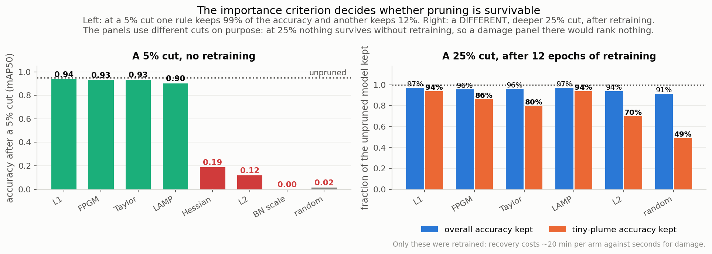
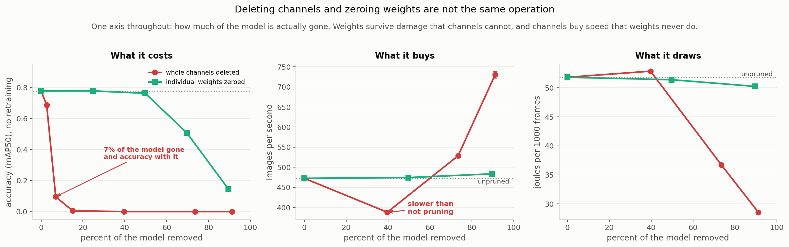
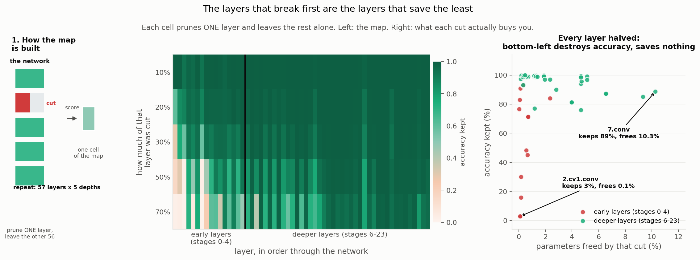
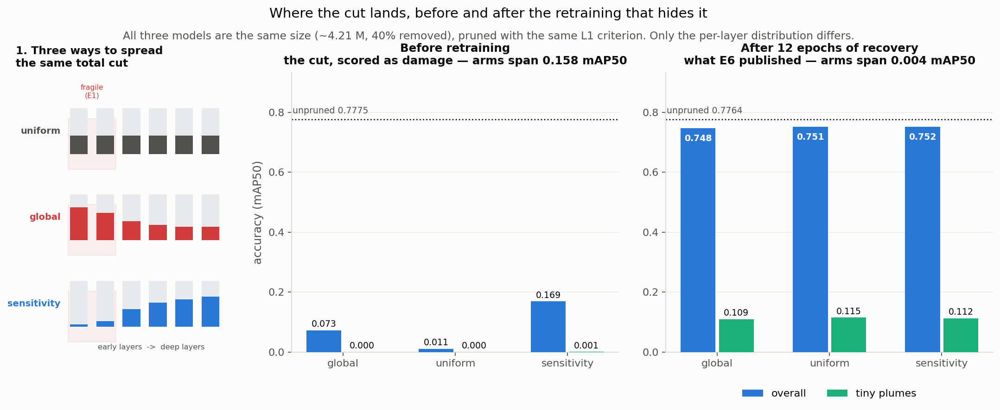
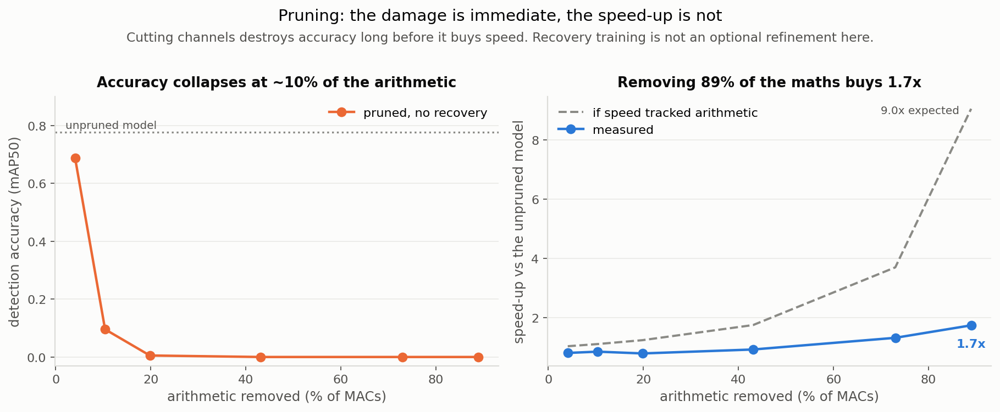

# XP6. Pruning: how much of this detector can you delete?

**Question:** pruning deletes parts of a trained network to make it smaller and faster. Does it
beat the far simpler option of feeding the same network a smaller image?

**Outcome:** no, but not for the reason this page used to give. The detector turns out to need
only **about a tenth of its weights**, and the collapse reported here originally was mostly the
fault of one badly chosen setting.

**The line to beat**, which nothing here beats: YOLOv5s at 512 px, TensorRT FP16,
**0.7776 mAP50 at 474 img/s** on the Jetson Orin Nano Super.

| | |
|---|---|
| Model | YOLOv5s, 7.03 M parameters, `0 = smoke`, `1 = fire` |
| Weights | The D-Fire authors' detectors ([pedbrgs/Fire-Detection](https://github.com/pedbrgs/Fire-Detection)), not ours |
| Data | [D-Fire](https://github.com/gaiasd/DFireDataset), 21,527 images; splits frozen at 15,500 / 1,721 / 4,306 |
| Accuracy | Full 4,306-image test set at 512 px |
| Speed | **Jetson only.** An engine is built for one GPU and will not load on another, so speed measured on a desktop card says nothing about a 15 W board. New results here were screened on an RTX 3090 and carry accuracy only |

> **What "plume" means here.** A plume is the visible smoke or flame the detector has to find.
> Accuracy is reported separately for **small plumes** (under 1% of the frame) and **tiny
> plumes** (under 0.1%, roughly 20x20 pixels), which is distant smoke, and what early detection
> actually depends on.


## Pruning is four choices, not one technique

**What shape** you delete in (single weights, or whole channels), **which parts** you pick,
**how much** comes out of each layer, and **what retraining** repairs the damage. Almost every
named method is one combination of those four. The results below change one at a time.

| Axis | Tested | Still open |
|---|---|---|
| Shape | channel, **single weights**, **2:4** | vector, kernel |
| Choice | L2, **L1, BN scale, Taylor, Hessian, FPGM, LAMP, random** | regression-based, APoZ |
| Amount per layer | global, **uniform, sensitivity driven** | automated search |
| Retraining | one-shot, iterative | **equal post-cut budget (unfinished)**, LR rewind |

Bold is new on this page.

> **What a "channel" is, since most of this page turns on it.** A layer is one processing step;
> a **channel is one of that layer's outputs**, a single 2D map of "how strongly does my pattern
> appear here". The image arrives with 3 channels (red, green, blue), layer 0 turns those into
> 32 learned pattern detectors, and by layer 8 there are 512 of them. So a channel is not a
> colour and not a whole layer, it is one detector inside a layer. **Pruning channels makes
> layers narrower; no layer was ever deleted here.** Deleting a channel also forces every layer
> downstream to drop the matching input, which is why it is structural surgery rather than
> setting numbers to zero.
>
> This vocabulary is specific to **convolutional** networks. The four choices above are not:
> a transformer has the same problem with attention heads and feed-forward widths in place of
> channels, and the same split between removing whole units and thinning weights inside them.

## 1. The collapse was mostly a bad setting

This page used to say that cutting 5% of channels costs 88% of the accuracy. That is mostly a
fact about **L2**, the one selection rule that had been tried.



**At a 5% cut, L1 keeps 99% of the accuracy where L2 keeps 12%.** In code the difference is
`p=2` against `p=1`. After 12 epochs of recovery at a 25% cut:

| selection rule (all at a **25% channel cut**, 12 epochs) | params left | mAP50 | small plumes | tiny plumes |
|---|---:|---:|---:|---:|
| **none (unpruned)** | 7.03 M | **0.7764** | 0.6038 | 0.1380 |
| LAMP | **3.91 M** | 0.7543 | 0.5783 | 0.1294 |
| L1 | 4.21 M | 0.7531 | 0.5720 | 0.1294 |
| Taylor | 4.45 M | 0.7460 | 0.5784 | 0.1102 |
| FPGM | 4.55 M | 0.7438 | 0.5701 | 0.1190 |
| **L2, as first published** | 4.24 M | 0.7298 | 0.5525 | 0.0963 |
| BN scale | 4.15 M | 0.7153 | 0.5160 | 0.0739 |
| Hessian | 3.83 M | 0.7111 | 0.5152 | 0.0810 |
| random (the control) | 4.45 M | 0.7093 | 0.4812 | 0.0676 |

All eight rules are in that table, and the spread is the story. **Before retraining they
range from 0.94 to 0.00; after it, from 0.754 to 0.709.** Retraining is a great leveller,
which is why damage measured without it is a poor guide to a deployed model: BN scale has
the worst damage of all and still finishes above Hessian.

**BN scale scored near random, and the reason is measurable.** It ranks channels by the scale
factor batch norm already learned, which works only if training pushed some of those scales
toward zero to mark channels as dead. In these weights **not one of the 9,504 channels has a
scale below 0.1**: they sit tightly around 1.0 with a floor at 0.166. The signal the method
reads does not exist here, so it selects almost arbitrarily. That is an unmet prerequisite, not
a failed method, and it is the clearest lesson in the set: **a technique can be sound and still
be inapplicable to the weights you were handed.**

**Random pruning is in that table on purpose.** Without it you cannot tell whether a rule is
clever or whether any cut plus retraining lands in the same place. It answers the question
twice over: on overall accuracy the good rules beat it by 4.5 points, but **on tiny plumes they
beat it by nearly double**. The choice barely matters for easy cases and matters enormously for
distant smoke, which is the entire point of the detector.

## 2. The capacity was always spare

Deleting individual weights removes the same capacity without removing any structure.



| what was removed | weights left | mAP50 |
|---|---:|---:|
| **nothing** | 7.03 M | **0.7764** |
| 25% of individual weights | 5.28 M | 0.7552 |
| **90% of individual weights** | **0.74 M** | **0.7425** |
| 5% of *channels*, no retraining | 6.53 M | 0.0956 |

**Nine tenths of this network can go.** At 90% sparsity it holds 96% of its accuracy on 0.74 M
weights. The detector was never short of capacity; what it cannot survive is losing whole
**channels**, because everything downstream is shaped around them.

That is also why pruning keeps losing here. The redundancy is real and provable, and no kernel
on this board can turn it into a single extra frame per second.

## 3. The one pattern the hardware understands

**2:4 sparsity** is the version of that idea Ampere GPUs can actually accelerate: of every four
neighbouring weights, exactly two must be zero. The Orin's GPU is Ampere class.

| | non-zero weights | mAP50 | tiny plumes |
|---|---:|---:|---:|
| **unpruned** | 7.03 M | **0.7764** | 0.1380 |
| 2:4, no retraining | 3.53 M | **0.0000** | 0.0000 |
| 2:4, after 12 epochs | 3.53 M | **0.7527** | 0.1249 |

Retraining wins it all back, to 97% of the unpruned model, matching what NVIDIA reports for
detection. But note the untrained row: free choice at the same 50% sparsity scores 0.7622, and
forcing the identical amount into a fixed pattern scores zero. **It is not how much you remove,
it is whether the removal has to follow a shape.**

Whether the board's compiler actually uses sparse kernels is a separate question with a separate
answer. If it does, this is the most promising candidate in the study: channel-pruning accuracy
at half the weights. See [`HANDOFF_TO_JETSON.md`](HANDOFF_TO_JETSON.md).

## 4. Where you cut matters less than what you cut

Pruning one layer at a time maps where damage is cheap and where it is fatal.



**The layers that break first are the ones that save the least.** Halving the first convolution
costs 84% of the accuracy and frees 0.16% of the model; halving `model.21.conv` costs 0.9% and
frees 5.13%. Early layers keep 59% of accuracy under a 50% cut, late layers keep 94%. A single
global threshold ranks channels by size and cannot see any of this, which is how the original
collapse happened.



Acting on that map helps less than expected. With all three arms cut to the same size,
**protecting the fragile layers wins by 0.4 accuracy points, where changing the selection rule
was worth 4.5.** It does buy one thing: correct silence on empty frames returns to the unpruned
97.4%, undoing the extra false alarms pruning otherwise causes.

## 5. Removing arithmetic is still not gaining speed



On the board, removing **88.9% of the multiply-adds bought 1.7x the throughput**, not the ~9x
the arithmetic implies. Pruned layers land on awkward widths (47 channels instead of 64) and GPU
kernels are written for regular sizes. The sharpest version: the iterative model kept *more*
parameters than the one-shot model and ran **18% faster**.

Parameter counts and MAC counts are structural facts here, never performance claims.

## Verdict

**Pruning still loses.** The best model is 44% smaller and gives up 2.2 accuracy points, and
simply running the unpruned network at 512 px is still the better deployment. What changed is
the size of the loss (4.8 points to 2.2) and the reason for it.

The honest summary: **this detector can be pruned far harder than this page used to claim, and
it still should not be**, because the cheap knob (smaller pictures) is still ahead.

## What was not finished

- **The regularity test never ran.** [`e3_regularity.py`](e3_regularity.py) is ready. It is the
  only direct test of why a larger pruned model ran faster than a smaller one.
- **The fair one-shot versus iterative rerun is half done.** Both arms were meant to get equal
  training *after* their final cut, fixing a confound this page has always flagged. One-shot
  completed; iterative was stopped part way. One arm is not a comparison, so no verdict.
- **Two sparsity levels have damage numbers only** (50% and 70%), after two runs were lost to a
  GPU out-of-memory error.

## Limitations

- **No speed number exists for anything new here.** It all needs the board.
- **Equal cut ratio is not equal size or equal compute.** At 25%, LAMP lands at 3.91 M
  parameters while removing 20.1% of the arithmetic; FPGM lands at 4.55 M while removing 33.5%.
- **Damage is a poor guide to a retrained model.** It separates the good tier from the bad tier
  reliably, but not the order within a tier: BN scale has the worst damage of all eight and
  still finishes above Hessian.
- **A 25% cut does not mean the same size for every rule**, which is why the parameter column
  above is not constant. The cut is a *channel* target, and channels are not equal in cost: one
  in the first layer carries about 100 weights, one deep in the network about 2,300. Each rule
  ranks channels differently, so a rule that concentrates its cuts in the wide late layers
  strips far more parameters than one nibbling at narrow early ones. From the identical setting,
  LAMP removes 44.4% of the parameters and FPGM 35.3%, leaving 3.91 M against 4.55 M. **Compare
  rules at similar sizes, not by the label they share** (it is also why the allocation
  experiment below matches its three arms by measured size rather than by ratio).
- **BN scale scored worse than random, which is not a verdict on it.** It assumes training used
  a penalty that spreads the batch-norm scales apart. These weights had none, so the signal it
  reads does not exist. An unmet prerequisite, not a failure.
- **Recovery is 12 epochs**, what the board allows overnight; **one dataset, one architecture.**
  "Early layers are fragile" is a claim about this network.

## Bugs that produced wrong numbers

**The library swapped the model.** Given `yolov5s.pt`, Ultralytics quietly downloaded its own
80-class COCO model instead. It ran and drew plausible boxes. Every load now asserts the class
names are `['smoke', 'fire']`.

**The training loop destroyed the model.** An early version took the *unpruned* model from 0.818
to 0.008 in one epoch and two published numbers were withdrawn. No recovery number is believed
now until retraining the unpruned model returns it to where it started.

**The sparse models were not sparse.** They came back 0% sparse, because the loop ends by
loading averaged weights and that average never runs a forward pass, so the masks enforcing
sparsity never reached it. Sparsity is now verified after training rather than assumed.

## Reproduce

```bash
python experiments/xp06_pruning/e1_sensitivity.py                       # layer map
python experiments/xp06_pruning/e2_criteria.py --stage damage           # selection rules
python experiments/xp06_pruning/e2_criteria.py --stage recover --criteria lamp l1 fpgm random
python experiments/xp06_pruning/e5_finegrained.py --sparsity 0.90       # single weights
python experiments/xp06_pruning/e4_sparsity24.py                        # 2:4
python experiments/xp06_pruning/e6_allocation.py --plan                 # then --arm <name>

python analysis/make_figures.py     # every figure, from the committed JSON
python analysis/xp06_tables.py      # every table, from the same JSON
```

An interactive walkthrough of the techniques is in [`course/`](course/).
