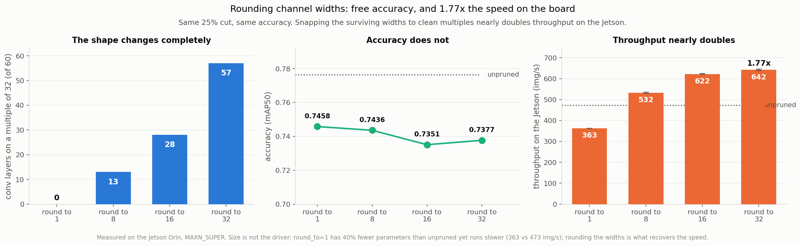
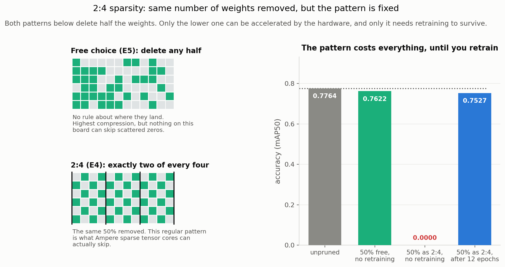
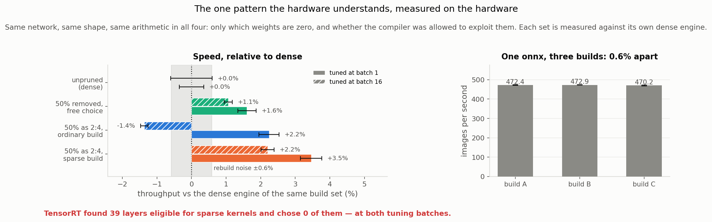
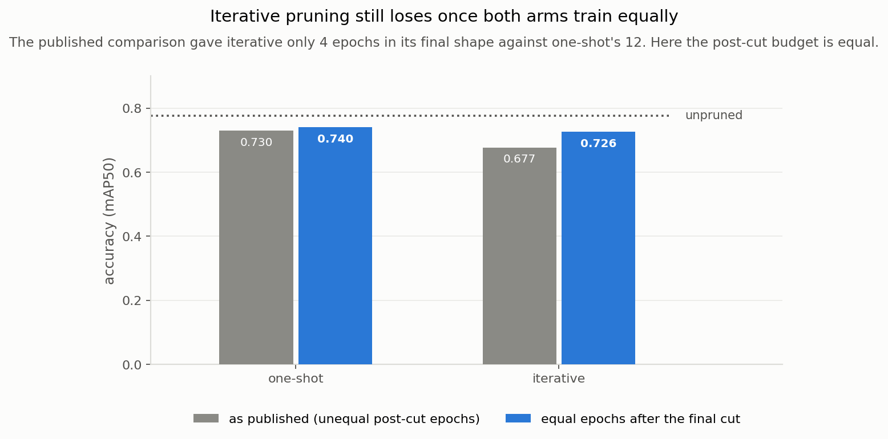
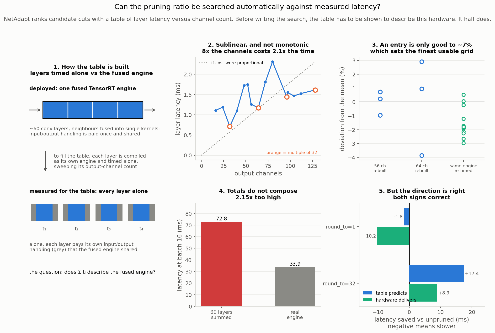

# XP6. Pruning: how much of this detector can you delete?

**Question:** pruning deletes parts of a trained network to make it smaller and faster. Does it
beat the far simpler option of feeding the same network a smaller image?

**Outcome:** no, but not for the reason this page used to give. The detector turns out to need
only **about a tenth of its weights**, and the collapse reported here originally was mostly the
fault of one badly chosen setting.

**The line to beat**, which nothing here beats: YOLOv5s at 512 px, TensorRT FP16,
**0.7776 mAP50 at 474 img/s** on the Jetson Orin Nano Super.

| | |
|---|---|
| Model | YOLOv5s, 7.03 M parameters, `0 = smoke`, `1 = fire` |
| Weights | The D-Fire authors' detectors ([pedbrgs/Fire-Detection](https://github.com/pedbrgs/Fire-Detection)), not ours |
| Data | [D-Fire](https://github.com/gaiasd/DFireDataset), 21,527 images; splits frozen at 15,500 / 1,721 / 4,306 |
| Accuracy | Full 4,306-image test set at 512 px |
| Speed | **Jetson only.** An engine is built for one GPU and will not load on another, so speed measured on a desktop card says nothing about a 15 W board. New results here were screened on an RTX 3090 and carry accuracy only |

> **What "plume" means here.** A plume is the visible smoke or flame the detector has to find.
> Accuracy is reported separately for **small plumes** (under 1% of the frame) and **tiny
> plumes** (under 0.1%, roughly 20x20 pixels), which is distant smoke, and what early detection
> actually depends on.


## Why, and what would count as winning

- **The detector has to run on a $249 fanless Jetson Orin Nano**: no cloud, 8 GB shared, a 15 W
  budget, thermals that only show up over ten minutes. Smaller and faster is the line between
  deployable and not.
- **The bar is the network itself**, unpruned, compiled to TensorRT FP16 at 512 px:
  **0.7776 mAP50 at 474 img/s**. Any technique has to beat that or it lost. So far nothing has,
  and the cheapest win of the whole study was simply feeding the network a smaller image.
- **We change one decision at a time.** Pruning looks like dozens of techniques; it is really
  four independent choices, and each experiment below moves exactly one of them.

## The four choices

- **Granularity** is the *shape* you delete in: scattered individual weights, or whole channels.
- **Criterion** is *which* parts you pick to remove.
- **Ratio** is *how much* comes out of each layer.
- **Retraining** is *how* you repair the damage afterwards.

> **What a "channel" is, since most of this page turns on it.** A layer is one processing step;
> a **channel is one of that layer's outputs**, a single 2D map of "how strongly does my pattern
> appear here". The image arrives with 3 channels (red, green, blue), layer 0 turns those into
> 32 learned pattern detectors, and by layer 8 there are 512 of them. So a channel is not a
> colour and not a whole layer, it is one detector inside a layer. **Pruning channels makes
> layers narrower; no layer was ever deleted here.** This network has no fully-connected layers
> at all, so the channel is also what a "neuron" would be.
>
> The vocabulary is specific to **convolutional** networks. The four choices are not: a
> transformer has the same problem with attention heads and feed-forward widths.

---

## The experiments

| | axis it changes | question | outcome |
|---|---|---|---|
| **E1** | ratio | which layers can be cut at all? | ✅ fragile layers are the ones that free the least |
| **E2** | criterion | which channels to pick, and does it beat random? | ✅ decides everything: 99% kept vs 12% |
| **E3** | channel widths | round the surviving widths so kernels run better? | ✅ **1.77x faster on the board** at the same accuracy |
| **E4** | granularity | does 2:4 sparsity, the pattern hardware understands, hold up? | ✅ accuracy holds; **the compiler refuses the sparse kernels** |
| **E5** | granularity | is the collapse a capacity limit or a structural one? | ✅ structural, decisively |
| **E6** | ratio | same cut, spread three ways. Does allocation rescue it? | ✅ decides the damage (15x), but 12 epochs erase it |
| **E7** | retraining | does iterative still lose when both arms train equally? | ✅ yes, it still loses |
| **E8** | criterion | pick channels by reconstructing the layer's output | ❌ **not attempted** |
| **E9** | allocation | can a search pick ratios against measured latency? | ✅ cost model right per network, too noisy per layer |

Each section below is one experiment. The unpruned model is the top row of every table.

---

## E1. Which layers can be cut

> **Axis:** ratio &nbsp;·&nbsp; **Asks:** which layers can be cut at all? &nbsp;·&nbsp; **Answer:** the fragile ones are exactly those that free the least

Prune one layer, leave the other 56 alone, measure, put it back, move on. 57 layers x 5 depths
of cut, on the **validation** split, since the result chooses a configuration and test has to
stay clean.


**How to read it.** On the left, every column is one layer and every row is how hard that single
layer was cut. Dark green means the network barely noticed, pale means it fell over. The black
line separates the early layers from the deeper ones. On the right, each dot is one layer
halved: how much of the model that freed, against how much accuracy survived. **Good cuts are
top-right. Bottom-left means you destroyed the detector and saved nothing.**

Two things jump out, and the second is the useful one.

**Fragility follows depth.** Early layers go pale as soon as you cut them; deeper layers stay
dark green even at 70%. Stages 0 to 4 keep 59% of accuracy under a 50% cut, stages 6 to 23 keep
94%.

**The fragile layers are also the ones with nothing to give.** Every red dot is jammed against
the left edge of the right-hand panel: halving the first convolution frees **0.16%** of the
model and costs **84%** of the accuracy. Halving `model.21.conv` costs **0.9%** and frees
**5.13%**. That is fifty times the saving for a hundredth of the damage.

**Conclusion.** There is no reason to ever cut the early layers of this detector. They are the
most expensive place to take damage and the least profitable place to save. A single global
threshold ranks channels by weight size and knows none of this, so part of its budget lands
exactly there, which is what produced the original collapse. E6 tests whether acting on this map
is enough to fix it.

---

## E2. Which channels to pick

> **Axis:** criterion &nbsp;·&nbsp; **Asks:** which channels to pick, and does it beat random? &nbsp;·&nbsp; **Answer:** it decides everything, 99% kept against 12%

This page used to say a 5% cut costs 88% of the accuracy. That is mostly a fact about **L2**,
the one selection rule that had ever been tried.

**Every rule is a different theory of what makes a channel worth keeping.** Each scores every
channel, and the lowest scores are deleted. $w$ is a channel's weights, $g$ its gradients,
$\gamma$ its batch-norm scale.

| rule | score | why you would use it | why you might not |
|---|---|---|---|
| **L1** | $\sum_i \lvert w_i \rvert$ | free, needs no data, treats every weight equally | blind to layer scale, so it over-cuts layers whose weights are globally small |
| **L2** | $\sqrt{\sum_i w_i^2}$ | the usual default, equally free | squaring lets **one** large weight rescue an otherwise-dead channel. On this model that was catastrophic |
| **LAMP** | $w_i^2 \big/ \sum_{j\ge i} w_j^2$ | layer-adaptive for free: layers compete on their own terms, so narrow critical layers survive | still pure magnitude, still ignores the data |
| **FPGM** | $\sum_j \lVert W_i - W_j \rVert_2$ | catches **redundancy** magnitude cannot: two large but near-identical channels | costs a pairwise distance per layer, the slowest of the cheap rules |
| **Taylor** | $\lvert g_i w_i \rvert$ | actually estimates the loss change, and is the only family that looks at the data | needs a backward pass over calibration data, and the loss is dominated by common cases, so rare ones get under-weighted |
| **Hessian** | $\tfrac{1}{2} h_{ii} w_i^2$ | the most principled on paper (Optimal Brain Damage) | assumes training converged and that weights are independent, both shaky for a fine-tuned detector. Worst real rule here |
| **BN scale** | $\lvert \gamma_c \rvert$ | free, reuses a number the network already learned | **requires** training with a penalty that spreads the scales apart. Without it the signal does not exist |
| **random** | $\sim U(0,1)$ | the control that proves the others are doing work | no signal, by construction |

The short version of the trade-off: **magnitude rules are free but data-blind, gradient rules see
the data but cost a backward pass and over-weight the common case, and FPGM is the only one
asking a different question entirely.** On this detector the free layer-adaptive rule beat every
expensive one.


**At a 5% cut, L1 keeps 99% of the accuracy where L2 keeps 12%.** In code the difference is
`p=2` against `p=1`.

### Where each rule actually cut

The cut is one **global** threshold across the whole network, not a per-layer quota, so each rule
decides for itself where the damage lands. That turns out to explain the ranking.

| rule | early (0-4) | mid (5-9) | deep (10-23) | mAP50 |
|---|---:|---:|---:|---:|
| **LAMP** | **0.1%** | 28.8% | 22.9% | **0.7543** |
| L1 | 18.3% | 16.1% | 32.6% | 0.7531 |
| Taylor | 22.1% | 11.5% | 35.5% | 0.7460 |
| FPGM | 12.8% | 8.5% | 40.4% | 0.7438 |
| BN scale | 33.2% | 18.5% | 29.0% | 0.7153 |
| Hessian | 22.3% | 33.2% | 15.8% | 0.7111 |
| **random** | **48.5%** | 18.6% | 25.6% | **0.7093** |

**LAMP barely touches the early layers and wins; random hammers them and loses.** Across the
seven rules, the correlation between how much of the early network they cut and their final
accuracy is **r = -0.79**.

That is E1's prediction confirmed by a completely separate experiment. E1 measured layers one at
a time and concluded the early ones must be protected; E2 never used that map, yet the rules that
happened to protect them are the rules that won. Two independent routes to the same mechanism,
which is much stronger than either alone. (Seven points, so treat the coefficient as direction
rather than a precise effect size.)

| selection rule (all at a **25% channel cut**, 12 epochs) | params left | mAP50 | small plumes | tiny plumes |
|---|---:|---:|---:|---:|
| **none (unpruned)** | 7.03 M | **0.7764** | 0.6038 | 0.1380 |
| LAMP | **3.91 M** | 0.7543 | 0.5783 | 0.1294 |
| L1 | 4.21 M | 0.7531 | 0.5720 | 0.1294 |
| Taylor | 4.45 M | 0.7460 | 0.5784 | 0.1102 |
| FPGM | 4.55 M | 0.7438 | 0.5701 | 0.1190 |
| **L2, as first published** | 4.24 M | 0.7298 | 0.5525 | 0.0963 |
| BN scale | 4.15 M | 0.7153 | 0.5160 | 0.0739 |
| Hessian | 3.83 M | 0.7111 | 0.5152 | 0.0810 |
| random (the control) | 4.45 M | 0.7093 | 0.4812 | 0.0676 |

**Before retraining these rules range from 0.94 to 0.00; after it, from 0.754 to 0.709.**
Retraining is a great leveller, which is why damage measured without it is a poor guide to a
deployed model.

**BN scale scored near random, and the reason is measurable.** It ranks channels by the scale
batch norm already learned, which works only if training pushed some of those scales toward zero
to mark channels as dead. In these weights **not one of the 9,504 channels has a scale below
0.1**. The signal does not exist, so it selects almost arbitrarily. An unmet prerequisite, not a
failed method.

**Random is in the table on purpose.** Without it you cannot tell whether a rule is clever or
whether any cut plus retraining lands in the same place. On overall accuracy the good rules beat
it by 4.5 points, but **on tiny plumes by nearly double**. The choice barely matters for easy
cases and matters enormously for distant smoke.

---

## E3. Regular channel widths recover the missing speed

> **Axis:** channel widths &nbsp;·&nbsp; **Asks:** does snapping odd widths (52) to clean ones (32) run faster? &nbsp;·&nbsp; **Answer:** yes, 1.77x on the board, for no accuracy cost

**It is the channel *count* that gets rounded, never the weights.** No weight value is altered,
and no weight is rounded to anything. What changes is *how many* channels a layer is allowed to
keep.

> **`round_to=N` means the surviving count must be a multiple of N. It is not a number of
> channels.** So `round_to=1` is the **control with no rounding at all**, because every integer
> is a multiple of 1 and any width is allowed. `round_to=32` permits only 32, 64, 96, 128 and so
> on. Bigger N is a *stricter* constraint, and since a width is snapped down to the multiple
> below it, **bigger N keeps fewer channels**, not more.

Take `model.1.conv`, a real layer in this detector. Its weight tensor is `[64, 32, 3, 3]`: **64
output channels**, each one a 32x3x3 filter.

1. **Unpruned.** 64 channels, tensor `[64, 32, 3, 3]`.
2. **Pruned 25%, `round_to=1`.** The criterion scores all 64 channels and deletes the weakest.
   **52 survive**, tensor `[52, 32, 3, 3]`. 52 is whatever the scores happened to leave.
3. **Pruned 25%, `round_to=32`.** Same scores, same order, but the survivor count must be a
   multiple of 32. **32 survive**, tensor `[32, 32, 3, 3]`.

Measured on this model, L1 criterion, 25% cut:

| layer | unpruned | `round_to=1`<br>(no rounding) | `round_to=32`<br>(multiples of 32 only) |
|---|---:|---:|---:|
| `model.0.conv` | 32 | 20 | **32** |
| `model.1.conv` | 64 | 52 | **32** |
| `model.2.cv3.conv` | 64 | 51 | **32** |
| `model.3.conv` | 128 | 97 | **96** |
| `model.4.cv3.conv` | 128 | 99 | **96** |
| **whole model** | **9,567** | **7,319** | **6,559** |

- Usually it rounds **down**, 52 to 32 and 97 to 96, deleting more channels than the ratio asked
  for.
- Occasionally **up**, 20 to 32, because a layer is never taken below one full group of 32.
- Across the whole model it nets out smaller: 7,319 surviving channels become 6,559.

**Why anyone would.** A GPU kernel does not walk a layer channel by channel. It covers it in
fixed-size tiles, and any leftover is padded out and computed anyway. A width of 52 is one full
tile of 32 plus a ragged 20 that still costs a whole second tile, so 20 of those 32 lanes compute
nothing useful. Widths of 32 and 96 fill their tiles exactly. XP6 even saw a *larger* pruned model run *faster* than a smaller one, which points at
exactly this. The test: do the clean widths run faster?



- **Rounding transforms the shape for free.** From 0 of 60 conv layers on a multiple of 32 at
  `round_to=1` to 57 of 60 at `round_to=32`, while accuracy moves 0.7458 to 0.7377, under one
  point and inside recovery noise.
- **On the board it nearly doubles throughput.** Same 25% cut, same accuracy. Parameters and
  engine size are in the table because the point of this experiment is that **they do not
  predict the speed**:

  | round_to | widths allowed | params | engine | aligned | mAP50 | Jetson throughput | energy |
  |---:|---|---:|---:|---:|---:|---:|---:|
  | *(unpruned)* | *not pruned* | *7.03 M* | *17.0 MB* | *n/a* | *0.7764* | *472.6 img/s* | *51.8 J/1k* |
  | 1 | any (no rounding) | 4.21 M | 12.3 MB | 0 / 60 | 0.7458 | 362.9 img/s | 58.4 J/1k |
  | 8 | multiples of 8 | 4.03 M | 11.0 MB | 13 / 60 | 0.7436 | 532.3 | 42.0 |
  | 16 | multiples of 16 | 3.79 M | 10.2 MB | 28 / 60 | 0.7351 | 622.4 | 37.5 |
  | 32 | multiples of 32 | **3.52 M** | **9.8 MB** | 57 / 60 | 0.7377 | **641.9 img/s** | **38.0 J/1k** |

- **Parameter count does not predict speed, and the table shows it three ways.**
  - Across the four arms, **parameters fall 16%** (4.21 M to 3.52 M) while **speed rises 77%**.
    Size cannot account for a gain four times larger than itself.
  - **The unpruned model has 67% more parameters than `round_to=1` and runs 30% faster**
    (7.03 M at 472.6 img/s against 4.21 M at 362.9). Deleting a third of the network made it
    slower.
  - `round_to=32` beats the unpruned model by 1.36x while also being half its size, so the two
    effects are separable and shape is the one doing the work.

  **So a bigger model can be the faster one.** If a rounded arm had come out larger than the
  ragged one, it could still have been the right choice, because what the hardware charges for
  is the shape of each layer, not the number of weights in it. Here rounding happened to shrink
  the model as well, which is a bonus rather than the mechanism.
- **This is a different mechanism from [E4](#e4-the-one-pattern-the-hardware-understands).** 2:4
  needed sparse tensor cores, which the compiler declined. Regularity works on the ordinary
  *dense* kernels: the width decides which tile the kernel picks, and a clean multiple of 32
  fills tiles that 52 leaves ragged. It was the one prediction on this page I got wrong, having
  expected a launch-bound board to show little.
- **It confirms XP6's oddest observation.** A larger pruned model really can run faster than a
  smaller one, because *how* the channels are shaped matters more than *how many* survive.

---

## E4. The one pattern the hardware understands

> **Axis:** granularity &nbsp;·&nbsp; **Asks:** does 2:4, the one pattern the hardware understands, hold up? &nbsp;·&nbsp; **Answer:** accuracy holds, and the compiler refuses the sparse kernels

**2:4 sparsity: of every four neighbouring weights, exactly two must be zero.** Half the numbers
go, but *where* they go is fixed, and that constraint is the point: Ampere GPUs, the Orin's
included, have circuitry that skips those zeros for up to twice the throughput. Scattered zeros
(E5) get no such support; whole channels need none. The weights are **masked, not removed** — the
model still stores 7.03 M numbers, 3.53 M of them non-zero.



**Half the weights removed, three ways.** Every row below deletes the same 3.49 M of 6.99 M
weights, from the same 57 layers, by magnitude. Only the rule about *where* changes: the top grid
in the figure may put its zeros anywhere, the bottom one must place exactly two in every four.

| 50% of the weights deleted | non-zero | mAP50 | tiny plumes |
|---|---:|---:|---:|
| **none (unpruned)** | 7.03 M | **0.7764** | 0.1380 |
| free choice of where ([E5](#e5-whole-channels-versus-individual-weights)) | 3.53 M | 0.7622 | 0.1562 |
| **forced into a 2:4 pattern** | 3.53 M | **0.0000** | 0.0000 |
| forced into a 2:4 pattern, then 12 epochs | 3.53 M | 0.7527 | 0.1249 |

Choosing freely costs **1.4 points**. Following the pattern costs **everything**, until 12 epochs
win it back to 97% of unpruned. **It is not how much you remove, it is whether the removal has to
follow a shape.**

### Why the patterned half collapses

A global threshold is **adaptive**: it spends per-layer sparsity anywhere from **8.4% to 87.6%**,
stripping layers full of small weights and sparing layers full of large ones. 2:4 takes exactly
half of every layer, because a group of four cannot know it sits somewhere fragile.

| what actually got deleted | free choice | 2:4 pattern |
|---|---:|---:|
| largest single weight removed | 0.0069 | **0.4365** |
| share of the network's weight energy removed | 2.1% | **12.6%** |
| weights removed from the network's strongest 10% | **0** | **64,990** |
| per-layer sparsity | 8.4% to 87.6% | 50.0% everywhere |

It lands hardest where this network can least afford it: free-form takes 9.0% of the first
convolution, 2:4 takes 50%. [E1](#e1-which-layers-can-be-cut) measured that halving that one
layer costs **84%** of the accuracy.

**That is why the score is exactly 0.0000 and not merely low.** Maximum objectness over 48
images: unpruned **0.911**, free choice **0.895**, 2:4 **0.00022**. The model still draws boxes,
at confidences far too low to clear any threshold, so mAP falls off a cliff instead of sliding.
Retraining rescales the head and the accuracy comes back — the capacity was never lost, the
calibration was.

### Does it run faster on the board?



No. Both 2:4 engines were built from the same ONNX, and the only difference between them is
`--sparsity=enable` — which is permission to *consider* sparse kernels, not an instruction to use
them. TensorRT considered, and declined:

```
(Sparsity) Found 39 layer(s) eligible to use sparse tactics
(Sparsity) Chose 0 layer(s) using sparse tactics
```

**Those two lines are about different things, and the difference is the result.** Line one
confirms the weights really are in 2:4 form; faulty masking would have found none eligible. Line
two is the autotuner deciding: every eligible layer had a **sparse** code path that skips the
zeros on the tensor cores and an ordinary **dense** one that multiplies all four numbers
including the two zeros, and TensorRT timed both and kept dense every time. So the sparsity is in
the data and absent from the execution. The engine multiplies by zero 3.49 M times per frame,
gets the right answer, and takes exactly as long as if nothing had been pruned.

**The first build set had a hole in it, and closing the hole did not change the answer.**
TensorRT autotunes at the `--optShapes` batch size, and that was **1** while throughput is
reported at **16** — so the kernels were chosen in the one regime where a sparse kernel cannot
win, its metadata-decode cost being fixed while the arithmetic it saves grows with batch. Every
arm was rebuilt at `--optShapes=16` to put tuning and measurement in the same place. The verdict
is unchanged: 39 eligible, **0 chosen**.

**Why dense wins.** Sparse kernels must load and decode metadata recording which two of four
survived, and that only repays itself when a layer is large enough for multiplication to
dominate. At 512 px on an Orin Nano the layers are small and the limit is moving data and
launching kernels, which is what [XP9](../xp09_tensorrt_fp16/) found across the whole runtime.
Halving the multiplies of something that was never multiply-bound buys nothing.

**The spread between the bars is not sparsity either, and there is now a control that says so.**
Three engines compiled from one unchanged ONNX with identical flags land within **0.6%** of each
other, so a same-build comparison is trustworthy to well under a percent. The four arms are not a
same-build comparison, and their ranking does not survive being rebuilt: `50% as 2:4, ordinary
build` runs **+2.1%** against dense when tuned at batch 1 and **−1.4%** when tuned at 16, from
byte-identical weights. A gap that changes sign under a recompile belongs to which kernels the
autotuner happened to pick, not to which weights are zero.

**So the verdict stands.** 2:4 was the last candidate with a hardware story behind it.

---

## E5. Whole channels versus individual weights

> **Axis:** granularity &nbsp;·&nbsp; **Asks:** is the collapse a capacity limit or a structural one? &nbsp;·&nbsp; **Answer:** structural, decisively

E1, E2, E6 and E7 deleted **whole channels**. E4 zeroed **individual weights** under a pattern.
This zeros them with no pattern at all. A convolution's weights are a grid
`[out, in, height, width]`:

- **Channel pruning deletes a whole slice.** The network genuinely narrows: 7.03 M parameters
  really do become 4.2 M, smaller on disk, in memory and in arithmetic.
- **Weight pruning punches holes.** Every channel still exists and is still computed. The grid
  keeps its exact shape.

> **Why zeroing 90% of the weights leaves the file the same size.** A zero occupies the same two
> bytes as any other number. Shrinking the file needs a **sparse storage format** that keeps only
> the non-zeros plus indices saying where they belong, and nothing here uses one: PyTorch, ONNX
> and TensorRT are all dense. Indices are not free either, since a naive one costs more than the
> value it points to. **2:4 is the exception**, because two-of-four positions fit in a couple of
> bits, which is why [E4](#e4-the-one-pattern-the-hardware-understands) is its own experiment.

Everything below is on one axis, **percent of the model actually removed**, because a 25% channel
cut removes 39.6% of the parameters and the nominal ratios do not compare.


**What it costs** (damage, no retraining in either series):

| removed | channels deleted | weights zeroed |
|---:|---:|---:|
| 0% | **0.7764** | **0.7764** |
| ~7% | 0.0956 | |
| ~25% | 0.0000 | 0.7775 |
| ~50% | 0.0000 | 0.7622 |
| ~70% | 0.0000 | 0.5066 |
| ~90% | 0.0000 | 0.1447 |

- **Weights absorb damage that channels cannot.** Half the model zeroed costs 1.4 points; 7% of
  the model deleted as channels costs almost everything.
- **The capacity was never the constraint; the structure is.** A channel is a unit everything
  downstream is built around. A weight is not.
- **Retraining closes most of the gap**, which is why the table above is damage only. Recovered,
  90% of weights reaches 0.7425 and 25% of channels reaches 0.7297. The structural advantage is
  real before recovery and largely gone after it.

**What it buys, and what it draws** (TensorRT engines on the board):

| removed | how | non-zero | throughput | energy |
|---:|---|---:|---:|---:|
| 0% | unpruned | 7.03 M | 472.6 ± 0.9 | 51.8 J/1k |
| 49.8% | weights zeroed | 3.53 M | 474.5 ± 0.8 | 51.4 |
| 89.5% | weights zeroed | 0.74 M | 483.6 ± 0.2 | 50.2 |
| 39.6% | channels deleted | 4.24 M | **388.2 ± 0.2** | 52.9 |
| 73.5% | channels deleted | 1.86 M | 528.7 ± 3.2 | 36.7 |
| 91.2% | channels deleted | 0.62 M | **730.4 ± 8.6** | **28.6** |

- **Zeroing weights is a flat line.** 89.5% of the parameters gone moves throughput by 2.3%.
- **Channels do buy speed, but only past about 70% removed**: **1.55x** at 91%, on 45% less energy.
- **In between it goes backwards.** At 39.6% removed the engine runs **18% slower than unpruned**,
  reproducing the 381 img/s XP6 measured earlier. Widths like 47 instead of 64 are what
  [E3](#e3-regular-channel-widths-recover-the-missing-speed) tests.
- **The speed arrives only after the accuracy has gone.** Read the three panels at 90% removed:
  channels are 1.55x faster at 0.0000 mAP50, weights hold 0.1447 and gain nothing.

**Neither granularity has a setting where both work.** That is the verdict of XP6 in one figure.

---

## E6. How to spread the cut

> **Axis:** ratio &nbsp;·&nbsp; **Asks:** same cut spread three ways, does allocation rescue it? &nbsp;·&nbsp; **Answer:** it decides almost everything about the damage, and almost nothing about what survives retraining

Using E1's map, protect the fragile layers and cut hard where there is slack. All three arms are
matched to the same measured size by search — 40.1% of the parameters removed, 7.03 M down to
about 4.21 M — so only the distribution varies. The criterion is held at L1 rather than LAMP,
because LAMP normalises magnitudes per layer and would smuggle in an allocation decision of its
own.


**The same three models, scored twice.** Left, at the moment they were cut. Right, after the 12
epochs E6 originally published.

| allocation | damage, no retraining | after 12 epochs |
|---|---:|---:|
| uniform | 0.0110 | 0.7514 |
| global (what XP6 used) | 0.0726 | 0.7479 |
| **sensitivity-driven** | **0.1689** | **0.7522** |
| *spread across the three* | *0.158* | *0.004* |

**Allocation is not second-order. Recovery is just strong enough to hide that it is not.**
Sensitivity-driven allocation leaves a model **15x** better than uniform and **2.3x** better than
global — and after twelve epochs all three land within 0.4 points of each other, which is the
number E6 first reported. Both measurements are of the same three models. Only the second one
was ever published, and on its own it says allocation barely matters.

**E1's map is right, and acting on it works.** Sensitivity wins on both sides of the figure,
which is the check that matters: an allocation derived from single-layer sensitivity really does
produce the least-damaged network. What it does not do is produce a *better* network once the
optimizer has been allowed to run.

> **This is E5's finding again on a different axis.** There, weight and channel pruning looked
> nothing alike as damage and converged once both retrained. Here, three allocations spanning
> 0.158 mAP50 converge to 0.004. On this detector, twelve epochs is enough to absorb almost any
> structural choice made before them — which makes "how much retraining can you afford" the
> question that determines whether any of these decisions matter. [E7](#e7-one-shot-versus-iterative-fairly)
> takes that up directly.

**So the practical reading depends entirely on your budget.** With a retraining budget, spend
your effort on the criterion — [E2](#e2-which-channels-to-pick) showed that is worth 4.5 points where
allocation is worth 0.4. Without one, allocation is the difference between a model at 0.169 and
a model at 0.011, and E1's map is the best tool on this page.

Sensitivity buys one thing outright: correct silence on empty frames returns to the unpruned
97.4%, undoing the extra false alarms the other two allocations leave behind.

---

## E7. One-shot versus iterative, fairly

> **Axis:** retraining &nbsp;·&nbsp; **Asks:** does iterative still lose when both arms train equally? &nbsp;·&nbsp; **Answer:** yes, it still loses

The original comparison was confounded: both arms got 12 epochs, but the iterative model's final
shape existed for only 4 of them while one-shot trained all 12 in its final shape. Here both get
**12 epochs after their final cut**, and iterative additionally keeps its 8 between-step epochs,
so it gets *more* total training, not less.



| | params | epochs after final cut | total epochs | mAP50 | small plumes | tiny plumes |
|---|---:|---:|---:|---:|---:|---:|
| **none (unpruned)** | 7.03 M | - | - | **0.7764** | 0.6038 | 0.1380 |
| one-shot | 4.24 M | 12 | 12 | **0.7403** | 0.5617 | 0.0923 |
| iterative | 4.53 M | 12 | **20** | 0.7262 | 0.5316 | 0.0812 |

**The confound was real, and fixing it does not change the answer.** The published gap between
the two arms was 5.4 accuracy points (0.7298 against 0.6763); on equal footing it is **1.4**. So
roughly three quarters of iterative's apparent deficit was the shorter training in its final
shape, exactly as the limitation on this page always suspected.

**But iterative still loses**, and it loses while holding every advantage: more total training
(20 epochs against 12) and a larger model (4.53 M against 4.24 M). The textbook expectation is
that gradual pruning preserves more accuracy at the same sparsity. On this detector it does not,
and that is a clean result rather than a budgeting artefact.

> **How far this generalises is not yet measured, and the limit is specific.** This is one point
> on an axis: 40.1% of the parameters. The reference result for iterative pruning plots the two
> arms from 40% to 95% removed and finds them lying on top of each other until roughly 90%,
> separating only past it — so 40% is the part of the curve where no difference is predicted.
> Two further choices narrow it: the arms are not size-matched the way [E6](#e6-how-to-spread-the-cut)
> matched its own (4.53 M against 4.24 M), and the criterion is held at L2, which
> [E2](#e2-which-channels-to-pick) found poor here and which an iterative arm applies once per
> step rather than once. **E7b sweeps the ratio to settle it**; the script and its handover are
> written and waiting on GPU time, in [`HANDOFF_TO_RTX3090.md`](HANDOFF_TO_RTX3090.md). Until it
> runs, read this section as "iterative does not pay for itself at 40% with L2", not as a
> general result.

---

## E9. Can the ratio be searched automatically?

> **Axis:** allocation &nbsp;·&nbsp; **Asks:** can a search pick per-layer ratios against measured latency instead of a proxy? &nbsp;·&nbsp; **Answer:** the cost model works at whole-network scale and fails at the scale the search uses

Every allocation on this page is hand-designed, and [E6](#e6-how-to-spread-the-cut) found three of
them 0.4 points apart after recovery. The lecture's answer to guessing is **NetAdapt**: choose
per-layer ratios by measuring what each candidate cut actually saves, using a table of layer
latency versus channel count.

It is the right method to want here, because XP6's recurring problem is that parameters and MACs
do not predict speed — [E3](#e3-regular-channel-widths-recover-the-missing-speed) measured a
3.52 M model running 1.77x faster than a 4.21 M one. NetAdapt is the one method in the lecture
that optimises *measured latency* rather than a proxy for it.

**This tests the table, not the search.** The search is easy to write and worthless if the table
it reads cannot describe the hardware. Every convolution in the detector was compiled and timed
on the board as a standalone engine; no model was trained.



**Reading the panels.** Panel 1 is how the table is built; the rest are the question asked in
four steps, each able to end it.

1. **How the table is built.** Deployed, the detector is one engine and TensorRT fuses
   neighbouring layers into single kernels, so input and output handling is paid once and shared.
   To fill the table each layer has to be compiled and timed *alone*, where it pays that handling
   by itself. The whole experiment turns on whether the second thing describes the first.
2. **Is layer cost informative?** Latency is strongly sublinear — 8x the channels costs 2.1x the
   time — so halving a layer saves far less than half its time. It is also not monotonic: 32
   channels cost *less* than 24, and 64 less than 52. That non-monotonicity is E3's tiling effect
   visible inside a single layer.
3. **How good is one entry?** Rebuilding the same layer moves it up to **7%**. The search ranks
   candidates whose predicted savings differ by less than that, so this number sets the finest
   width grid worth searching. Merely re-timing an already-built engine moves it 3%.
4. **Do the layers sum to the network?** No: 72.8 ms of layers against a 33.9 ms engine, **2.15x
   too high** — the grey overhead in panel 1, counted sixty times instead of once.
5. **Does it get a real cut right?** Yes. Scored against two engines E3 already built and
   measured, the table calls `round_to=1` **slower** than unpruned and `round_to=32` faster —
   both signs correct, and the full ranking correct.

**Panels 4 and 5 disagree on purpose.** NetAdapt never uses absolute latency, only the difference
a cut makes, so a per-layer overhead that does not change with width cancels out. A total that is
2.15x wrong is survivable. A wrong direction would not be, and the direction is right.

**The conclusion is that the table works at the wrong scale.** It correctly ranks whole networks
— it knows that ragged widths make a *smaller* model slower, which no parameter count or MAC
count on this page ever managed. But NetAdapt does not compare whole networks. Its inner loop
compares one layer's entry against another's to decide where the next cut goes, and at that
scale a 7% wobble is the same size as the differences being ranked. The cost model is right about
the thing the search does not ask and unreliable about the thing it does.

**So it is worth building, with one constraint.** A NetAdapt search on this board must move in
steps of 16 or 32 channels, never single ones, so each candidate's predicted saving clears the
table's own noise. That constraint is not a workaround: it is
[E3's result](#e3-regular-channel-widths-recover-the-missing-speed) arrived at independently,
which is the strongest evidence so far that E3's tiling explanation is the right one.

---

## Speed: removing arithmetic is still not gaining it


On the board, removing **88.9% of the multiply-adds bought 1.55x the throughput**, not the ~9x
the arithmetic implies. (That figure was 1.7x while it rested on PyTorch timings; measured as a
TensorRT engine in E5b above it is 1.55x, and the engine is the number that counts.) Pruned layers land on awkward widths (47 channels instead of 64) and GPU
kernels are written for regular sizes. Parameter counts and MAC counts are structural facts
here, never performance claims.

---

## Verdict

**Pruning still loses.** The best model is 44% smaller and gives up 2.2 accuracy points, and
simply running the unpruned network at 512 px is still the better deployment. What changed is
the size of the loss (4.8 points to 2.2) and the reason for it.

The honest summary: **this detector can be pruned far harder than this page used to claim, and
it still should not be**, because the cheap knob (smaller pictures) is still ahead.

**But E3 is the one result worth carrying into practice.** If you do prune, rounding the
surviving widths to a multiple of 32 costs nothing in accuracy and runs 1.77x faster on the
board, turning a pruned model that was *slower* than unpruned into one that is 1.36x faster.
It does not beat the frontier on accuracy, but it is a free, hardware-aware speedup that any
pruning pipeline should apply by default.

---

## What was not finished

- **E8, regression-based selection, was not attempted.** The most implementation-heavy item, and
  deliberately last.
- **E7b, the recoverable frontier, is written but not run.** It sweeps the pruning ratio so E7's
  one-shot versus iterative comparison can be read as a curve rather than a single point at 40%.
  About 7 hours on a 3090; the board cannot do it at a comparable batch size. See
  [`HANDOFF_TO_RTX3090.md`](HANDOFF_TO_RTX3090.md).
- **Two sparsity levels in E5 have damage numbers only** (50% and 70%), after two runs were lost
  to a GPU out-of-memory error.
- **E6's damage scores were taken on the Orin, not the screening box** that produced its
  recovered numbers, because the 3090 was not reachable when the gap was found. The unpruned
  baseline was re-scored alongside them and agrees to 0.0011 mAP50, so the two panels of the E6
  figure are comparable; they are not, however, the same machine.

---

## Limitations

- **E3 and E4 now have board speed numbers.** The remaining new results on this page (E5's
  granularity, E6, E7) are accuracy only and still need the board for throughput.
- **The spread between the four E4 engines is bounded now, not explained.** The control that was
  missing has run: one ONNX compiled three times varies by 0.6%, and the arms' ranking inverts
  when they are retuned at batch 16, which is enough to rule the zeros out as the cause. What
  tactic the autotuner picks for a given weight file, and why that is worth a few percent, is
  still not measured — only shown to be unrelated to sparsity.
- **The batch-16 build set was measured after an hour of continuous engine building** and sits
  about 2.6% below the batch-1 set across all four arms, the die being warm rather than the
  engines being slower. Only within-set comparisons are quoted, and the figure plots each set
  against its own dense engine for that reason.
- **A 25% cut does not mean the same size for every rule**, which is why E2's parameter column is
  not constant. The cut is a *channel* target, and channels are not equal in cost: one in the
  first layer carries about 100 weights, one deep in the network about 2,300. A rule that
  concentrates its cuts in the wide late layers strips far more parameters than one nibbling at
  narrow early ones. LAMP removes 44.4% of the parameters and FPGM 35.3% from the identical
  setting. **Compare rules at similar sizes, not by the label they share**, which is why E6
  matches its arms by measured size.
- **Nothing is matched on arithmetic.** LAMP is the smallest model but cuts only 20.1% of the
  MACs where L1 cuts 38.7%. On hardware where speed tracks neither, that is a third axis nobody
  here controlled for.
- **Damage is a poor guide to a retrained model.** It separates the good tier from the bad tier
  reliably, but not the order within a tier: BN scale has the worst damage of all eight and
  still finishes above Hessian.
- **Recovery is 12 epochs**, what the board allows overnight; **one dataset, one architecture.**
  "Early layers are fragile" is a claim about this network.

---

## Bugs that produced wrong numbers

**The library swapped the model.** Given `yolov5s.pt`, Ultralytics quietly downloaded its own
80-class COCO model instead. It ran and drew plausible boxes. Every load now asserts the class
names are `['smoke', 'fire']`.

**The training loop destroyed the model.** An early version took the *unpruned* model from 0.818
to 0.008 in one epoch and two published numbers were withdrawn. No recovery number is believed
now until retraining the unpruned model returns it to where it started.

**The sparse models were not sparse.** They came back 0% sparse, because the loop ends by
loading averaged weights and that average never runs a forward pass, so the masks enforcing
sparsity never reached it. Sparsity is now verified after training rather than assumed.

---

## Reproduce

```bash
python experiments/xp06_pruning/e1_sensitivity.py                       # E1 layer map
python experiments/xp06_pruning/e2_criteria.py --stage damage           # E2 selection rules
python experiments/xp06_pruning/e2_criteria.py --stage recover --criteria lamp l1 fpgm random
python experiments/xp06_pruning/e4_sparsity24.py                        # E4 2:4 accuracy
python experiments/xp06_pruning/e4_why.py                               # E4 why the pattern collapses
python experiments/xp06_pruning/e4_speed.py                             # E4 speed, ON THE BOARD
python experiments/xp06_pruning/e4_speed.py --skip-build --reverse      # ... and the order control
python experiments/xp06_pruning/e5_finegrained.py --sparsity 0.90       # E5 single weights
python experiments/xp06_pruning/e6_allocation.py --plan                 # E6, then --arm <name>
python experiments/xp06_pruning/e7_fair_rerun.py --mode iterative --post-epochs 12  # E7
python experiments/xp06_pruning/e6_damage.py                            # E6 before recovery
python experiments/xp06_pruning/e7b_frontier.py --plan                 # E7b, then --arm <name>
python experiments/xp06_pruning/e9_netadapt.py --stage all             # E9, ON THE BOARD

python analysis/make_figures.py     # every figure, from the committed JSON
python analysis/xp06_tables.py      # every table, from the same JSON
```

An interactive walkthrough of the techniques is in [`course/`](course/).
