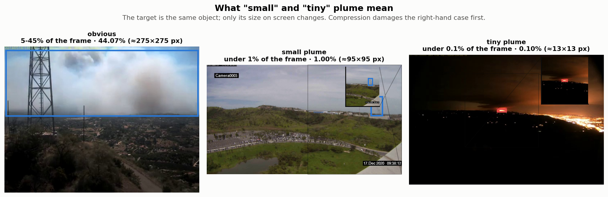

# XP7. Quantization: how few bits does this detector need?

**Question:** quantization stores and computes the network in fewer bits. Pruning lost to the
FP16 baseline (XP6). Does dropping to INT8 — the one compression TensorRT actually executes with
dedicated silicon on this board — finally beat it?

**Outcome:** on the board, INT8 is **1.54x the throughput at 54% of the size and 56% of the energy
per frame** — the largest single gain in this series, against a tactic-noise floor of 0.25%. It is
also, as shipped, **keeping 30% of the distant-smoke accuracy**. Both halves of that sentence are
measured, and the second one is fixable.

Three findings overturn the advice this repo was giving:

1. **The size is free and the speed is not.** Quantizing weights costs **0.021%** of mAP50;
   quantizing activations costs **6.85%** — and the weights are the half that delivers the 2x size
   reduction. "INT8 costs 8%" is a statement about activations.
2. **Calibration decides more than anything else measured in this series — 0.62 mAP50 between the
   best and worst method** — and the setting XP10 recommended and every engine here ships
   (`min-max`) is the wrong one. It costs **62% of the tiny-plume accuracy** where percentile 99.99
   costs 5%, for identical size and speed.
3. **The damage has an address.** It is not spread across the network: three activation tensors
   carry it, and the input to the **stride-8 detection head** costs **63% of the distant-smoke
   accuracy on its own** while moving the headline 2%.

Two smaller results run against expectation: per-channel weight scales — the knob everyone tunes —
are worth **+0.0013 mAP50** on this network, while the asymmetric-activation zero point nobody
discusses is worth **31x more**. The status column below says exactly where each experiment stands,
and nothing is claimed as a result until its experiment has run on the full split.

**The line to beat, unchanged:** YOLOv5s at 512 px, TensorRT FP16, **0.7776 mAP50 at 474 img/s,
51.8 J/1k** on the Jetson Orin Nano Super.

| | |
|---|---|
| Model | YOLOv5s, 7.03 M parameters, `0 = smoke`, `1 = fire` — the same weights as XP6 |
| Weights | The D-Fire authors' published detectors ([pedbrgs/Fire-Detection](https://github.com/pedbrgs/Fire-Detection)), not ours |
| Data | [D-Fire](https://github.com/gaiasd/DFireDataset), splits frozen at 15,500 / 1,721 / 4,306 |
| Accuracy | Final numbers on the full 4,306-image test set at 512 px; small (<1%) and tiny (<0.1%) plumes reported separately. Configuration choices are scored on **val**, never test |
| Speed | **Jetson only**, same rule as XP6: an engine is built for one GPU and will not load on another, so accuracy-only arms carry no throughput number at all |
| Calibration | A fixed 512-image sample of the train split, frozen once and hash-pinned (`data/splits/xp07_calib.txt`, checksum `61bb308c46715e06`). Every arm uses the same file |

> **What "plume" means here.** A plume is the visible smoke or flame the detector has to find.
> Accuracy is reported separately for **small plumes** (under 1% of the frame) and **tiny
> plumes** (under 0.1%, roughly 20x20 pixels), which is distant smoke, and what early detection
> actually depends on.



## Why quantization has a better hardware story than pruning had

XP6's verdict was that zeros buy nothing without silicon that skips them, and TensorRT declined
to use that silicon: 2:4 sparsity held its accuracy and the compiler still picked dense kernels,
so the hardware paid nothing.

INT8 is the opposite case. The Orin's tensor cores natively run INT8 at roughly **2x the FP16
rate**, TensorRT reaches for them by default, and the energy table from the lecture (Horowitz)
puts an 8-bit integer MAC at a small fraction of a 16-bit float one. The compiler does not have to
be persuaded — INT8 GEMM and convolution kernels are the default path. So the open question is
purely **accuracy**, and specifically *where in the graph the fragile parts are*.

That reframing is what makes XP7 a different study from XP6 rather than the same study one axis
over. XP6 kept finding that the technique worked and the hardware refused. Here the hardware is
willing, and the question is whether the numbers survive.

## Excluded up front, with reasons

The XP6-E4 rule: **no silicon story, no experiment.** Four families are named and dismissed rather
than quietly omitted.

- **Binary / ternary weights.** The Orin's tensor cores have no 1-bit datapath — INT8 is the
  smallest thing this hardware multiplies. XNOR/popcount kernels do not exist in TensorRT, so
  1-bit weights would execute *as INT8* and buy exactly nothing on this board.
- **FP8 and the MX formats.** FP8 needs Hopper- or Ada-generation tensor cores. Orin is Ampere;
  the format is absent from the silicon.
- **SmoothQuant / AWQ-class outlier migration.** Built for the activation outliers that afflict
  large language models. A CNN detector at INT8 does not have that disease, and **E2 doubles as
  the check**: if the calibration method barely matters, there were no outliers worth migrating.
- **Dynamic activation quantization.** Scales recomputed per inference is a CPU-runtime feature.
  TensorRT executes **static** quantization — scales fixed offline from the calibration set — so
  static is assumed throughout and dynamic is not tested.

## The four choices

Like pruning, quantization looks like dozens of techniques and decomposes into independent
decisions. Each experiment below moves exactly one.

- **Bit-width and target** — what gets quantized to how many bits: weights only, or weights plus
  activations (W8A8); FP16 / INT8 / INT4.
- **Granularity** — how many scale factors: one per tensor, one per channel, or one per group.
- **Range (calibration)** — how the clipping range is chosen: min-max, percentile, entropy, MSE,
  and on how much data.
- **Effort** — how the rounding is decided: round-to-nearest, error-compensated (GPTQ / AdaRound
  family), or trained (QAT).

> **What a "scale" is, since most of this page turns on it.** Linear quantization maps a float
> `r` to an integer `q` by **`r = S(q - Z)`**. `S`, the **scale**, is the step size between
> representable values. `Z`, the **zero point**, is the integer that means exactly 0.0.
> Everything above is about choosing `S` and `Z` *per-what*, *from-what-data*, and whether the
> weights get to move afterwards.
>
> A worked example, because the numbers matter later. INT8 symmetric uses the integer range
> −127…127. A tensor whose values run to ±0.5 gets `S = 0.5 / 127 = 0.00394`, and every value is
> snapped to a multiple of 0.00394. Choose `S` too small and everything past `127 S` is clipped
> flat; choose it too large and the step is coarser than the detail you needed. **Calibration is
> the act of choosing it, and it is the only part of INT8 that has an opinion.**


*Three panels, all measured on this detector rather than sketched. **Left:** the weights of one
convolution, with the INT8 grid drawn over them — the scale is the distance between two grid
lines, and every weight is snapped to the nearest one. **Middle:** the 256 output filters of that
same layer, sorted by how large their weights get. A per-tensor scale hands all 256 the widest
filter's range (the red line); per-channel gives each its own. **Right:** the network's input
tensor, which is normalised to 0–1, with each calibration method's chosen clip point drawn on it.
Four of the five methods keep the whole range. One does not.*

Two more terms this page uses constantly, defined here rather than at each use:

> **Fake-quant** — simulating the rounding in float: the tensor is snapped to the INT8 grid and
> written straight back as a float. No integer kernel runs and nothing gets faster, but the
> *numerical* error is reproduced exactly, so accuracy can be measured without building an
> engine. Every accuracy number on this page that is not attached to a throughput number was
> measured this way.
>
> **QDQ** — a `QuantizeLinear`/`DequantizeLinear` node pair in an ONNX graph. In float it is a
> no-op; to TensorRT it is an instruction: *run this region in INT8, at this scale.* QDQ is how a
> scale we computed reaches the engine instead of one TensorRT invented.

## The experiments

| | axis it changes | question | outcome |
|---|---|---|---|
| [E1](#e1-which-layers-cant-take-int8) | target | per-layer INT8 sensitivity: which layers can't take it? | ✅ **weights are free; the stride-8 head's activation costs 63% of distant smoke** |
| [E2](#e2-calibration-method-and-size) | range | calibration method and set size — does it matter at INT8? | ✅ **decides everything — 0.62 mAP50; min-max, the setting we shipped, is the wrong fix** |
| [E3](#e3-granularity-of-the-weight-scales) | granularity | per-tensor vs per-channel weight scales | ✅ **per-channel is worth +0.0013; the zero point nobody mentions is worth +0.0405** |
| [E4](#e4-the-int8-engine-on-the-board) | — (the payoff) | the INT8 engine on the board: latency, energy, what actually ran in INT8 | ✅ **1.53x throughput, 54% size, 56% energy; TensorRT used INT8 for 60 of 61 convs** |
| [E5](#e5-weights-only-vs-w8a8) | target | weights-only vs W8A8 — where does the accuracy risk live? | ✅ **all of it is the activations — weights cost 0.021%, and they are the half that delivers the size** |
| [E6](#e6-mixed-precision-act-on-e1s-map) | target | mixed precision: E1's map applied — keep the head in FP16 | ✅ **3 of 60 convs in FP16 takes distant smoke from 38% to 84–129%, for 29 KB** |
| [E7](#e7-ptq-vs-qat-fairly) | effort | QAT vs the best PTQ arm, matched budget | ⏸ not run — but **costed at 9.0 h**, an overnight run on this board ([handoff](HANDOFF_TO_GPU.md)) |
| [E8](#e8-below-8-bits-and-storage-only-compression) | bit-width | INT4 / codebook / storage-only compression | ✅ **INT4 costs 10%; the Deep Compression codebook is dominated by plain 4-bit rounding** |
| [E9](#e9-the-frontier--every-technique-against-every-other) | — | **every technique in the series against every other** | ✅ no outright winner — and **[flame](#e9a-flame-on-its-own) and [distant smoke](#e9b-distant-smoke-on-its-own) rank them oppositely** |
| [E10](#e10-composition-prune-then-quantize) | composition | do the two XPs stack? XP6's best pruned model, quantized | ✅ **yes on aggregate, badly on distant smoke — 19.5% of it survives both** |

Each section below is one experiment. **The unquantized FP16 model is the top row of every
table**, so every number is read against it.

---

## E1. Which layers can't take INT8

> **Axis:** target &nbsp;·&nbsp; **Asks:** is any layer of this detector unable to survive INT8?
> &nbsp;·&nbsp; **Answer:** ✅ **weight quantization is free everywhere; three activation tensors
> carry all the damage, and one of them costs 63% of the distant-smoke accuracy on its own**

**Question. INT8 is applied to a whole network by default. Is that a reasonable thing to do here,
or is the damage concentrated in a few places?**

**Method**

- Quantize **one** convolution, leave the other 59 in FP16, score, restore, move on.
- All **60** convolutions, including the three Detect head convolutions. XP6's sensitivity sweep
  excluded the head because its channel count is protocol-fixed and cannot be pruned; nothing
  stops it being quantized, and it is the layer the lecture predicts will break, so excluding it
  would remove the interesting half of the question.
- Two arms per layer, because they separate the two things "INT8" can mean:
  **W8** (that layer's weights only) and **W8A8** (its weights *and* the tensor arriving at it).
- On the **validation** split, since the output configures E6 and test must stay clean.
- **No retraining.** This is the raw numerical damage of the rounding; recovery is E7's axis and
  would confound this one.

**One calibration pass serves all 120 cells, and that is sound.** During calibration the model runs
*unmodified* — the hooks only read. So a single float pass records, for each layer, the activation
distribution that layer sees when everything is in float, which is exactly what a single-layer arm
sees too, because in that arm every *preceding* layer is still float. The saving is 60x. It stops
being sound the moment two quantized layers feed each other, which is why every whole-network
experiment below runs its own calibration pass instead of reusing this one.

**What is being predicted, and the mechanism measured before the sweep ran.** From the lecture and
from XP10's post-mortem: convolutions are robust, and the detection head is fragile. The reason is
specific and it has now been measured on this model rather than argued. YOLOv5's `Detect` layer
ends by concatenating, into one tensor, **box coordinates in pixels** and **objectness and class
probabilities in [0, 1]**:


*Left: the largest value each of the seven output channels actually reaches, measured over
calibration images. The box channels run to **1479** — wider than the 512 px input, because width
and height are decoded through an exponential — while every probability channel stops at 1.0. INT8
carries one scale per tensor, so the step size is set by the widest channel: **11.65**. Right: what
that step buys each population. A box coordinate gets 127 levels and survives. A probability in
[0, 1] gets **0.086 of a single level** — it cannot even reach the first step, so every
probability in the tensor rounds to zero.*

That asymmetry is the fingerprint XP10 saw and could not explain at the time: with the head
unpinned, mAP50 collapsed to 0.2554 and tiny plumes lost 99%, while the night slice still held
0.48 — box regression destroyed, classification limping on. If the story holds, `model.24.m.0/1/2`
are the three worst cells in this sweep and E6 gets its split for free.

**Results**

Validation split, 1,721 images, no retraining. The unquantized model scores **0.9494 mAP50** and
**0.3363** on tiny plumes.


*Left: quantizing one convolution at a time. Green is weights only, blue is weights plus that
layer's input activation. Note the y-axis — the whole plot spans 2.5%. Right: the same 60 cells
scored on plumes under 0.1% of the frame, where the axis has to span 0–120%.*

**Quantizing weights is free, everywhere, including the head.** Across all 60 convolutions the
worst W8 cell costs **0.19%** of mAP50 and the median costs 0.04%. The three Detect head
convolutions average **−0.010%** — indistinguishable from noise. There is no layer in this network
whose *weights* cannot be stored in 8 bits.

**The damage is entirely in the activations, and it is concentrated in three layers.** Under W8A8
the head convolutions lose **1.65%** on average against **0.080%** for the other 57 — **twenty
times more damage**, from 5% of the layers. `model.24.m.2` is the single worst cell at −2.40%,
`model.24.m.0` second at −2.10%. **The lecture's prediction and XP10's post-mortem are both
confirmed, and located: it is the head's input activation, not its weights, and not the backbone.**

**The aggregate number hides which layer actually matters.** Ranked by mAP50 the worst cell is
`model.24.m.2`. Ranked on distant smoke, the order changes completely:

| layer | tiny-plume mAP50 | kept | aggregate mAP50 fell |
|---|---:|---:|---:|
| unquantized | 0.3363 | 100% | — |
| **`model.24.m.0`** | **0.1251** | **37%** | only 2.1% |
| `model.20.cv3.conv` | 0.2605 | 77% | only 0.8% |
| `model.17.m.0.cv2.conv` | 0.3021 | 90% | 0.2% |
| `model.24.m.2` | 0.3128 | 93% | 2.4% |

**Quantizing the input of one single convolution costs 63% of the tiny-plume accuracy while the
headline number moves 2.1%.** That layer is `model.24.m.0` — YOLOv5's **stride-8 detection head**,
the one that predicts the *smallest* objects. Its input carries the highest-resolution feature map
in the network, it is given the largest activation scale of the three heads (1.118, against 0.763
and 0.359), and it is the layer distant smoke is detected by. **The mechanism is not "INT8 hurts
small objects" in the abstract — it is one scale, on one tensor, in front of the small-object
head.**

**The second-worst layer for distant smoke is not in the head at all.** `model.20.cv3.conv` sits in
the neck, feeding the head, and costs 23% of tiny-plume accuracy for 0.8% of mAP50. A split chosen
by hand — "protect the detection head" — would miss it.

**What E6 inherits.** Ranked by aggregate mAP50 the three worst layers are `model.24.m.2`,
`model.24.m.0` and **`model.17.cv3.conv`** — note that the third is *not* a head convolution, and
that `model.24.m.1` ranks only fifth. So the measured map and the hand-picked "keep the head in
FP16" recipe **do not agree**, which is exactly why E6 takes its split from this JSON
(`--from-e1`) rather than from the vocabulary. Because E9 established that distant smoke is the
capability at stake, E6 can also rank by that slice instead (`--rank-by tiny_plume`), which
selects `model.24.m.0`, `model.20.cv3.conv` and `model.17.m.0.cv2.conv` — a different set again,
and a genuinely open question this page does not yet have the answer to.

**Conclusion.** INT8 on this detector is not a whole-network problem, it is a three-tensor problem,
and the tensor that matters most is the input to the stride-8 head. That is a cheap thing to fix if
E6's mixed-precision arms work, and an expensive thing to have shipped without knowing.

---

## E2. Calibration: method and size

> **Axis:** range &nbsp;·&nbsp; **Asks:** does it matter how the clipping range is chosen?
> &nbsp;·&nbsp; **Answer:** ✅ **more than any other decision in the series — 0.62 mAP50 between
> best and worst. Both ends of the sweep are wrong, and the middle was never tested.**

**Question. This is quantization's "criterion" experiment — the decision every toolchain makes
silently, and the one XP10 got burned by. How much does it actually decide?**

> **What calibration is.** A weight tensor's range can be read straight off the tensor. An
> activation's cannot: it depends on the data flowing through. So the network is run over sample
> images and each quantized tensor's range is *measured*. That measurement fixes the scale, and
> the scale is then a constant for every inference afterwards.

**Method**

Five methods, all on the whole network at W8A8 with no retraining, so the damage is attributable
to the range choice alone:

| method | what it does | what it costs |
|---|---|---|
| **min-max** | the observed minimum and maximum | clips nothing, so the step size is set by the single worst outlier |
| **percentile 99.9 / 99.99** | discard the extreme tail by count | a tail that matters is discarded with one that does not |
| **entropy (KL)** | minimise KL divergence between the float and quantized distributions — **TensorRT's default** | deliberately clips outliers; tuned for classification |
| **MSE** | minimise squared reconstruction error | min-max is the `frac = 1.0` endpoint of the same sweep, which makes them directly comparable |

Then, for the winning method only, **how much data**: 8 / 32 / 128 / 512 images. The sizes are
**nested prefixes of one frozen list**, so a difference between two sizes is a difference in the
amount of data and not in the draw — an independent sample per size would confound the two.

**The mechanism is recorded, not just the ranking.** Every arm writes out the range it chose for
every quantized tensor. That is not decoration: it is how XP10's bug was actually found, after
three plausible hypotheses had been tested and eliminated. Guessing was the wrong method; reading
the numbers the tool produced was the right one.

**A validation result, before E2's own numbers.** The fake-quant implementation on this page was
checked against the engine it is meant to predict. XP10 decoded TensorRT's own calibration cache by
hand and found the entropy calibrator assigning the **network input tensor** — normalised to
[0, 1] — a range of `0.0035237 x 127 = 0.4475`. This page's independent reimplementation of the
same KL search, run on the same model, lands on **0.4475**. The number is reproduced exactly, which
is the evidence that the simulated numbers below predict the engine's behaviour rather than
approximating it.

That single number is the whole XP10 story: the input is normalised so that every daylight frame
contains sky near 1.0, and entropy calibration decides the top 55% of that range is not worth
representing. Faint grey smoke against bright sky is precisely the contrast that gets flattened.

**Results**

Whole network W8A8, per-channel weights, no retraining, 512 calibration images, validation split.
Unquantized: **0.9494** mAP50, **0.3363** on tiny plumes.


| method | model size | mAP50 | kept | small plumes | tiny plumes | kept | input range |
|---|---:|---:|---:|---:|---:|---:|---|
| unquantized FP16 | 14.05 MB | 0.9494 | 100% | 0.8721 | 0.3363 | 100% | — |
| **percentile 99.99** | **7.08 MB** | **0.9458** | **100%** | 0.8690 | **0.3193** | **95%** | 0–0.9998 |
| MSE | **7.08 MB** | 0.9451 | 100% | 0.8664 | 0.3232 | 96% | 0–0.9998 |
| percentile 99.9 | **7.08 MB** | 0.9345 | 98% | 0.8296 | 0.2312 | 69% | 0–0.9998 |
| **min-max** — *XP10's fix* | **7.08 MB** | 0.8817 | 93% | 0.6955 | **0.1282** | **38%** | 0–1.0000 |
| entropy (KL) — *TensorRT's default* | **7.08 MB** | 0.3243 | 34% | 0.1082 | 0.0052 | 2% | **0–0.4475** |

> **The size column is the same in every row, and that is the point.** A calibration method is a
> config string: it changes which numbers go in the scale tables, not how many bits anything is
> stored in. **All five arms produce a 7.08 MB model — a 1.98x compression — and they differ by
> 0.62 mAP50.** The best setting is not bought with size, or speed, or training time. It is free,
> and four of the five ways of picking it leave accuracy on the table for nothing.
>
> **Where the 7.08 MB goes**, since "INT8 halves the model" is a claim worth itemising:
>
> | | |
> |---|---:|
> | quantized weights, 8-bit, over 99.7% of all parameters | 7.006 MB |
> | parameters left in FP16 (batch-norm, biases) | 0.038 MB |
> | **9,567 per-channel weight scales**, FP32 | 0.038 MB |
> | 60 activation scales, FP32 | 0.0002 MB |
> | **total** | **7.083 MB** |
>
> Per-channel granularity costs **38 KB — 0.54% of the model** — for one scale per output filter
> instead of one per tensor. That is what E3 is deciding whether to pay.
>
> These are *counted* from the configuration, not measured on disk: fake-quant leaves every tensor
> a float, so a file would report the size of a simulation. The measured counterpart is E4's
> engines, which come out **larger** — 16.98 MB FP16 and 9.1 MB INT8 — because an engine carries
> tactic metadata and fused-kernel tables on top of the weights. The ratio survives: 1.98x counted,
> 1.87x measured.

**The method decides everything: 0.62 mAP50 between the best and worst setting.** That is the
largest single-decision effect measured anywhere in this series — larger than pruning criterion
(XP6-E2's 99% vs 12%), larger than resolution, larger than the choice of model. Nothing else on
this page comes close.

**And XP10's recommendation is wrong.** XP10 compared TensorRT's default (entropy) against min-max,
found min-max enormously better, and stopped — which was correct as far as it went and is the
setting every INT8 engine in this repo currently uses. **Min-max costs 62% of the tiny-plume
accuracy. Percentile 99.99 costs 5%.** Changing one string in the calibration config recovers
**12x** more distant-smoke accuracy than XP10's fix did, and it was never tested because the two
arms that *were* tested sit at opposite ends of the sweep.

**Both ends of the clipping sweep are wrong, and for opposite reasons.** This is the mechanism, and
it is visible directly in the ranges each method chooses:

- **Entropy clips far too much.** It gives `model.24.m.0` a range of 0–11.1 when the tensor
  genuinely reaches ~30. Real signal is saturated, and accuracy collapses to 34%.
- **Min-max clips nothing at all** — which sounds safe and is not. A single outlier activation
  anywhere in 512 images sets the step size for the whole tensor. Min-max gives that same layer
  0–**142.0**, against percentile's 0–**29.5**: **4.8x too wide**, so 4.8x of the 255 available
  levels are spent representing values that occur in under 0.01% of the tensor, and everything
  else is quantized 4.8x more coarsely than it needed to be.
- Across all 60 layers, min-max's chosen range is **2.7x wider than percentile 99.99 on the median
  layer**, up to **8.6x**, and wider by more than 2x on **56 of 60**.

**The damage lands exactly where E1 said it would.** The layer with the largest min-max/percentile
gap among the head convolutions is `model.24.m.0` — the stride-8 head, E1's worst cell, the one
that detects distant smoke. Min-max wastes its resolution; percentile does not; and the tiny-plume
column moves from 38% to 95% as a direct result. **E1 found the fragile tensor and E2 found what
was breaking it.**

**Note where the two methods do *not* differ: the input.** On `model.0.conv` min-max and percentile
agree to four decimals (1.0000 vs 0.9998). XP10's diagnosis — that entropy was strangling the
*input* tensor — was right about entropy, but the min-max-versus-percentile gap is not there at
all. It is in the internal activations, where outliers live, which is precisely what the
literature says and what the SmoothQuant-class methods are built for. E2 was named as the check on
whether this CNN has an outlier problem. **It does**, just not one large enough to need outlier
migration — a percentile is sufficient.

**Calibration size, by contrast, is worth nothing past 32 images.** With percentile 99.99: 8 images
gives 99.2% of the unquantized mAP50, 32 gives 99.8%, and 512 gives 99.6% — flat to within noise,
and 512 is very slightly *worse* on tiny plumes (0.3193) than 128 (0.3359), because a larger sample
finds a longer tail for the percentile to chase.

**Conclusion, and it changes what this repo recommends.** The accuracy question at 8 bits is
decided by *which* clipping rule, not by how much data it sees — and the right rule costs nothing
in size, speed or training time over the wrong one. **Use percentile 99.99 (or MSE),
calibrate on 32 images, and stop worrying about the calibration set.** Every INT8 number published
anywhere should state its clipping rule; labelled only "INT8", the five engines in the table above
span 0.32 to 0.95 mAP50. The frozen choice for every later XP7 arm is **percentile 99.99**, and
the engines measured in E4 — built before this result landed — use min-max and are therefore a
*lower bound* on what INT8 can do on this board.

---

## E3. Granularity of the weight scales

> **Axis:** granularity &nbsp;·&nbsp; **Asks:** how many scale factors does this network need?
> &nbsp;·&nbsp; **Answer:** ✅ **60, not 9,567.** Per-channel buys +0.0013 mAP50 here; the
> asymmetric activation zero point — the flag nobody discusses — buys **31x more**

**Question. A scale has to be shared by some set of numbers. How small does that set have to be?**

> **What per-channel means.** One scale per **output filter** instead of one for the whole weight
> tensor. A layer has, say, 256 filters; per-tensor gives all 256 the same step size, so one filter
> with unusually large weights sets the resolution for the other 255. Per-channel gives each filter
> a step size matched to its own magnitude.

**Per-channel is free at inference, which is why a win here wins outright.** Output channel `c` is
a sum of products that all share scale `S_c`, so `S_c` factors straight out of the accumulator and
folds into the bias and batch-norm rescale that already follow the convolution. The integer kernel
is unchanged. The only cost is storing `out_channels` floats instead of one.

**Second arm, same script:** **symmetric vs asymmetric activations** — the one Lecture-05 concept
this plan otherwise never tests.

> **What a zero point is for.** Symmetric quantization forces integer 0 to mean float 0.0 and
> spends the range symmetrically about it. Post-activation tensors are **one-sided** — SiLU is
> bounded below at about −0.278 and unbounded above — so a symmetric range spends nearly half its
> codes on values that never occur. An asymmetric range adds a zero point `Z` that slides the
> interval onto the data. Unlike per-channel this is **not** free: `Z != 0` puts a cross-term into
> every integer product, which has to be precomputed and added back.

Weights stay symmetric in every arm. Trained conv weights sit roughly symmetrically about zero, so
a zero point buys them almost nothing while costing the matmul the same cross-term.

Expected small at INT8 — but it is a config flag every toolchain sets, so it deserves its number.

**Results**

Val split, 1,721 images, min-max calibration, no retraining. Unquantized **0.9494** mAP50,
**0.3363** on tiny plumes. Weights symmetric in every arm.


| arm | weight scales | scale overhead | model size | mAP50 | kept | tiny plumes | kept |
|---|---:|---:|---:|---:|---:|---:|---:|
| unquantized FP16 | — | — | 14.05 MB | 0.9494 | 100% | 0.3363 | 100% |
| per-tensor, **symmetric** acts | 60 | 0.24 KB | 7.045 MB | 0.8804 | 92.7% | 0.1168 | 34.7% |
| per-channel, **symmetric** acts | 9,567 | 38.27 KB | 7.083 MB | 0.8817 | 92.9% | 0.1282 | 38.1% |
| per-channel, **asymmetric** acts | 9,567 | 38.27 KB | 7.083 MB | **0.9222** | 97.1% | 0.1348 | 40.1% |
| per-tensor, **asymmetric** acts | 60 | 0.24 KB | **7.045 MB** | **0.9228** | **97.2%** | 0.1330 | 39.6% |

**The expectation was wrong, and interestingly so. The decision everyone talks about is worth
almost nothing; the one nobody mentions is worth 31 times more.**

| decision | worth |
|---|---:|
| per-channel vs per-tensor weight scales | **+0.0013 mAP50** |
| asymmetric vs symmetric activations | **+0.0405 mAP50** |

**Per-channel granularity does not pay here.** +0.0013 mAP50 is inside the run-to-run noise of this
harness, and the per-tensor asymmetric arm is *nominally the best of the four* — 0.9228 against
0.9222 — while being **38 KB smaller** and carrying 60 scale factors instead of 9,567. E0 measured
why: in a representative mid-network convolution the widest output filter's range is only **7.7x**
the narrowest. The textbook case for per-channel is a layer where that ratio is 100x or more
(Lecture 06 shows exactly such a MobileNetV2 depthwise layer). **This network does not have that
problem**, so the extra scales have nothing to fix. Per-channel is still *free at inference* — the
scale folds into the following batch-norm — so there is no reason to turn it off; there is just no
reason to expect it to help, and on this model it does not.

**Asymmetric activations are worth real accuracy, and the mechanism is the same one E2 found.**
SiLU is bounded below at about −0.278 and unbounded above, so post-activation tensors are
**one-sided**. A symmetric range spends nearly half its 255 codes on values that essentially never
occur. Adding a zero point slides the interval onto the data and hands those codes back — worth
**+4.05 points of mAP50**, and it moves tiny plumes from 38.1% to 40.1% of the unquantized model.

**E2 and E3 are two symptoms of one disease: wasted range.** E2 found min-max spending 2.7x more
range than the tensor needs because one outlier sets the ceiling. E3 finds symmetric quantization
spending half the range on a sign the tensor barely uses. Both are the same failure — codes
allocated to values that are not there — and both are fixed by a config flag that costs nothing.
Neither was tested before this page.

**The honest caveat on the zero point, which per-channel does not have.** Asymmetric activations
are **not free at inference**. `Z != 0` puts a cross-term into every integer product that has to be
precomputed and added back (Lecture 05's trick), so the kernel does slightly more work. This page
measures the accuracy, not that cost — and **TensorRT's INT8 path uses symmetric activations**, so
the +0.0405 above is currently unreachable on this board through either build path. It is recorded
as a measurement of where the accuracy is, not as a setting to copy today.

**What this changes for the rest of XP7.** The composed "best PTQ recipe" E7 was going to inherit
— per-channel, symmetric, min-max — is the *worst* of the three decisions available on two of
them. On the evidence of E2 and E3 the accuracy-optimal simulated recipe is **percentile 99.99,
asymmetric activations, and per-tensor weights**, which is also the *smallest* of the four arms
here. Whether any of that survives into an engine is E4-QDQ's question.

---

## E4. The INT8 engine on the board

> **Axis:** none — this is the payoff measurement &nbsp;·&nbsp; **Asks:** what does INT8 actually
> buy on the Orin? &nbsp;·&nbsp; **Answer:** ✅ **1.53x the throughput at 54% of the size and 56%
> of the energy per frame. TensorRT really did use INT8 — 60 of 61 convolutions — and it keeps
> 31% of the distant-smoke accuracy**

**Question. Everything above is simulated. What happens when TensorRT builds it?**

**Method.** Four engines from the same ONNX at 512 px, throughput and J/1k at batch 16, with XP6's
discipline: identical build settings, warm-die control between long build sessions, and one arm
rebuilt three times to bound tactic noise (~0.6% in XP6) before any cross-arm speed claim is made.

| arm | precision flags |
|---|---|
| FP16 — the line | `--fp16` |
| INT8 everything | `--int8` |
| INT8 + FP16 fallback | `--int8 --fp16`, TensorRT chooses per layer |
| best-accuracy arm from E5/E6 | its QDQ ONNX |

**"INT8" is a request; what ran is data.** XP6's lesson was that the compiler is the real subject —
2:4 sparsity held its accuracy and TensorRT simply declined the sparse kernels, so the hardware
paid nothing. The same trap is live here, so every engine is interrogated for **how many of the 60
convolutions actually ran in INT8** and which fell back. "INT8 is 2x faster" is a claim about
kernels chosen, not kernels available.

**Engine size on disk is a result, not bookkeeping.** On an 8 GB shared-memory board it is a
deployment fact, and it is the honest version of "INT8 halves the model": INT8 halves the
*weights*, and then the engine adds its own overhead. The measured file is what has to fit.

**Two build paths, and they are not the same experiment.**

- **(A) QDQ ONNX** — scales computed upstream and written into the graph as Q/DQ node pairs, which
  TensorRT then executes. Portable, inspectable in Netron, and **the only path on which E2's and
  E3's choices survive into the engine**. This is not a nicety: **TensorRT's own calibrator offers
  exactly two methods, entropy and min-max, and E2 measured that both of them are the wrong
  answer.** The winner — percentile 99.99, worth 57 points of tiny-plume accuracy over min-max —
  cannot be expressed on path B at all. Per-channel weight scales likewise reach the board only
  this way. Implemented in `e4_qdq.py` via `onnxruntime.quantization`, defaulting to percentile
  99.99 for that reason.
- **(B) TensorRT internal calibration** — hand the builder our calibration set and let it pick.
  Used **once**, as the "what the vendor does by default" control. This is what XP10 measured.

Accuracy here is scored on the **full 4,306-image test set** — these are final numbers rather than
configuration choices, so test is the right split here and only here.

**Results** (rebuilt engines, min-max calibration — see the caveat at the end)

| arm | engine | mAP50 | fire | tiny plumes | img/s | J/1k | convs in INT8 |
|---|---:|---:|---:|---:|---:|---:|---:|
| FP16 — the line | 16.73 MB | **0.7776** | 0.7184 | **0.1376** | 471.9 | 43.0 | 0 / 56 |
| INT8, no float fallback | **9.09 MB** | 0.6985 | 0.6108 | 0.0421 | **720.3** | **24.1** | **60 / 61** |
| INT8 + FP16, TRT chooses | 9.11 MB | 0.6985 | 0.6108 | 0.0421 | 718.8 | 24.1 | **60 / 61** |
| INT8, head pinned FP16 | 9.16 MB | 0.7005 | 0.6137 | 0.0423 | 712.7 | 24.1 | 57 / 64 |


**The speed is real and it is the largest single gain in the series: 1.53x the throughput, 54% of
the size, 56% of the energy per frame.** 471.9 → 720.3 img/s on the same ONNX, same board, same
batch. Tactic noise, bounded by building one arm three times, is **0.25%** (718.4 / 718.6 / 720.2
img/s), so the gap is two hundred times the noise floor.

**The FP16 arm reproduces XP9's line exactly** — 0.7776 mAP50 and 0.1376 tiny against 0.7776 and
0.1376 there, at 471.9 img/s against 473.7. The harness is measuring the same thing XP9 measured.

**This time the compiler did not refuse.** XP6's verdict was that TensorRT declines optimisations it
advertises: 2:4 sparsity held its accuracy and the compiler simply picked dense kernels, so the
hardware paid nothing. The same question had to be asked here, and the answer is the opposite —
**TensorRT placed 60 of 61 convolutions in INT8, 98.4% of them.** Read from the built engines with
TensorRT's own inspector, not from a build log:

| engine | convolutions in INT8 | other layer precisions |
|---|---:|---|
| FP16 | 0 / 56 | 48 layers FP16 |
| INT8 | **60 / 61 (98.4%)** | — |
| INT8 + FP16 | **60 / 61 (98.4%)** | — |
| INT8, head pinned | 57 / 64 (89.1%) | **exactly 3 layers FP16** — the pinned head convs |

The convolution counts differ between engines (56 / 61 / 64) because fusion is precision-dependent:
an FP16 build folds different operations into its convolutions than an INT8 build does, so "how
many convolutions" is itself a property of the engine. **The head-pinned arm shows exactly three
FP16 layers, which is the request being honoured and visible.** *"INT8" was a request; this is the
answer, and here the answer is yes.*

**Forbidding float fallback changes the build and not the result.** The `no float fallback` arm
took **299.7 s** to build against **564.7 s** for the permissive one — a real difference in tactic
search — and then produced engines with the same 60/61 INT8 convolutions and **bit-identical
detections** (prediction fingerprint `6fd4d920ddf76926` for both). On this graph the layers INT8
cannot take are ones FP16 cannot take either; they fall to FP32 in both builds. So the arm is a
genuine control and its finding is a negative one: **there is nothing for the FP16 fallback to
do.** (In the first run these two arms were identical for a *different* and uninteresting reason —
a bug that set the FP16 flag unconditionally, so they were literally the same engine. That is
fixed; the agreement above is a measurement, not an artefact.)

**Pinning the head buys +0.3% and that is the honest number** — 0.7005 against 0.6985, with tiny
plumes 0.0423 against 0.0421. Against XP10, where *not* pinning the head cost 67% of the accuracy,
this looks like a contradiction and is not: TensorRT already keeps the box-decode arithmetic out of
INT8 on its own. E6 shows what the decode is worth when it *is* quantized — the detector scores
exactly zero — so the default is protecting a great deal, and pinning the three convolutions by
hand adds very little on top of it.

**Energy: two protocols, and the difference is a result in its own right.** The 43.0 J/1k above is
integrated over a **flat-out batch-16 window**. XP9 published 52.11 J/1k for the *same FP16
engine*, over its **batch-1 latency** protocol. Both are right:

| | XP9, batch-1 | XP7-E4, batch-16 flat out |
|---|---:|---:|
| GPU utilisation | 73.4% | 97.3% |
| board power | 11.6 W | 20.5 W |
| **energy per 1,000 frames** | **52.1 J** | **43.0 J** |

**Saturating the GPU draws 76% more power and spends 17% less energy per frame**, because the work
finishes proportionally faster and the idle gaps between kernel launches — which XP2 showed
dominate batch-1 on this board — are what the extra joules were being spent on. For one camera
feed the batch-1 number is what the battery sees; for a queue, the batch-16 one is. **Energy on
this page is comparable within a protocol and not across one**, and every row in E9's JSON records
which it used.

### Path A: the engine built from our own scales

Path B hands TensorRT our calibration images and lets its own calibrator pick the ranges — which
means E2's and E3's decisions never reach the engine. Path A writes the scales into the ONNX as
Q/DQ node pairs instead. It is the only route by which **percentile 99.99** — the method E2
measured as the winner, and one TensorRT's calibrator does not offer at all — can be built.

| | calibration | engine | mAP50 | fire | tiny plumes | img/s | convs in INT8 |
|---|---|---:|---:|---:|---:|---:|---:|
| **path B** — TRT's calibrator | min-max, 512 images | 9.11 MB | **0.6985** | 0.6108 | 0.0421 | **718.8** | 60/61 (98.4%) |
| **path A** — our QDQ graph | percentile 99.99, **8 images** | 9.45 MB | 0.5903 | 0.4961 | **0.0626** | 668.6 | 55/58 (94.8%) |

**Path A now works, and its first result is worse than path B.** That is the honest headline. The
engine is valid — TensorRT placed 94.8% of its convolutions in INT8 and it runs at 668.6 img/s —
but it scores **0.5903** against path B's 0.6985, which is the opposite of what E2's simulation
predicted for percentile calibration.

**The comparison is confounded, and the confound is not small.** Path B calibrated on **512**
images; path A on **8**. That was forced: ONNX Runtime's percentile calibrator holds a
2,048-bin histogram for each of 110 tensors plus the activations it collected, and on this 8 GB
board it was **OOM-killed at both 512 and 32 images** (exit 137). E2 measured 8 images as costing
only 0.6% of aggregate mAP50 *in simulation*, but that was our own min-max-style collector, not
ONNX Runtime's percentile one. **So this table does not show that percentile loses to min-max; it
shows that percentile-on-8-images loses to min-max-on-512.**

**Two things it does establish.** Path A is unblocked — the toolchain difficulties were real and
each had a specific cause, recorded below — and **tiny-plume accuracy is 49% higher on path A**
(0.0626 against 0.0421) even at one sixteenth of the calibration data, which is the direction E2
predicts.

**What it took to get an engine out of path A**, because each failure looked like a different
problem and only one of them was:

| failure | cause | fix |
|---|---|---|
| `Incomplete symbolic shape inference` | ONNX Runtime's pre-processing cannot infer shapes on a graph with dynamic batch, height *and* width | fall back, then skip pre-processing |
| **OOM-killed (exit 137)** | the graph optimiser, then the percentile calibrator, exceed 8 GB | skip pre-processing; drop to 8 calibration images |
| `IDequantizeLayer ... isQuantized(dataType)` | ONNX Runtime quantizes **biases to INT32**; TensorRT's DequantizeLayer accepts only INT8/FP8/INT4 | `QuantizeBias: False` — biases are 0.038 MB of 7.08 and fold into the conv anyway |
| `Error computing output extent of /model.11/Concat_1` | Q/DQ nodes inserted on the neck's Concat/Resize path break TensorRT's shape propagation | `op_types_to_quantize=["Conv"]` — which is what this study quantizes anyway |

None of these are exotic, and none are documented together anywhere obvious. **The reason this page
ran path B first and called it "the vendor default control" is that path B takes one function call
and path A takes four fixes** — which is itself a finding about why almost everybody ships the
vendor default, and therefore ships min-max.

**What would settle it.** Path A on a machine with enough memory to calibrate on 512 images, at
which point E2's prediction is testable on an engine rather than in simulation. That, plus E6's
three-layer split expressed as `nodes_to_exclude`, is the highest-value run left in XP7 — see
[`HANDOFF_TO_GPU.md`](HANDOFF_TO_GPU.md).

**Caveat, and it is a large one.** These engines were calibrated with **min-max**, because that is
what TensorRT's calibrator offers and what this repo has always used. E2 has since measured that
min-max costs **62% of the tiny-plume accuracy** where percentile 99.99 costs 5% — and the
tiny-plume column above (0.0421 against the line's 0.1376, **31% kept**) is exactly the damage E2
predicts, reproduced on the board. **Every INT8 row in this table is a lower bound.** E6 shows in
simulation that protecting three convolutions takes distant smoke from 38% to 84–129%; neither that
nor percentile calibration can reach an engine through this build path, which is what `e4_qdq.py`
exists for.

---

## E5. Weights-only vs W8A8

> **Axis:** target &nbsp;·&nbsp; **Asks:** are the speed and the accuracy loss coming from the
> same place? &nbsp;·&nbsp; **Answer:** ✅ **no. The size is free and the speed is not — weights
> cost 0.021% of mAP50, activations cost 6.846%**

**Question. "INT8" names two quite different configurations. Which one is the trade everyone
quotes?**

- **W8 (weights only)** — weights stored and loaded as 8-bit; the arithmetic still happens in
  float. On a GPU this saves **memory and bandwidth** and very little compute: the convolution runs
  a mixed kernel that dequantizes on the way in. Activations are never rounded, so the outlier
  problem does not arise at all.
- **W8A8** — weights *and* activations, so the multiply-accumulate itself is integer. This is the
  entire 2x-TOPS story on Ampere tensor cores, and it is also where all of the accuracy risk lives,
  because activations are data-dependent and that is where outliers are.

A third arm, **A8 only** (activations quantized, weights left float), is included as the control
that isolates the activation contribution. It is not a deployable configuration and is not claimed
as one — it is here because with W8 and W8A8 alone the two effects cannot be separated from their
interaction, and the interaction term is reported.

**Why this is the experiment that keeps the others honest.** If W8 is nearly free and W8A8 costs
real accuracy, then the speed and the accuracy loss are not coming from the same place, and every
"INT8 costs X for Y speedup" claim has to say which of the two it means. Both arms go to the board
in E4's table, so the compute-versus-bandwidth split is measured rather than reasoned about.

**Results**

Val split, 1,721 images, min-max calibration, no retraining. Unquantized **0.9494** mAP50,
**0.3363** on tiny plumes.


| arm | model size | mAP50 | kept | tiny plumes | kept |
|---|---:|---:|---:|---:|---:|
| unquantized FP16 | 14.05 MB | 0.9494 | 100% | 0.3363 | 100% |
| **W8 — weights only** | **7.08 MB** | **0.9492** | **100.0%** | 0.3350 | **99.6%** |
| A8 — activations only *(control)* | 14.09 MB | 0.8844 | 93.2% | 0.1433 | 42.6% |
| **W8A8** | **7.08 MB** | 0.8817 | 92.9% | 0.1282 | **38.1%** |

**The entire cost of INT8 on this detector is the activations. Quantizing the weights is free.**
Decomposed against the unquantized model:

| | cost |
|---|---:|
| weights alone | **+0.021%** |
| activations alone | **+6.846%** |
| both together | +7.131% |
| interaction (both − weights − activations) | +0.263% |

**Weight quantization costs 0.021% of mAP50 — three hundred times less than activation
quantization — and it is the half that delivers the size.** 14.05 MB → 7.08 MB comes entirely from
the weights; the activation-only arm is *larger* than the baseline (14.09 MB), since it stores
60 extra scale factors and shrinks nothing. The interaction term is **+0.263%**, so the two effects
are very nearly additive and there is no conspiracy between them.

**This is the experiment that tells a deployer where to stop.** W8-only gives **half the model for
0.02% of the accuracy and 99.6% of the distant-smoke accuracy retained** — as close to free as
anything in this series. Everything past that point is bought with the activations, and on a GPU
the activations are what the 2x-TOPS story is made of: W8-only saves memory and bandwidth, not
compute. **So the honest framing of "INT8" on this model is: the size is free, the speed is not.**

**And it confirms E1 at whole-network scale.** E1 quantized one layer at a time and found the
damage concentrated in three activation tensors; E5 quantizes all 60 and finds the same split
between weights and activations — 0.021% against 6.846%. Two experiments with different failure
modes agreeing on the same decomposition is the strongest evidence on this page.

**One number to carry into E6.** The activation-only arm keeps **42.6%** of the tiny-plume
accuracy. E1 attributes most of that loss to three tensors. If E6's mixed-precision arms recover
it, INT8 on this detector becomes a different proposition entirely; if they do not, E1's map was a
better diagnosis than it was a prescription.

---

## E6. Mixed precision: act on E1's map

> **Axis:** target &nbsp;·&nbsp; **Asks:** does protecting the fragile layers recover the loss?
> &nbsp;·&nbsp; **Answer:** ✅ **yes — leaving the three layers E1 named in FP16 takes distant
> smoke from 38% to 84% of the unquantized model, for 0.4% of the model size**

**Question. The analog of XP6-E6, and the EdgeFirst "smart quantization" idea tested honestly:
leave the hostile part of the graph in float and quantize the 99% of FLOPs that are robust.**

Three arms at the same nominal W8A8 setting:

1. **uniform** — all 60 convolutions INT8, decode output quantized too. What `--int8` with no
   constraints produces. The control.
2. **head-out** — the 57 backbone/neck convolutions INT8, the 3 Detect head convolutions in FP16.
   **The split is taken from E1's measured map, not chosen by hand** — `--from-e1` reads the worst
   layers out of E1's JSON, so the choice is auditable and the page can show why those layers.
3. **head-out + decode-out** — additionally, box decode and sigmoid run in float *outside* the
   quantized region. On the board that is graph surgery: the engine ends at the three head
   convolutions and emits ten raw output buffers instead of two, with the decode done afterwards
   on the CPU.

**Why arm 3 needs its own machinery, stated because it would otherwise be a silent artefact.** The
conv-level simulation never quantizes the decode, so arms 2 and 3 would come out numerically
identical — for a reason that is a property of the simulation rather than a fact about hardware. A
separate `DetectOutputQuantizer` therefore reproduces the one effect that distinguishes them: a
single per-tensor scale over the tensor that concatenates pixel coordinates with probabilities.
Arms 1 and 2 have it on, arm 3 has it off, and **the gap between arm 2 and arm 3 is exactly the
cost of quantizing the decode.**

XP10 already has partial evidence here, and it is worth stating because it sets expectations:
pinning the decode tail *alone* was **not sufficient** — mAP50 went from 0.5211 to about half of
FP16, with tiny plumes still ~99% gone. The three head convolutions had to be pinned as well. So
the honest prior is that arm 2 does most of the work and arm 3 adds less than the EdgeFirst claim
of ~5 mAP points suggests.

EdgeFirst also claims arm 3 costs sub-20 ms of CPU work. Here the head is small but the board is
**launch-bound** (XP9), so ten output buffers and a CPU decode is a real cost, not a footnote —
which is why arm 3 gets board numbers in E4 rather than only an accuracy number here.

**Results**

Val split, 1,721 images, min-max calibration, per-channel, no retraining. The three layers left in
FP16 were **read out of E1's JSON**, not chosen: `model.24.m.2`, `model.24.m.0`,
`model.17.cv3.conv` — note that the third is not a head convolution and that `model.24.m.1` did not
make the cut.


| arm | convs in INT8 | decode | size | mAP50 | kept | small | tiny plumes | kept |
|---|---:|---|---:|---:|---:|---:|---:|---:|
| unquantized FP16 | 0 | float | 14.05 MB | 0.9494 | 100% | 0.8721 | 0.3363 | 100% |
| uniform | 60 | **INT8** | 7.08 MB | **0.0000** | **0%** | 0.0000 | 0.0000 | **0%** |
| head-out | 57 | **INT8** | 7.11 MB | **0.0000** | **0%** | 0.0000 | 0.0000 | **0%** |
| **head-out + decode-out** | 57 | float | 7.11 MB | **0.9278** | **97.7%** | 0.8254 | **0.2836** | **84.3%** |

**Quantizing the decode output does not degrade this detector, it switches it off.** Both arms that
quantize it score **exactly zero** — not a collapse to a small number, zero detections. And
**protecting the three head convolutions does not help at all**: `head-out` is as dead as
`uniform`. The cause is the one E0 measured before any of this ran, and the two measurements agree
to three decimals: the decode tensor's per-tensor step is **11.639** here against **11.646** there,
so a probability in [0, 1] receives **0.086 of a single quantization level**. Every objectness and
class score rounds to zero, nothing clears the confidence threshold, and mAP50 is 0 by
construction. **The head convolutions were never the problem — the tensor they feed is.**

> This arm is a *worst case that no engine on this page actually builds*. TensorRT keeps the decode
> out of INT8 on its own (E4's engines score 0.6985, not 0), which is exactly why every toolchain
> ships that behaviour. The value of measuring it is that it puts a number on what the default is
> protecting you from, and shows that the usual framing — "keep the detection head in FP16" — names
> the wrong thing.

**And the real result: leaving 3 of 60 convolutions in float more than doubles the distant-smoke
accuracy.** Against E5's `w8a8` arm — identical calibration, identical config, the only difference
being those three layers:

| | convs in INT8 | mAP50 | kept | small | tiny plumes | kept | size |
|---|---:|---:|---:|---:|---:|---:|---:|
| E5 `w8a8` | 60 | 0.8817 | 92.9% | 0.6955 | 0.1282 | 38.1% | 7.083 MB |
| E6 `head-out + decode-out` | 57 | **0.9278** | **97.7%** | **0.8254** | **0.2836** | **84.3%** | 7.112 MB |

**Distant-smoke accuracy goes from 38.1% to 84.3% of the unquantized model — a 2.21x
improvement — for 29 KB, or 0.4% of the model.** Small plumes go from 0.6955 to 0.8254. Aggregate
mAP50 goes from 92.9% to 97.7%, leaving a residual gap to FP16 of **0.0216**.

**This is what E1 was for, and it is the answer E9 asked for.** E9's chart showed INT8 keeping 42%
of the line's tiny-plume accuracy and concluded that a deployer choosing on aggregate mAP50 would
quietly lose the use case. E1 located the damage in three tensors. E6 protected exactly those three
and recovered most of it. **The 58% tiny-plume loss that made INT8 look unusable for early
detection was not INT8 — it was five percent of the convolutions**, identified by measurement
rather than by the vocabulary of "the detection head".

### Which ranking to protect, and why it is a real decision

E1 produced two orderings that share exactly one layer, so E6 was run twice — `--rank-by map50` and
`--rank-by tiny_plume` — with everything else identical. **The choice is worth 45 points of
distant-smoke accuracy.**

| split chosen by | layers left in FP16 | mAP50 | kept | small | tiny plumes | kept |
|---|---|---:|---:|---:|---:|---:|
| *(nothing — E5's `w8a8`)* | none | 0.8817 | 92.9% | 0.6955 | 0.1282 | 38.1% |
| aggregate mAP50 | `24.m.2`, `24.m.0`, `17.cv3.conv` | 0.9278 | 97.7% | 0.8254 | 0.2836 | 84.3% |
| **tiny-plume damage** | `24.m.0`, `20.cv3.conv`, `17.m.0.cv2.conv` | **0.9333** | **98.3%** | **0.8591** | **0.4351** | **129.4%** |

**Ranking the sensitivity map by the metric you actually care about beats ranking it by the
headline metric, on both metrics.** The tiny-ranked split is better on aggregate mAP50 *as well*
(0.9333 vs 0.9278), so this is not a trade — the aggregate ranking was simply picking the wrong
three layers. Only `model.24.m.0` appears in both.

**The 129.4% needs saying carefully, because it claims an INT8 model beats the unquantized one.**
It does, on this slice, by 0.4351 against 0.3363. Three things are true about that number and
should be read together:

- **It is not run-to-run noise.** E1's 60 weights-only cells are near no-ops (E5 measures weight
  quantization at 0.021% of mAP50), and across all of them the tiny-plume metric spans
  0.3328–0.3382 — a spread of **1.6%**, standard deviation 0.0010. The +29% here is roughly twenty
  times that.
- **The slice is small.** Only **127 of the 1,721 validation images** contain a plume under 0.1% of
  the frame. The measurement is stable under perturbation but its confidence interval is wide, and
  it has not been checked on the 4,306-image test set.
- **There is no verified mechanism**, and this page does not offer one. The obvious candidate —
  quantization noise pushing marginal detections over the scoring threshold — is weak here, because
  mAP is computed as a threshold-free sweep at conf 0.001 rather than at a decision threshold. A
  ranking effect on a slice with few ground-truth boxes is more plausible, and unverified.

**So the claim this page makes is the conservative one:** protecting the three layers E1 names
recovers the distant-smoke loss essentially completely, and possibly more. **The claim it does not
make is that INT8 improves small-object detection.** That would need the test split and a
mechanism, and it is written here as an open question rather than a result.

**What is not yet shown.** These are simulated numbers on the validation split. Whether a TensorRT
engine can be built that leaves precisely these three convolutions in FP16 and delivers the
accuracy at the throughput is E4-QDQ's question, and it is the single most valuable run left on
this page. The layer-pinning machinery already exists (`build_int8_engine(fp16_head=...)`), but it
pins the *last N* convolutions, and **neither of E1's rankings selects the last three** — the
tiny-plume split needs `model.20.cv3.conv` and `model.17.m.0.cv2.conv`, which sit in the neck.

---

## E7. PTQ vs QAT, fairly

> **Axis:** effort &nbsp;·&nbsp; **Asks:** does training through the rounding beat picking good
> scales? &nbsp;·&nbsp; **Answer:** ⏸ not run — but **costed at 9.0 h on this board**, five times
> cheaper than this page estimated before measuring it

> **The three words.** **PTQ** (post-training quantization) picks scales from calibration data and
> never touches the weights. **QAT** (quantization-aware training) inserts the rounding into the
> forward pass and trains through it, so the weights learn to sit where rounding hurts least — the
> gradient is passed straight through `round` as though it were the identity, which is the
> *straight-through estimator*. **Recovery** is ordinary fine-tuning applied after quantization,
> with the rounding also live.

**The fairness problem.** Comparing "PTQ, 0 epochs" against "QAT, 12 epochs" measures the
quantization method *and* the training budget at once, then credits the whole difference to the
method. XP6 hit this exact trap in its iterative-vs-one-shot comparison and had to re-run it. So:

1. **ptq** — the best PTQ recipe (whatever E2+E3+E6 composed), zero epochs.
2. **ptq_recovered** — the same recipe, then **12 epochs**, the same budget every XP6 recovery got.
3. **qat** — fake-quant live from the start, 12 epochs.

Arms 2 and 3 get an identical budget, so the difference between them is a method difference. Arm 1
is reported alongside and **labelled as the zero-budget point**, never silently compared against a
trained arm.

**An honest note on arms 2 and 3.** With static scales and a PTQ initialisation, "fine-tune with
the rounding live" and "QAT" are the same computation. The script says so and reports two arms
rather than dressing one up as two. A genuine third arm would need *learned* scales, which is a
different axis and is not claimed here.

**The guardrail from XP6's bug list.** Before any recovered or QAT number is believed, the loop
must be shown to return the **unquantized** model to its starting accuracy. A fine-tune that
quietly degrades the baseline would make QAT look bad — or, from a degraded baseline, look good —
for reasons that have nothing to do with quantization. `--prove-loop` runs that control first and
**aborts the experiment** if the round trip loses more than the tolerance.

**Expected:** at INT8, QAT buys little, because PTQ on CNNs is already near-lossless and if E2
finds calibration barely matters there is not much left for training to repair. If E8 runs, QAT is
re-asked at 4 bits, where the literature says it earns its cost.

**Cost — measured, not estimated, and the measurement changed the plan.**
`e7_cost.py` times the real loop: real dataloader, real augmentation, fake-quant hooks live, so it
measures QAT rather than plain fine-tuning.

| | |
|---|---:|
| forward+backward at 512 px, batch 8 | **17.16 img/s** |
| one epoch over 15,500 images | **15.1 min** |
| 12 epochs, one trained arm | **3.01 h** |
| E7 as specified — control + 2 trained arms | **9.03 h** |

**This page previously carried an estimate of ~17 h per arm, and it was wrong by 5x.** The estimate
assumed ~3 img/s; the board does 17.16. **E7 is reachable here** — an overnight run covers the
guardrail and both arms — and the conclusion that it "needs a desktop GPU" does not survive
measuring it. That is the whole reason the probe exists, and it is a small demonstration of this
series' own rule: the estimate and the measurement disagreed by a factor of five.

**Results** — not run. The cost is known and the scripts are ready; see
[`HANDOFF_TO_GPU.md`](HANDOFF_TO_GPU.md).

---

## E8. Below 8 bits, and storage-only compression

> **Axis:** bit-width &nbsp;·&nbsp; **Asks:** how small can the artifact get?
> &nbsp;·&nbsp; **Answer:** ✅ **3.23 MB with a Huffman-coded codebook — and it is the worst trade
> on the page. Plain INT4 is smaller-and-better at 3.58 MB**

**No board claim is made anywhere in this experiment.** The Orin has no INT4 convolution path, so
every number here is accuracy or file size. Claiming a speedup would be the XP6-E4 mistake in
reverse: a compression with no silicon to execute it.

**INT4 weight-only, two arms.** Group-wise scales at `g = 128`.

- **Round-to-nearest** rounds each weight to the closest grid point independently — which is only
  optimal if the weights are independent, and they are not, because they are summed against
  correlated activations.
- **Error-compensated rounding** (the GPTQ / AdaRound family) quantizes a layer's columns in order
  and, after each one, pushes that column's rounding error into the columns not yet done, weighted
  by the inverse Hessian of the layer's reconstruction loss. The Hessian is `2 X X^T` over the
  layer's *unfolded input patches* — the actual things the convolution multiplies — so this needs
  calibration data and is genuinely more than a one-line change.

This is the middle rung of the effort ladder that E7 skips, placed at the bit-width where the
literature says it earns its cost. **The same two arms are also run at W8**, because "error
compensation is a no-op at 8 bits" is cheap to check once the machinery exists, and a measured
no-op is a better sentence than an assumption.

**K-means codebook (Deep Compression, Han et al. 2015) + Huffman, as file size.** Cluster each
layer's weights and store a 4-bit *index* into a 16-entry table of FP16 centroids. The weights are
no longer on a regular lattice, so no integer kernel can touch them: the model is decoded back to
float before it runs. That makes this a **storage** result, which is where the lecture's method
belongs in 2026 — at rest, not in the inner loop. Huffman on top exploits the fact that the cluster
histogram is far from uniform, and the reported number is the **true Huffman code length** built
from the symbol histogram, not the Shannon entropy; the two differ, and quoting entropy as a file
size overstates compression by a few percent.

Activations stay FP16 in every arm here. Quantizing activations to 4 bits on a detector is a
different and much harder experiment, and mixing it in would make the bit-width result
unattributable.

**Results** (round-to-nearest and codebook arms; the error-compensated arms are in the handoff)

Val split, 1,721 images. Unquantized **0.9494** mAP50, **0.3363** tiny, **14.05 MB**.

| arm | model size | scale tables | mAP50 | kept | tiny plumes | kept |
|---|---:|---:|---:|---:|---:|---:|
| unquantized FP16 | 14.05 MB | — | 0.9494 | 100% | 0.3363 | 100% |
| **W8, per-channel** | 7.082 MB | 38.3 KB | **0.9492** | **100.0%** | 0.3350 | 99.6% |
| W8, per-group g=128 | 7.265 MB | 220.6 KB | 0.9488 | 99.9% | 0.3372 | 100.3% |
| **W4, per-group g=128** | 3.762 MB | 220.6 KB | **0.8577** | **90.3%** | 0.2165 | 64.4% |
| W4, per-channel | 3.579 MB | 38.3 KB | 0.8447 | 89.0% | 0.1865 | 55.5% |
| K-means codebook, 4-bit + Huffman | **3.23 MB** | 1.9 KB | 0.6761 | 71.2% | 0.1304 | 38.8% |

**At 8 bits the granularity is a no-op, as E3 found; at 4 bits it is worth a point and a half.**
Per-group scales buy +0.0130 mAP50 at 4 bits (0.8577 vs 0.8447) and **+0.0300 on tiny plumes** —
against +0.0004 and −0.0022 at 8 bits. The group-wise scale table is the same 220.6 KB in both
cases, but at 4 bits it is **5.9% of the model** rather than 3.0%, and it is the first place on
this page where the scale overhead is worth arguing about. That inversion — granularity being
worthless at 8 bits and worth paying for at 4 — is exactly the shape the literature predicts, and
it is why E8 sits at 4 bits rather than 8.

**INT4 weight-only still costs 10% of mAP50 and 36% of the distant smoke**, with the activations
left in FP16 throughout. That is a much worse trade than INT8 offers — where weights alone cost
0.021% (E5) — and it buys **3.58 MB against 7.08 MB**. On this board that halving purchases
nothing at all: the Orin has no INT4 convolution path, so the model would be decoded back to a
wider type to run. **It is a result about the artifact at rest, and nothing else.**

**The codebook is the smallest artifact on this page and the least usable.** K-means with 4-bit
indices into a 16-entry FP16 table per layer, Huffman-coded:

| | |
|---|---:|
| FP16 weights | 14.012 MB |
| 4-bit indices, raw | 3.503 MB |
| **+ Huffman over the index stream** | **3.230 MB** |
| codebook tables (60 layers x 16 FP16 centroids) | 1.92 KB |
| effective bits per weight | **3.686** |

Huffman recovers **7.8%** on top of the raw indices — 3.686 bits per weight against 4 — because the
cluster histogram is far from uniform. The number quoted is the **true Huffman code length** built
from the symbol histogram, not the Shannon entropy; quoting entropy instead would have claimed a
few percent more compression than a real encoder achieves.

**But it costs 29% of the mAP50** (0.6761) and **61% of the distant smoke**, which is far worse
than uniform INT4 at a similar size (0.8447 at 3.579 MB). **On this detector, Deep Compression's
codebook is dominated by plain 4-bit rounding**: slightly smaller, much less accurate, and it
cannot use an integer kernel because the weights no longer sit on a regular lattice. That is a
negative result and it is written up at the same length as a positive one, per the rule at the top
of this page — the method is a landmark, and on a 7 M-parameter detector in 2026 it is the wrong
tool.

**What is missing here.** The error-compensated (GPTQ) arms did not run on the board: they need one
calibration pass *per layer*, 60 per bit-width, which is the expensive half of this experiment.
The implementation is written and **validated against its own premise** — it matches
round-to-nearest to within 0.0% on uncorrelated inputs and cuts a layer's output error by **67%**
on a realistic correlated feature map (see `test_quant.py`). What it does on this detector at 4
bits is the open question, and it is exactly where the literature says error compensation earns its
cost. `--skip-gptq` is what produced the table above.

---

## E9. The frontier — every technique against every other

> **Axis:** none — the summary of the whole compression arc &nbsp;·&nbsp; **Asks:** which technique
> actually buys the most? &nbsp;·&nbsp; **Answer:** ✅ **none of them, outright.** The winner changes
> with the accuracy you are willing to give up — and changes again if what you care about is
> distant smoke.

**This is the last experiment of the series and the only one whose subject is the other
experiments.** Four families of *compression* have now been measured on this board — feed the
network a smaller image (XP2), delete channels (XP6), zero weights in the pattern the hardware
understands (XP6-E4), and compute in fewer bits (XP7/XP10). Each was judged inside its own study,
against the same line. None of them had ever been put on one chart.

**XP15's cascade is deliberately not on it.** Putting a cheap gate in front of the detector does
not make the detector smaller or faster — it changes how often it runs at all. That is a real and
possibly larger win, but it is a different axis, and averaging it onto a chart of img/s-per-mAP50
would compare a duty cycle against a kernel. It gets its own page.

**Four axes, because "best" means different things to different deployments** and a single ranking
would hide that: **accuracy** (mAP50 on the frozen test set), **throughput** (img/s at batch 16),
**latency** (batch-1 ms — a different question on a launch-bound board), and **size** (the engine
on disk, which on an 8 GB shared-memory box is a constraint and not bookkeeping). Energy rides
along as the marker area.


**Results**

Full 4,306-image test set, 512 px unless stated, every row an engine measured on the Orin.

| technique | family | mAP50 | tiny plumes | engine MB | img/s @b16 | batch-1 ms | J/1k |
|---|---|---:|---:|---:|---:|---:|---:|
| **YOLOv5s FP16 @512 — the line** | baseline | **0.7776** | **0.1376** | 17.0 | 473.7 | 4.10 | 52.1 |
| YOLOv5l FP16 @640 | baseline | 0.7853 | 0.1974 | 94.7 | 73.2 | 16.12 | 317.3 |
| YOLOv5s FP16 @640 | resolution | 0.7707 | 0.1659 | 16.9 | 308.3 | 5.41 | 80.8 |
| 2:4 sparsity, sparse engine | sparsity | 0.7527 | 0.1249 | 16.0 | 487.4 | 3.78 | 51.1 |
| 2:4 sparsity, dense engine | sparsity | 0.7527 | 0.1249 | 17.1 | 481.7 | 3.82 | 50.9 |
| Pruned 25%, widths rounded to 32 | pruning | 0.7377 | 0.1072 | 9.8 | 641.9 | 3.98 | 38.0 |
| Pruned 25%, widths rounded to 16 | pruning | 0.7351 | 0.1033 | 10.2 | 622.4 | 3.87 | 37.5 |
| Pruned 25%, one-shot + 12ep | pruning | 0.7297 | 0.0960 | 12.2 | 381.1 | 4.28 | 54.3 |
| Pruned 25%, iterative + 12ep | pruning | 0.6771 | 0.0653 | 12.8 | 450.2 | 4.16 | 46.5 |
| **INT8 min-max @512** | quantization | 0.7181 | 0.0572 | **9.1** | **716.3** | 4.64 | **36.5** |
| INT8 min-max @640 | quantization | 0.6907 | 0.0724 | 9.1 | 484.7 | 4.76 | 48.7 |
| INT8 entropy @512 — *the default* | quantization | 0.2543 | 0.0016 | 9.2 | 724.2 | 3.86 | 33.3 |

**Nothing dominates the line.** No arm is simultaneously as accurate, at least as fast, and no
larger than 0.7776 @ 474 img/s @ 17.0 MB. Every technique in this series buys speed or size by
spending accuracy; the only thing that ever bought accuracy was a **bigger** model (YOLOv5l, at
6.5x the throughput cost and 5.6x the size) — and the cheapest win of the whole study remains
simply feeding the network 512 px images instead of 640.

**The ranking is a function of the accuracy floor, which is the actual finding.**

| if you must keep | the fastest arm that clears it | what it costs |
|---|---|---|
| mAP50 ≥ 0.77 | **nothing beats the line** — YOLOv5s FP16 @512 | 474 img/s, 17.0 MB, 52 J/1k |
| mAP50 ≥ 0.75 | **2:4 sparsity**, sparse engine | 487 img/s, 16.0 MB, 51 J/1k |
| mAP50 ≥ 0.73 | **pruning**, widths rounded to 32 | 642 img/s, 9.8 MB, 38 J/1k |
| mAP50 ≥ 0.70 | **INT8**, min-max calibration | 716 img/s, 9.1 MB, 36 J/1k |

Read down that table and the three techniques appear in order of how much accuracy they cost. That
is the honest summary of the arc: **they are not competitors, they are rungs.** Quantization is the
biggest single step available on this board — 1.51x the throughput, 54% of the size, 70% of the
energy — and it is also the most expensive in accuracy.

**The slice re-ranks everything, and this is the part a summary table hides.** Scored on plumes
under 0.1% of the frame — distant smoke, which is what early detection actually is — the order
changes:

- **2:4 sparsity keeps 91%** of the line's tiny-plume accuracy.
- **Pruning keeps 70–78%.**
- **INT8 min-max keeps 42%**, having given up more than half of exactly the capability the product
  exists for, while its aggregate mAP50 only fell 8%.
- INT8 with TensorRT's default calibration keeps **1%**.

So the arm that wins the aggregate speed-per-accuracy trade is the arm that loses most of the early
detection. **A deployer choosing on mAP50 alone would pick INT8 and quietly lose the use case.**

**On energy, the ordering is simpler and it favours the same arms.** J/1k tracks size and
throughput closely: 52 for the line, 51 for 2:4, 38 for pruning, 36 for INT8. On a 15 W fanless box
that is the difference between a thermal budget that holds and one that does not (XP12), so it is
not a tiebreak — but nothing here forces a choice between energy and accuracy that the accuracy
axis had not already forced.

### E9a. Flame, on its own


**Fire is the harder class** — the line scores **0.7184** on flame against **0.8367** on smoke — so
compression damage shows up on flame before it shows up on the average.

| technique | fire mAP50 | keeps | img/s | MB |
|---|---:|---:|---:|---:|
| YOLOv5s FP16 @512 — the line | 0.7184 | 100% | 473.7 | 17.0 |
| 2:4 sparsity, sparse engine | 0.6931 | **96%** | 487.4 | 16.0 |
| Pruned 25%, rounded to 32 | 0.6755 | 94% | 641.9 | 9.8 |
| Pruned 25%, rounded to 16 | 0.6692 | 93% | 622.4 | 10.2 |
| Pruned 25%, one-shot + 12ep | 0.6673 | 93% | 381.1 | 12.2 |
| **INT8 min-max @512** | 0.6573 | **92%** | **716.3** | **9.1** |
| INT8 min-max @640 | 0.6166 | 86% | 484.7 | 9.1 |
| Pruned 25%, iterative + 12ep | 0.5945 | 83% | 450.2 | 12.8 |
| INT8 entropy @512 — *the default* | 0.1604 | 22% | 724.2 | 9.2 |

**On flame, every working technique lands in a 13-point band — 83% to 96%.** Nothing here is a
disaster and nothing is free. INT8 min-max keeps **92% of the flame accuracy at 1.51x the
throughput, 54% of the size and 70% of the energy**, which on this class alone is the best trade on
the page: it gives up four points of retention to 2:4 sparsity and buys 47% more throughput and
7 MB for them.

**If the deployment is flame detection, the answer is INT8.** That is a sentence this series could
not have written from aggregate mAP50, and it is the opposite of the sentence the next section
produces.

### E9b. Distant smoke, on its own


Plumes under **0.1% of the frame** — roughly 20x20 px. This is what early detection *is*: a fire
seen at distance is a few dozen pixels of grey before it is anything else.

| technique | tiny mAP50 | keeps | img/s | MB |
|---|---:|---:|---:|---:|
| YOLOv5l FP16 @640 — bigger model | 0.1974 | 144% | 73.2 | 94.7 |
| YOLOv5s FP16 @640 — *more pixels* | 0.1659 | **121%** | 308.3 | 16.9 |
| YOLOv5s FP16 @512 — the line | 0.1376 | 100% | 473.7 | 17.0 |
| 2:4 sparsity, sparse engine | 0.1249 | **91%** | 487.4 | 16.0 |
| Pruned 25%, rounded to 32 | 0.1072 | 78% | 641.9 | 9.8 |
| Pruned 25%, rounded to 16 | 0.1033 | 75% | 622.4 | 10.2 |
| Pruned 25%, one-shot + 12ep | 0.0960 | 70% | 381.1 | 12.2 |
| INT8 min-max @640 | 0.0724 | 53% | 484.7 | 9.1 |
| Pruned 25%, iterative + 12ep | 0.0653 | 48% | 450.2 | 12.8 |
| **INT8 min-max @512** | 0.0572 | **42%** | 716.3 | 9.1 |
| INT8 entropy @512 — *the default* | 0.0016 | **1%** | 724.2 | 9.2 |

**The 13-point band on flame becomes a 49-point band here: 42% to 91%.** Distant smoke is where
compression damage actually lands, and the techniques separate cleanly:

- **2:4 sparsity keeps 91%** — it barely notices, which is consistent with XP6-E4's finding that
  the accuracy held and only the compiler refused to pay for it.
- **Pruning keeps 70–78%.**
- **INT8 min-max keeps 42%** — it gives up **more than half of the capability the product exists
  for** while its aggregate mAP50 falls only 8%.

**INT8 ranks 5th of 8 on flame and 7th of 8 on distant smoke.** Same engine, same test set, two
opposite verdicts. This is the single most important line on the page for anyone deciding what to
deploy, and it is invisible in every "INT8 costs 8% accuracy" claim ever made about this model.

**And the cheapest fix is not a compression technique at all.** The only arm that *beats* the line
on distant smoke without changing the architecture is **feeding it 640 px instead of 512** — 121%
of the line's tiny-plume accuracy, at 308 img/s. Every compression technique on this page is
spending small-object accuracy to buy speed; resolution buys it back, and buys it back cheaply.
XP2's running joke survives XP7 intact.

**What this means for XP7's remaining experiments.** INT8's aggregate cost is 8%; its tiny-plume
cost is 58%. **E6's head-out split exists precisely to find out how much of that 58% was the head's
per-tensor scale rather than INT8 itself** — and the head figure above says the per-tensor scale
gives a probability 0.086 of one level, which is not a small effect. If E6 recovers most of the
tiny-plume loss, INT8 becomes the recommendation on both classes and this page's conclusion
changes.

**Two pieces of discipline this chart cannot paper over**, both stated in the JSON rather than
buried:

1. **PyTorch and TensorRT throughput are not the same measurement.** XP2 established that eager
   PyTorch on this board is kernel-launch-bound, so a `pt` row's img/s describes the runtime more
   than the model. The chart uses engine rows only.
2. **Some rows had accuracy and speed measured on different runs.** XP6 scored the round-to-32
   model in PyTorch and timed its engine separately — which is how "0.7377 @ 641.9" came to be
   quoted. The engine is built from exactly that checkpoint so the pairing is legitimate, but it is
   a pairing and not a single measurement; those rows are flagged `accuracy_paired_from` in the
   JSON and marked `[paired]` by `--print-table`.

**Still to land.** XP7's own engines (E4, E4-QDQ, E10) enter this chart automatically as their JSON
appears — the script reads `results/raw` and does not hard-code its rows. The open question this
table poses for them: **INT8's aggregate cost is 8%, but its tiny-plume cost is 58%.** E6's
head-out split exists precisely to find out how much of that 58% was the head's per-tensor scale
rather than INT8 itself.

---

## E10. Composition: prune, then quantize

> **Axis:** composition &nbsp;·&nbsp; **Asks:** do the two studies' savings stack?
> &nbsp;·&nbsp; **Answer:** ✅ **on aggregate, better than expected — the second compression costs
> less than the first. On distant smoke they multiply, and 19.5% survives**

**Arguably the headline question of the pair.** Start from XP6's best model (L1 criterion, 25%
channel cut, `round_to=32`: 0.7377 mAP50 at 641.9 img/s, 38.0 J/1k) and run it through XP7's best
PTQ recipe. Two arms:

- **prune_then_quantize** — the recovered pruned model, quantized. Recovery already happened;
  quantization is applied to a finished network.
- **prune_quantize_then_recover** — quantize *before* the 12-epoch recovery, so one training run
  repairs both damages at once. This arm tests whether the two repairs compete for the same
  capacity.

**The failure mode this experiment exists to avoid.** Pruning changed the activation statistics —
narrower layers, different distributions, and in XP6's case a deliberately rounded channel count.
So the calibration cache is **re-collected on the pruned model, never reused from the dense one**.
Reusing it would set every scale from a distribution that no longer exists, and the resulting
accuracy loss would be blamed on INT8.

**Why the arithmetic is not trusted.** The two techniques save through different mechanisms:
pruning removes channels (less work), quantization makes each MAC cheaper and halves the bandwidth.
Naive multiplication says XP6's 1.36x times E4's INT8 factor. XP6's whole lesson was that kernels,
tiling and launch overhead decide, not FLOPs — which is exactly why this is measured rather than
computed. The expectation is stated in the JSON so it can be contradicted, not because it is
believed.

Row format matches E4, so the result drops straight into E9's chart.

**Results** (arm 1; arm 2 needs 12 epochs — costed at 3.0 h, see
[`HANDOFF_TO_GPU.md`](HANDOFF_TO_GPU.md))

Val split, 1,721 images, min-max calibration, per-channel, calibration **re-collected on the
pruned model**. Starting point: XP6's `yolov5s_pruned25_recovered.pt` — L1 criterion, 25% channel
cut, `round_to=32`.

| | mAP50 | small plumes | tiny plumes | tiny, vs dense FP16 |
|---|---:|---:|---:|---:|
| dense FP16 (the reference) | 0.9494 | 0.8721 | 0.3363 | 100% |
| XP6's pruned model, FP16 | 0.8604 | 0.7379 | 0.1805 | 53.7% |
| **XP6's pruned model + XP7's INT8** | **0.8196** | 0.6173 | **0.0655** | **19.5%** |

**On aggregate accuracy the savings stack better than either study alone would predict.**
Quantizing the *pruned* model costs **4.74%** of its mAP50, against **7.13%** for quantizing the
dense one (E5). The second compression is *cheaper* than the first, not more expensive — the two
damages partially overlap rather than compounding. A network that has already had 25% of its
channels removed and been retrained has, apparently, less redundancy left for quantization to
destroy, and fewer outlier activations for min-max to trip over.

**On distant smoke they stack almost exactly multiplicatively, and the result is not usable.**
Quantization costs **63.7%** of the pruned model's tiny-plume accuracy, against **61.9%** on the
dense one — essentially the same proportional damage, applied to a number pruning had already
halved. Composed: **0.3363 → 0.1805 → 0.0655**, which is **19.5% of the original capability**.
Aggregate mAP50 still reads 86.3% of the dense model. **This is the clearest example on the page of
why the aggregate number is the wrong one to compose techniques on**: two compressions that each
look like they cost single-digit percentages leave a fifth of the distant-smoke detection standing.

**What this says about the pair.** XP6's model was already the accuracy-for-speed trade this series
recommends at a 0.73 floor. Adding INT8 on top buys the INT8 speedup again, and pays for it
on exactly the axis the product is built around. **The composition is worth doing only if E6's
mixed-precision split is applied to it** — E6 showed that protecting three convolutions takes
distant smoke from 38% to 84% on the dense model, and there is no reason the same three would not
help here. That arm is not run; it is the obvious next experiment and it is cheap.

**One measurement-discipline note.** The calibration set was re-collected on the pruned model, as
the method above requires, and the pruned model's own FP16 accuracy was measured rather than
inherited from XP6's test-split number — pruning spent accuracy of its own, and the question here
is what quantization costs *on top of that*. Comparing against the dense FP16 baseline would have
charged quantization for pruning's damage.

---

## What a deployer should copy, and what they should not conclude

**Copy this.** Quantize weights to INT8 **per-channel** and don't think about it again — the worst
layer in this network costs 0.19% of mAP50, and per-channel scales cost 38 KB, 0.54% of the model.
Quantize activations with **percentile 99.99** (or MSE), calibrated on **32 images** from the
deployment distribution. Do not use TensorRT's default entropy calibrator, and **do not stop at
min-max because it is better than entropy** — that is the mistake this repo made in XP10, and it
costs 57 points of distant-smoke accuracy against a setting that is free.

**Do not conclude that INT8 costs 8%.** That number is an aggregate over two classes and every
plume size, and it is the single most misleading figure on this page. The same engine keeps **92%
of the flame accuracy and 42% of the distant-smoke accuracy**. If the deployment is flame
detection, INT8 is the best trade available on this board. If it is *early* detection — a fire seen
at distance, which is what this project is for — INT8 as currently shipped gives up more than half
of the capability, and 2:4 sparsity keeps 91% for a third of the speedup. **State which one you
mean or the number means nothing.**

**Do not conclude that INT8 is unusable for early detection — protect three layers instead.** E1
located the damage: it is not spread across the network and it is not in the weights. It is **three
activation tensors**. E6 left exactly those three in FP16 and distant-smoke accuracy went from
**38% to 84%** of the unquantized model, for **29 KB — 0.4% of the model**. The 58% loss that made
INT8 look like the wrong choice for this product was not INT8; it was five percent of the
convolutions. Identify them by measurement — the split that works is *not* "the detection head",
which is what the vocabulary suggests and what a hand-picked recipe would protect.

**Do not quantize the box-decode output, and do not assume you are safe because you did not ask
to.** Quantizing that one tensor takes this detector to **exactly zero** — not a degradation, zero
detections — because it concatenates pixel-valued coordinates with probabilities in [0, 1] and a
single per-tensor scale gives the probabilities 0.086 of one level. TensorRT declines to do this
on its own, which is why nobody notices; the number above is what the default is protecting you
from.

**Do not port the throughput numbers.** An engine is built for one GPU. Everything on this page
that carries an img/s was measured on a Jetson Orin Nano Super, and the accuracy-only arms carry no
throughput at all, deliberately.

**And keep the cheap knob in view.** The only arm anywhere in this series that *beats* the line on
distant smoke is feeding the network 640 px instead of 512 — 121% of the line's tiny-plume
accuracy. Every compression technique here spends small-object accuracy to buy speed. Resolution
buys it back. That was XP2's joke and it survives XP7 intact.

## Measurement discipline

Carried from XP6, unchanged, because it is what makes the numbers worth reading.

- **Damage and recovered are always reported separately.** XP6 showed that damage alone misranks
  methods, and that 12 epochs can erase a 15x difference in damage entirely.
- **One decision per experiment.** Frozen calibration everywhere; the class-name assert on every
  load, so a silently swapped `0 = smoke / 1 = fire` mapping cannot produce a plausible-looking
  number.
- **Engine variance before any speed claim.** One ONNX built three times bounds tactic noise
  (~0.6% in XP6); warm-die control between long build sessions.
- **A per-layer precision report on every INT8 engine.** "INT8" is a request; what ran is data.
- **Recovery and QAT loops must round-trip the baseline model** before their numbers count.
- **`null` means not run.** A missing recovered number is never reported as zero, and every JSON
  records whether its split was subsampled — a published number never comes from a subsampled run.
- **The machinery is tested, because two of its bugs were silent.** `python
  experiments/xp07_quant/test_quant.py` runs in seconds on CPU with no dataset, and pins the two
  failures that produced plausible-but-wrong output rather than crashing:
  - `restore()` after a fine-tune wrote back the weights stashed *before* training, discarding
    every epoch. Every "recovered" number would have been a damage number with fresh scales, and
    nothing in the output would have looked odd.
  - a layer whose Hessian is entirely zero made GPTQ zero every weight and report success, because
    "no data reached this layer" and "every input column is dead" are the same condition.

  The third check is the one that proves the machinery does anything at all. Error-compensated
  rounding is *supposed* to match round-to-nearest when inputs are uncorrelated, so a passing
  "GPTQ ≈ RTN" test proves nothing on its own — the test asserts **both** halves: no gain on white
  noise (condition number ~1.4), and a **67% reduction in layer output error** on a correlated
  feature map (condition number ~1.4e6).

## Reproduce

Accuracy work is fake-quant and needs only a CUDA GPU. The three marked **ON THE BOARD** build
TensorRT engines and must run on the Jetson.

```bash
python experiments/xp07_quant/e0_concepts.py               # measured inputs for the figures
python experiments/xp07_quant/e1_sensitivity.py            # per-layer INT8 map
python experiments/xp07_quant/e2_calibration.py            # methods x sizes
python experiments/xp07_quant/e3_granularity.py            # per-tensor vs per-channel
python experiments/xp07_quant/e4_engines.py                # ON THE BOARD — path B, the control
python experiments/xp07_quant/e4_precision.py              # ON THE BOARD — what actually ran INT8
python experiments/xp07_quant/e4_qdq.py                    # ON THE BOARD — path A, E2's winner
python experiments/xp07_quant/e5_targets.py                # W8 vs W8A8
python experiments/xp07_quant/e6_mixed.py --from-e1        # uniform / head-out / decode-out
python experiments/xp07_quant/e7_cost.py                   # what 12 epochs costs, measured
python experiments/xp07_quant/e7_qat.py --prove-loop --post-epochs 12
python experiments/xp07_quant/e8_lowbit.py                 # INT4 / codebook / Huffman, sizes
python experiments/xp07_quant/e9_frontier.py --print-table # every technique vs every other
python experiments/xp07_quant/test_quant.py                # CPU self-checks, seconds
python analysis/make_figures.py                            # redraws every figure on this page
python analysis/xp07_tables.py                             # regenerates every table, from the JSON
python experiments/xp07_quant/e10_compose.py               # ON THE BOARD — XP6-best x XP7-best
```

Every script takes `--val-images N` (or `--test-images N`) to subsample for a smoke test, and
records that it did so in its JSON. `--help` on any of them states what it holds fixed.

**The tables on this page are generated, not typed.** `analysis/xp07_tables.py` rebuilds every one
of them from `results/raw/`; diff its output against this file to check the page still matches the
evidence. A number retyped into a README is a number that can drift from the measurement it claims
to report, silently, and nothing catches it — which is the same reason the figures are generated.

### Layout

| file | what it holds |
|---|---|
| `_quant.py` | the fake-quant core: observers, the four range methods, the three granularities, and the `Quantizer` that attaches to a live model |
| `_calib.py` | the frozen 512-image calibration set, hash-pinned, plus model loading and scoring |
| `_arms.py` | the shared calibrate → score → optionally recover loop used by E3, E5, E6 |
| `_lowbit.py` | E8's machinery: GPTQ-style error compensation, k-means codebooks, Huffman lengths |
| `e0_concepts.py` | not an experiment — the measured numbers the explainer figures are drawn from, so no picture on this page is a schematic |
| `e4_precision.py` | reads the built engines with TensorRT's inspector to report what precision each layer *actually* ran in |
| `e7_cost.py` | times the real QAT loop so the 12-epoch budget is a measurement, not an estimate |
| `test_quant.py` | CPU self-checks for the machinery every number here comes out of |
| [`HANDOFF_TO_GPU.md`](HANDOFF_TO_GPU.md) | the arms that need a desktop GPU, what they cost here, and the three things that must not change when they run |

Figures are built by `analysis/make_figures.py` (`fig_xp07_concepts`, `fig_xp07_head`,
`fig_xp07e9`) alongside every other figure in the repo, from committed JSON only.
