# XP7. Quantization: how few bits does this detector need?

**Question.** Quantization stores and computes the network in fewer bits. Pruning lost to the FP16
baseline (XP6). Does INT8 — the one compression TensorRT executes with dedicated silicon on this
board — finally beat it?

**Outcome.** **1.53x throughput at 54% of the size and 56% of the energy** — the largest single gain
in the series — while keeping **31% of the distant-smoke accuracy**. That half is fixable:

- **Calibration decides most** — **0.62 mAP50** between methods, and `min-max`, which XP10
  prescribed and every engine here ships, is the wrong end of the sweep.
- **The size is free, the speed is not.** Weights cost **0.021%** of mAP50, activations **6.85%**.
- **The damage has an address:** three activation tensors. The stride-8 head's input alone costs
  **63% of distant smoke** while moving the headline 2%.
- **Protecting 3 of 60 convolutions** takes distant smoke from **38% to 84%**, for 29 KB.
- **Don't compose on aggregate mAP50.** Prune then quantize reads as two single-digit costs and
  leaves **17.2%** of the distant-smoke capability.

**The line to beat, unchanged:** YOLOv5s at 512 px, TensorRT FP16, **0.7776 mAP50 at 474 img/s,
51.8 J/1k** on the Jetson Orin Nano Super.

| | |
|---|---|
| Model | YOLOv5s, 7.03 M parameters, `0 = smoke`, `1 = fire` — the same weights as XP6 |
| Weights | The D-Fire authors' detectors ([pedbrgs/Fire-Detection](https://github.com/pedbrgs/Fire-Detection)), not ours |
| Data | [D-Fire](https://github.com/gaiasd/DFireDataset), splits frozen at 15,500 / 1,721 / 4,306 |
| Accuracy | Full 4,306-image **test** set; configuration choices scored on **val**. Reported separately for **small** (<1% of frame) and **tiny** (<0.1%, ~20x20 px) plumes — tiny plumes are distant smoke, which is what early detection is |
| Speed | **Jetson only.** An engine is built for one GPU; accuracy-only arms carry no throughput |
| Calibration | 512 train images, frozen and hash-pinned (`data/splits/xp07_calib.txt`, `61bb308c46715e06`) |

## Why quantization had a better hardware story than pruning

- XP6's verdict: zeros buy nothing without silicon that skips them, and TensorRT declined to use
  the sparse kernels it advertises.
- INT8 is the opposite bet: Ampere tensor cores run it at ~2x the FP16 rate, TensorRT reaches for
  them by default, and an 8-bit MAC costs a fraction of a 16-bit float one (Horowitz).
- So the open question was **accuracy**, not whether the hardware would cooperate. **E4 confirms it
  did**: 60 of 61 convolutions actually ran in INT8.

## Excluded up front, with reasons

The XP6-E4 rule — *no silicon story, no experiment*:

All four were **measured, not assumed** (`probe_precision.py`, and a build attempt for INT4);
`results/raw/xp07_precision_support.json` has the raw answers.

- **FP8** — `mma...e4m3` assembles for `sm_89` and **not** for this board's `sm_87`. The silicon has
  no FP8 datapath, so it would be widened to FP16 to compute: all of 8-bit's accuracy loss, none of
  its speed. (TensorRT 10.3 still *advertises* `BuilderFlag.FP8` here — advertised is not available.)
- **Binary / ternary** — **the silicon can do it.** `mma.m8n8k128...b1.b1.s32.and.popc` assembles
  for `sm_87`, and that `and.popc` *is* the XNOR-popcount primitive binary networks are built on.
  **TensorRT has no 1-bit type at all**, so there is no path to it short of hand-written CUTLASS.
  The blocker is the compiler, not the chip — XP6-E4's lesson one level down.
- **INT4** — same story, one step further. `mma...s4.s4.s32` assembles for `sm_87`, TensorRT
  exposes `DataType.INT4`, and a build **succeeds** — then picks a **TF32** kernel
  (`sm80_xmma_gemm_f32f32_tf32f32_f32`). It is also 2D-only: a 4D convolution is rejected outright
  with *"Block quantization is supported only for 2D inputs"*. Accepted, built, and never run in
  INT4 — which is precisely the failure `e4_precision.py` exists to catch.
- **SmoothQuant / AWQ outlier migration** — built for LLM activation outliers. **E2 is the check**,
  and it found outliers worth clipping but not worth migrating: a percentile suffices.
- **Dynamic activation quantization** — a CPU-runtime feature. TensorRT executes **static** scales,
  so static is assumed throughout.

## The four choices

Quantization looks like dozens of techniques; it is four independent decisions. Each experiment
moves exactly one.

| choice | what it sets | tested in |
|---|---|---|
| **bit-width & target** | weights only or weights+activations; 8 / 4 bits | E1, E5, E8 |
| **granularity** | one scale per tensor, channel, or group | E3 |
| **range (calibration)** | how the clipping range is chosen, from how much data | E2 |
| **effort** | round-to-nearest, error-compensated, or trained | E7, E8 |

> **Scale and zero point.** Linear quantization maps a float `r` to an integer `q` by
> **`r = S(q − Z)`**. `S` is the step size; `Z` is the integer meaning exactly 0.0. Everything above
> is about choosing `S` and `Z` *per-what* and *from-what-data*.
>
> **Fake-quant** — snapping a tensor to the INT8 grid and writing it back as float. Nothing gets
> faster; the numerical error is reproduced exactly. Every accuracy number here without a
> throughput beside it was measured this way.
>
> **QDQ** — a `QuantizeLinear`/`DequantizeLinear` pair in an ONNX graph. A no-op in float; to
> TensorRT it means *run this region in INT8, at this scale*.

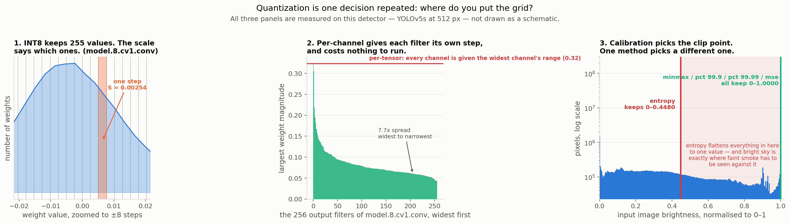

*All three panels measured on this detector, not sketched. **Left:** one convolution's weights with
the INT8 grid over them. **Middle:** its 256 filters sorted by range — per-tensor gives all of them
the widest filter's range (red line). **Right:** the input tensor with each calibration method's
clip point. Four of five keep the whole range; one does not.*

## The experiments

| | axis | question | outcome |
|---|---|---|---|
| [E1](#e1-which-layers-cant-take-int8) | target | which layers can't take INT8? | ✅ weights free everywhere; **three activation tensors carry all the damage** |
| [E2](#e2-calibration-method-and-size) | range | does the clipping rule matter? | ✅ **0.62 mAP50 — the largest single decision in the series** |
| [E3](#e3-granularity-of-the-weight-scales) | granularity | how many scale factors? | ✅ per-channel worth **+0.0013**; the zero point worth **31x more** |
| [E4](#e4-the-int8-engine-on-the-board) | — | what does INT8 buy on the board? | ✅ **1.53x, 54% size, 56% energy**; 60/61 convs really ran INT8 |
| [E5](#e5-weights-only-vs-w8a8) | target | where does the risk live? | ✅ **entirely in the activations** — weights cost 0.021% |
| [E6](#e6-mixed-precision-act-on-e1s-map) | target | does protecting the fragile layers work? | ✅ **3 of 60 convs → distant smoke 38%→84%**, for 29 KB |
| [E7](#e7-ptq-vs-qat-fairly) | effort | does QAT beat PTQ at a matched budget? | ⏸ not run; **costed at 9.0 h** |
| [E8](#e8-below-8-bits-and-storage-only-compression) | bit-width | how small can the artifact get? | ✅ **3.23 MB** — and dominated by plain INT4 |
| [E9](#e9-the-frontier-quantization-first-then-everything-else) | — | which decision matters, and which technique wins? | ✅ **[calibration and target decide it](#e9a-quantization-on-its-own)**; across families, no outright winner |
| [E10](#e10-composition-prune-then-quantize) | composition | do XP6 and XP7 stack? | ⚠️ on aggregate yes; **17.2% of distant smoke survives**; arm 2 unresolved |

**The unquantized FP16 model is the top row of every table**, so every number is read against it.

---

## E1. Which layers can't take INT8

> **Axis:** target · **Question:** is any layer unable to survive INT8? · **Answer:** weight
> quantization is free everywhere; **three activation tensors carry all the damage**, and one costs
> 63% of the distant-smoke accuracy on its own.

**Hypothesis.** Convolutions are robust; the detection head is fragile. YOLOv5's `Detect` layer
concatenates box coordinates in pixels with probabilities in [0,1], and one scale per tensor cannot
serve both. If true, `model.24.m.*` are the worst cells in the sweep.

**Method**

- Quantize **one** of the 60 convolutions, leave the other 59 in FP16, score, restore, repeat.
- Two arms per layer: **W8** (weights only) and **W8A8** (weights + that layer's input activation).
- **Val split**, 1,721 images — the output configures E6, so test must stay clean.
- **No retraining**: this is raw rounding damage. Recovery is E7's axis.
- One calibration pass serves all 120 cells: during observation the model is unmodified, so a
  single float pass records the right range for every layer. 60x cheaper, and unsound only once two
  quantized layers feed each other — which is why every whole-network arm re-calibrates.

**The mechanism**, measured before the sweep ran:

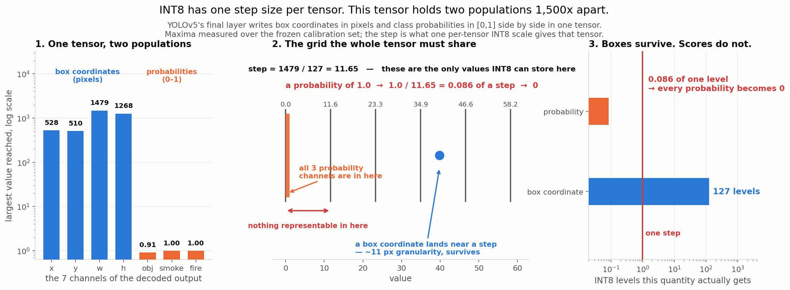

- YOLOv5's final layer writes **7 numbers per candidate box into one tensor** — `x, y, w, h` in
  **pixels**, `obj, smoke, fire` in **[0, 1]**.
- Measured maxima: `x 527.5 · y 509.5 · w 1479 · h 1268` against `obj 0.91 · smoke 1.0 · fire 1.0`.
  **Two populations, 1,500x apart.** (`w` exceeds the 512 px input because width decodes as
  `(2·sigmoid(t))²·anchor`.)
- INT8 uses **one step for the whole tensor**, sized so the largest value fits in 127 steps:
  **`S = 1479 / 127 = 11.65`**. Representable values are `0, 11.65, 23.30, …` — nothing between.
- A box coordinate of 527.5 → 45 steps → 524.2. **~11 px granularity, survives.**
- A class score of 1.0 → **0.086 of a step → rounds to 0.** Every probability in the tensor becomes
  **exactly zero**, nothing clears the detection threshold, and mAP50 is **0.0000** by construction.
- **No other step size fixes it.** One small enough for probabilities (`1/127 = 0.0079`) would need
  **187,000 steps** for the boxes. With one scale you must annihilate one population or the other.

> **Not a reason box detectors can't use INT8.** The problem is the *ratio*, not the magnitude:
> boxes alone are fine in INT8, probabilities alone are fine, only the concatenation breaks — a
> property of the **graph**, not of detection. Four things remove the constraint:
>
> | fix | available here? |
> |---|---|
> | don't quantize the decode — negligible FLOPs | **yes**, TensorRT's default |
> | split the tensor — separate scales, 11.65 and 0.0079 | **yes**, E6's decode-out arm |
> | per-channel *activation* scales | **no** — TensorRT is per-tensor for activations |
> | a format with an exponent (FP8) | **no** — [no FP8 silicon here](../../results/raw/xp07_precision_support.json) |
>
> Two are standard practice, which is why this is a curiosity rather than a blocker — E6 forced the
> bad case deliberately, to measure what the default protects you from. The third would solve it
> outright and is a **runtime limitation, not a mathematical one.**

That asymmetry is XP10's unexplained fingerprint: mAP50 0.2554, tiny plumes −99%, night slice still
0.48 — **box regression destroyed, classification limping on.**

**Results** — unquantized: **0.9494** mAP50, **0.3363** tiny.

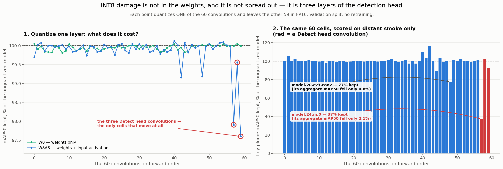

*Both panels plot the same 60 experiments — one point or bar per convolution, that layer quantized
alone with the other 59 left in FP16 — and both y-axes are **% of the unquantized model kept**.
**Left**, scored on aggregate mAP50: the whole panel spans 3.1%, and only the three head
convolutions move at all. **Right**, the identical runs scored on plumes under 0.1% of the frame:
the axis now needs 0–120%. Same perturbations, same models; the slice is what separates them.*

- **W8 is free, everywhere.** Worst cell **0.19%**, median 0.04%. The three head convs average
  **−0.010%** — noise. No layer needs more than 8 bits for its weights.
- **W8A8 damage is 20x concentrated.** Head convs lose **1.65%** on average vs **0.080%** for the
  other 57 — from 5% of the layers.
- **Ranked on distant smoke, the order changes completely:**

| layer | tiny mAP50 | kept | aggregate fell |
|---|---:|---:|---:|
| unquantized | 0.3363 | 100% | — |
| **`model.24.m.0`** | **0.1251** | **37%** | only 2.1% |
| `model.20.cv3.conv` | 0.2605 | 77% | only 0.8% |
| `model.17.m.0.cv2.conv` | 0.3021 | 90% | 0.2% |
| `model.24.m.2` | 0.3128 | 93% | 2.4% |

- **One convolution's input costs 63% of the tiny-plume accuracy** while the headline moves 2.1%.
  That layer is the **stride-8 head** — the one predicting the *smallest* objects, carrying the
  highest-resolution feature map, given the largest activation scale of the three heads (1.118 vs
  0.763, 0.359).
- **The second-worst layer for distant smoke is not in the head at all.** `model.20.cv3.conv` sits
  in the neck. A hand-picked "protect the head" split misses it.
- **So "W8A8 is fine except the last layers" is true of the aggregate and false of the slice.** The
  left panel supports it; the right panel is the same experiments and does not.
- **Some bars sit above 100% — quantizing that layer really did score higher, repeatably.**
  `model.17.cv3.conv` reaches **116.4%**, and re-running it five times reproduces 0.3914 exactly
  (spread 0.0pp). It is not measurement noise. mAP is an area under a *ranking* of detections, so a
  perturbation that happens to demote a false positive below a true one raises it — and on a slice
  of **127 images** that is worth several points. **Reproducible is not the same as generalisable**:
  this is a property of this configuration on this validation subset, with no reason to expect it on
  test or on other data, and no way to predict which layer will do it. It is also why the two
  rankings disagree — the aggregate ranking's third pick is the slice's best cell.

**Conclusion**

- **Weights are free — there is nothing to decide.** All 60 convolutions, 8 bits, worst cell 0.19%.
- **The damage is in the activations, and in three of them.** W8A8 quantizes each convolution's
  **input activation tensor** as well as its weights; 57 of those 60 tensors cost under 0.9% of
  aggregate mAP50, and three carry the rest. *That* is what "a three-tensor problem" means — not
  three layers' weights, three activation tensors.
- **The worst single one is the input to the stride-8 head** (`model.24.m.0`). Quantizing that one
  tensor costs **63% of the distant-smoke accuracy** while moving the headline **2.1%**.
- **Which three depends on what you measure.** Ranked on aggregate mAP50 they are `24.m.2`,
  `24.m.0`, `17.cv3.conv`; ranked on distant smoke, `24.m.0`, `20.cv3.conv`, `17.m.0.cv2.conv`.
  **Only `24.m.0` appears in both**, and `17.cv3.conv` — third-worst on the aggregate — is the
  *best* cell of all 60 on distant smoke.

---

## E2. Calibration: method and size

> **Axis:** range · **Question:** does it matter how the clipping range is chosen? · **Answer:**
> **more than any other decision in this series — 0.62 mAP50.** Both ends of the sweep are wrong and
> the middle was never tested.

**Hypothesis.** At INT8 the spread across sane calibration methods is small on CNNs; if so, the
accuracy question at 8 bits is closed and effort belongs at 4 bits.

**Why it matters.** *Calibration* is measuring activation ranges on sample data to fix the scales.
It is the only part of INT8 that has an opinion, and most toolchains do not surface it as a choice.

**What "clipping" means, and why there is no safe default**

INT8 gives you 256 values, so before anything can be stored you must answer one question: **which
real value does the largest code stand for?** Call it `T`.

- Everything from `0` to `T` gets **127 evenly spaced steps**.
- Everything **above `T` is flattened onto `T`** — that is clipping.

**The four calibration methods are four rules for picking `T`.** They all read the same histogram
and disagree about where to stop:

| rule | where it stops | clips |
|---|---|---|
| **min-max** | at the largest value ever seen | nothing, by definition |
| **percentile 99.99** | where 99.99% of values fit below | the top 0.01% |
| **entropy (KL)** — *TensorRT's default* | where the clipped histogram's *shape* best matches the original | whatever that implies |
| **MSE** | tries many stopping points, keeps the least-error one | whatever that implies |

Moving `T` trades one error against the other, and they pull in opposite directions:

| pick `T` too **large** | pick `T` too **small** |
|---|---|
| nothing is clipped, but the 127 steps are stretched thin | steps are fine, but large values are erased |
| **rounding error** — every value slightly wrong | **clipping error** — a few values very wrong |

There is no default that is safe on both, because **the right `T` depends on the shape of the
tensor** — and one network contains both shapes. The two below are at opposite ends of it:

| | **input tensor** — `model.0.conv` | **inner tensor** — `model.24.m.0` |
|---|---|---|
| where | the **first** convolution | deep in the **detection head** |
| what it sees | the image itself | 24 layers of accumulated activations |
| bounded? | **yes** — pixels are scaled to 0–1, so a tail is impossible | **no** — a few strong features reach 142 |
| range known in advance? | **yes, exactly `[0, 1]`** — no calibration needed | **no** — only measurement can find it |
| so | **never clip it** | the top 60% of the range is nearly empty, so clip hard |

**The input tensor should never be clipped at all** — its range is fixed by the preprocessing, not
discovered from data. Min-max reporting `1.0000` is rediscovering a known bound, not learning one.
And the image is not merely bounded, it is *dense at the bound*: **0.55% of all 50.3M pixel values
sit in the very top bin** (saturated sky, flame cores), so clipping even slightly is punished at
once — `T=0.98` costs **1.7x**, `T=0.95` costs **9.2x**, `T=0.90` costs **44.9x**.

> **TensorRT clips it anyway, by default.** This is not a simulation result: XP10 decoded
> TensorRT's own calibration cache from a real engine build and found `IInt8EntropyCalibrator2`
> assigning the input tensor `0.0035237 × 127 = ` **`0.4475`** — the same number this page's
> independent KL implementation reaches. The cache decoding is verified against a constant with a
> known answer (the anchor grid, `0.00393797 × 127 = 0.5` exactly). So TensorRT's default discards
> **55% of the input range** and **22% of all pixel values**, on the one tensor whose correct
> answer required no measurement.


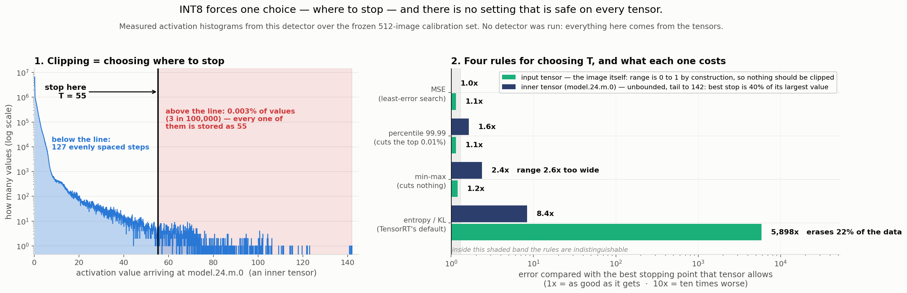

The best `T` for each is therefore at opposite ends too: **100% of the max** for the input (clip
nothing) and **40% of the max** for the inner tensor (clip hard). Panel 2 gives each rule two bars,
one per tensor, scored against the best `T` *that* tensor allows — **1.0x is as good as it gets,
10x is ten times worse**:

| method | input tensor | inner tensor | how it fails |
|---|---:|---:|---|
| **MSE** | 1.1x | **1.0x** | it doesn't |
| **percentile 99.99** | 1.1x | 1.6x | never badly |
| min-max | 1.2x | **2.4x** | *too late* on long tails — stretches 127 steps over empty space |
| entropy (TRT default) | **5,898x** | 8.4x | *too early* on bounded inputs — erases 22% of the data |

The three sane rules span **1.15–1.20x** on the input tensor: that is grid alignment, not a ranking,
and they should be read as tied. Only entropy separates itself, by four orders of magnitude.

Two things to take from it:

- **Discarding almost nothing buys a lot.** On the inner tensor MSE clips **0.0031%** of values —
  3 in 100,000 — and that alone cuts the error **2.4x** versus min-max, because the surviving
  99.997% get **2.6x** the resolution (127 steps across 0–55.4 instead of 0–142).
- **Discarding a little more destroys everything.** On the input, entropy clips **22%** of all
  values and lands **5,898x** off the best possible choice.

MSE's 1.0x is partly by construction — the yardstick is squared error, which is MSE's own
objective. The independent check is the measured mAP50 table below, where percentile 99.99 wins.

Both ends of the sweep are therefore wrong, in opposite directions, and each tensor demonstrates
one of them. This is computed from activation histograms alone — no detector, no mAP, no inference
run — and it **recovers the accuracy ranking measured below**. It was computed after the sweep, so
it explains the result rather than having predicted it; its value is that the same ordering falls
out of the tensors alone, so it is a property of this network's activations and not of one split.

**Method**

- Five methods, whole network W8A8, per-channel, no retraining, so damage is attributable to the
  range choice alone: **min-max**, **percentile 99.9 / 99.99**, **entropy (KL)** (TensorRT's
  default), **MSE**.
- Then, for the winner only, **8 / 32 / 128 / 512** images — **nested prefixes** of one frozen list,
  so a size difference is a difference in data, not in draw.
- Every arm writes the range it chose for every tensor: XP10's bug was found by reading the
  calibrator's numbers, not by guessing.

**Validation.** This page's independent KL implementation assigns the input tensor **0–0.4475** —
the exact number XP10 decoded from TensorRT's own calibration cache (0.0035237 × 127). The
simulation predicts the engine rather than approximating it.

**Results** — unquantized: **0.9494** mAP50, **0.3363** tiny, **14.05 MB**.

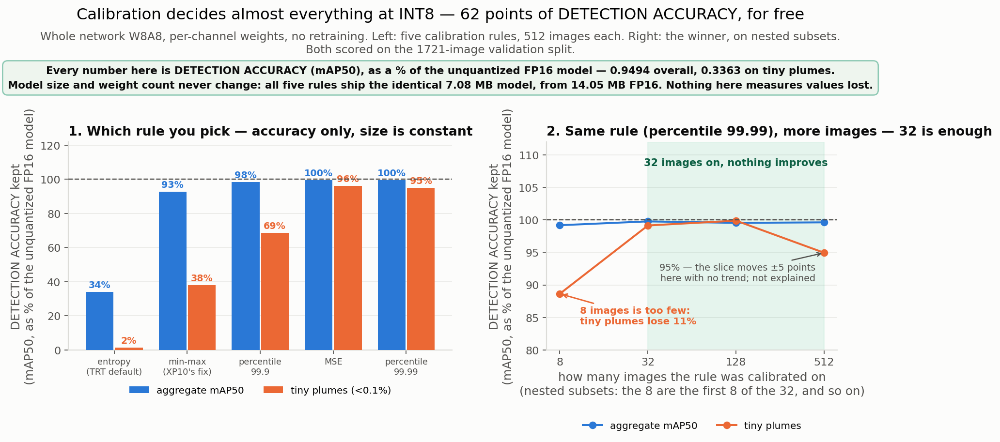

| method | size | mAP50 | kept | tiny | kept | input range |
|---|---:|---:|---:|---:|---:|---|
| unquantized FP16 | 14.05 MB | 0.9494 | 100% | 0.3363 | 100% | — |
| **percentile 99.99** | 7.08 MB | **0.9458** | 99.6% | **0.3193** | **94.9%** | 0–0.9998 |
| MSE | 7.08 MB | 0.9451 | 99.5% | 0.3232 | 96.1% | 0–0.9998 |
| percentile 99.9 | 7.08 MB | 0.9345 | 98.4% | 0.2312 | 68.7% | 0–0.9998 |
| **min-max** — *XP10's fix* | 7.08 MB | 0.8817 | 92.9% | **0.1282** | **38.1%** | 0–1.0000 |
| entropy — *TRT's default* | 7.08 MB | 0.3243 | 34.2% | 0.0052 | 1.5% | **0–0.4475** |

- **The hypothesis is wrong: the spread is 0.62 mAP50**, larger than pruning criterion, resolution,
  or model choice anywhere in this series.
- **Every arm ships an identical 7.08 MB model.** The method is a config string — the spread is
  bought for **zero bytes, zero speed, zero training time**.
- **XP10's prescription is wrong.** It compared entropy against min-max — the two *ends* of the
  sweep — and stopped. Min-max costs **62%** of tiny-plume accuracy; percentile 99.99 costs **5%**.
- **Both ends fail for opposite reasons.** On `model.24.m.0`: entropy picks 0–**11.1** when the
  tensor reaches ~30 (real signal saturated); min-max picks 0–**142.0** (**4.8x too wide**, so 4.8x
  of the 255 levels are spent on values occurring in under 0.01% of the tensor). Across all 60
  layers min-max is **2.7x wider on the median**, up to 8.6x, wider by >2x on **56 of 60**.
- **The two methods agree on the input tensor** (1.0000 vs 0.9998). XP10's diagnosis was about
  entropy and the input; the min-max problem is in the internal activations.
- **Size is worth nothing past 32 images**: 8 → 99.2%, 32 → 99.8%, 512 → 99.6%.

**Where the 7.08 MB goes** — since "INT8 halves the model" deserves itemising:

| | |
|---|---:|
| quantized weights, 8-bit, 99.7% of parameters | 7.006 MB |
| parameters left FP16 (batch-norm, biases) | 0.038 MB |
| **9,567 per-channel weight scales** | 0.038 MB |
| **total** | **7.083 MB** |

Counted from the configuration, not measured: fake-quant leaves every tensor a float. E4's engines
are the measured counterpart and are larger (16.98 / 9.1 MB) — 1.98x counted, 1.87x measured.

**Conclusion.** The accuracy question at 8 bits is decided by *which* clipping rule, not by how much
data it sees. **Use percentile 99.99 (or MSE), calibrate on 32 images.** Every INT8 number anywhere
should state its clipping rule: labelled only "INT8", the five engines above span 0.32 to 0.95.

---

## E3. Granularity of the weight scales

> **Axis:** granularity · **Question:** how many scale factors does this network need? · **Answer:**
> **60, not 9,567.** Per-channel buys +0.0013; the asymmetric zero point buys **31x more**.

**Hypothesis.** Per-channel wins outright, because it is *free at inference* — output channel `c`'s
scale factors out of the accumulator and folds into the following batch-norm. Symmetric vs
asymmetric activations is expected to be small at INT8.

**Why the zero point should matter.** SiLU is bounded below at ≈−0.278 and unbounded above, so
post-activation tensors are **one-sided**; a symmetric range spends nearly half its 255 codes on
values that never occur.

**Method**

- Weight scales **per-tensor** vs **per-channel**; activations per-tensor throughout (what the
  runtime supports).
- Crossed with **symmetric vs asymmetric activations**. Weights stay symmetric in every arm —
  trained conv weights sit about zero, and `Z = 0` keeps the integer matmul free of cross-terms.
- Whole network W8A8, min-max, no retraining, val split.

**Results**

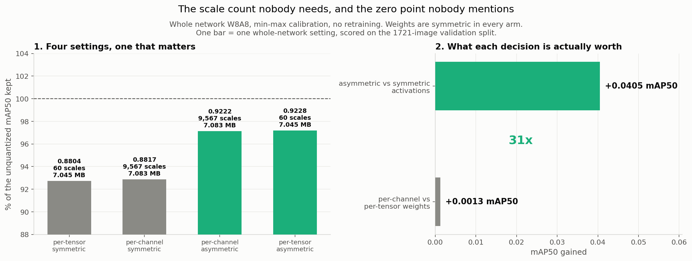

| arm | weight scales | overhead | size | mAP50 | kept | tiny | kept |
|---|---:|---:|---:|---:|---:|---:|---:|
| unquantized FP16 | — | — | 14.05 MB | 0.9494 | 100% | 0.3363 | 100% |
| per-tensor, symmetric | 60 | 0.24 KB | 7.045 MB | 0.8804 | 92.7% | 0.1168 | 34.7% |
| per-channel, symmetric | 9,567 | 38.3 KB | 7.083 MB | 0.8817 | 92.9% | 0.1282 | 38.1% |
| per-channel, **asymmetric** | 9,567 | 38.3 KB | 7.083 MB | 0.9222 | 97.1% | 0.1348 | 40.1% |
| **per-tensor, asymmetric** | **60** | **0.24 KB** | **7.045 MB** | **0.9228** | **97.2%** | 0.1330 | 39.5% |

- **The hypothesis is wrong on both counts.** Per-channel: **+0.0013 mAP50**, inside run-to-run
  noise. Asymmetric activations: **+0.0405** — **31x more**.
- **The best arm is the smallest.** Per-tensor asymmetric leads nominally (0.9228 vs 0.9222) with
  **60 scales instead of 9,567** and 38 KB less.
- **Why per-channel has nothing to fix here:** E0 measured the widest output filter's range at only
  **7.7x** the narrowest. The textbook case (Lecture 06's MobileNetV2 depthwise layer) is 100x+.
- **E2 and E3 are one disease — wasted range.** Min-max spends 2.7x more range than needed because
  one outlier sets the ceiling; symmetric spends half the range on a sign the tensor barely uses.

**Caveat.** Per-channel is free at inference; **asymmetric activations are not** — `Z ≠ 0` adds a
cross-term to every integer product. And **TensorRT's INT8 path uses symmetric activations**, so
+0.0405 is currently unreachable on this board through either build path.

**Conclusion.** The knob everyone tunes is worth nothing here; the flag nobody discusses is worth
4 points. The accuracy-optimal simulated recipe is **percentile 99.99 + asymmetric + per-tensor** —
which is also the smallest of the four arms.

---

## E4. The INT8 engine on the board

> **Axis:** none — the payoff · **Question:** what does INT8 buy on the Orin? · **Answer:**
> **1.53x throughput, 54% of the size, 56% of the energy per frame.** TensorRT really used INT8 —
> 60 of 61 convolutions — and the engine keeps **31%** of the distant-smoke accuracy.

**Hypothesis.** The XP6 trap recurs: TensorRT advertises INT8 and then declines to use it, as it
declined the sparse kernels. *"INT8" is a request; what ran is data.*

**Method**

- Four engines from the same ONNX at 512 px, throughput and J/1k at batch 16, XP6 discipline:
  identical build settings, warm-die control, **one arm rebuilt three times** to bound tactic noise.
- Accuracy on the **full 4,306-image test set** — final numbers, so test is right here and only here.
- **Per-layer precision read from the built engine** with TensorRT's inspector (tactic names), not
  from a build log.
- Two build paths, not the same experiment: **(B)** TensorRT's own calibrator — the vendor-default
  control, used here; **(A)** QDQ ONNX carrying *our* scales — the only route by which E2's and E3's
  choices reach an engine.

**Results**

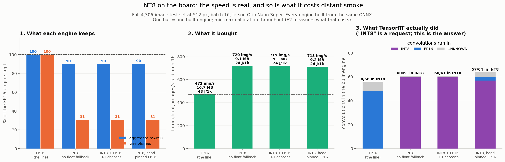

| arm | engine | mAP50 | fire | tiny | img/s | J/1k | convs in INT8 |
|---|---:|---:|---:|---:|---:|---:|---:|
| FP16 — the line | 16.73 MB | **0.7776** | 0.7184 | **0.1376** | 471.9 | 43.0 | 0 / 56 |
| INT8, no float fallback | **9.09 MB** | 0.6985 | 0.6108 | 0.0421 | **720.3** | **24.1** | **60 / 61** |
| INT8 + FP16, TRT chooses | 9.11 MB | 0.6985 | 0.6108 | 0.0421 | 718.8 | 24.1 | **60 / 61** |
| INT8, head pinned FP16 | 9.16 MB | 0.7005 | 0.6137 | 0.0423 | 712.7 | 24.1 | 57 / 64 |

- **Tactic noise is 0.25%** (718.4 / 718.6 / 720.2 img/s), so the 1.53x gap is 200x the noise floor.
- **The FP16 arm reproduces XP9 exactly** — 0.7776 and 0.1376, at 471.9 img/s vs 473.7.
- **The hypothesis is wrong, and that is the good news: the compiler did not refuse.** 60 of 61
  convolutions ran in INT8 (98.4%). The head-pinned arm shows **exactly 3 FP16 layers** — the
  request honoured and visible. Convolution counts differ per engine (56/61/64) because fusion is
  precision-dependent.
- **Forbidding float fallback changes the build, not the result.** 299.7 s vs 564.7 s to build, then
  **bit-identical detections** (fingerprint `6fd4d920ddf76926`). The layers INT8 cannot take, FP16
  cannot either; both fall to FP32. A genuine control with a negative finding.
- **Pinning the head buys +0.3%** — because TensorRT already keeps the decode out of INT8 on its
  own. E6 shows what the decode is worth when it *is* quantized.

**Energy: two protocols, and the difference is a result.**

| | XP9, batch-1 | XP7-E4, batch-16 flat out |
|---|---:|---:|
| GPU utilisation | 73.4% | 97.3% |
| board power | 11.6 W | 20.5 W |
| **J per 1,000 frames** | **52.1** | **43.0** |

Saturating the GPU draws **76% more power and spends 17% less energy per frame** — the idle gaps
between kernel launches that XP2 showed dominate batch-1 are what the extra joules were buying.
**Energy is comparable within a protocol, not across one**; every row in E9's JSON records which.

### Path A: the engine built from our own scales

| | calibration | engine | mAP50 | tiny | img/s | convs INT8 |
|---|---|---:|---:|---:|---:|---:|
| path B — TRT's calibrator | min-max, 512 imgs | 9.11 MB | **0.6985** | 0.0421 | **718.8** | 60/61 |
| path A — our QDQ graph | percentile 99.99, **8 imgs** | 9.45 MB | 0.5903 | **0.0626** | 668.6 | 55/58 |

- **Path A works, and its first result is worse.** That is the honest headline.
- **The comparison is confounded**: 8 images vs 512, forced by repeated **OOM kills** (exit 137) at
  512 and 32. So this shows percentile-on-8 losing to min-max-on-512, **not** percentile losing to
  min-max.
- **Tiny plumes are 49% higher on path A** (0.0626 vs 0.0421) at one sixteenth the calibration data
  — the direction E2 predicts.

**What it took to get an engine out of path A**, each failure a different cause:

| failure | cause | fix |
|---|---|---|
| `Incomplete symbolic shape inference` | dynamic batch+H+W defeats ORT's inference | skip pre-processing |
| **OOM-killed (exit 137)** | optimiser, then percentile calibrator, exceed 8 GB | skip; drop to 8 images |
| `IDequantizeLayer ... isQuantized` | ORT quantizes **biases to INT32**; TRT accepts only INT8/FP8/INT4 | `QuantizeBias: False` |
| `output extent of /model.11/Concat_1` | Q/DQ on the neck's Concat/Resize breaks shape propagation | `op_types_to_quantize=["Conv"]` |

**Conclusion.** The speed is real and the compiler cooperated. **Every INT8 row here is a lower
bound**: these engines use min-max, which E2 measured as costing 62% of the tiny-plume accuracy.
Path B takes one function call; path A takes four fixes — which is why almost everybody ships the
vendor default, and therefore ships min-max.

---

## E5. Weights-only vs W8A8

> **Axis:** target · **Question:** are the speed and the accuracy loss coming from the same place? ·
> **Answer:** **no.** Weights cost 0.021%, activations 6.85% — and the weights are the half that
> delivers the size.

**Hypothesis.** W8-only saves memory and bandwidth but little compute; W8A8 is the 2x-TOPS story and
carries all the accuracy risk, because activations are where outliers live.

**Method**

- Three arms from the same frozen calibration: **W8** (weights only), **W8A8** (both), and **A8**
  (activations only) as the control that isolates the activation contribution.
- A8 is not deployable and is not claimed as one — without it the two effects cannot be separated
  from their interaction, and the interaction is reported.

**Results**

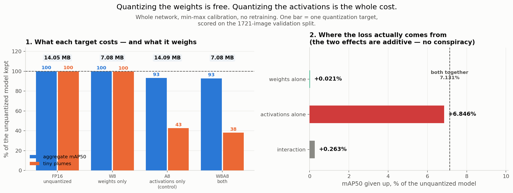

| arm | size | mAP50 | kept | tiny | kept |
|---|---:|---:|---:|---:|---:|
| unquantized FP16 | 14.05 MB | 0.9494 | 100% | 0.3363 | 100% |
| **W8 — weights only** | **7.08 MB** | **0.9492** | **100.0%** | 0.3350 | **99.6%** |
| A8 — activations only *(control)* | 14.09 MB | 0.8844 | 93.2% | 0.1433 | 42.6% |
| **W8A8** | **7.08 MB** | 0.8817 | 92.9% | 0.1282 | **38.1%** |

| decomposition | cost |
|---|---:|
| weights alone | **+0.021%** |
| activations alone | **+6.846%** |
| both together | +7.131% |
| interaction | +0.263% |

- **Weight quantization costs 300x less than activation quantization** — and delivers all of the
  size reduction. The A8 arm is *larger* than baseline (14.09 MB): 60 extra scales, nothing shrunk.
- **The two effects are additive** (interaction +0.263%). No conspiracy between them.
- **Confirms E1 at whole-network scale.** Two experiments with different failure modes agree on the
  same decomposition.

**Conclusion.** **W8-only gives half the model for 0.02% of the accuracy and 99.6% of the distant
smoke** — as close to free as anything in this series. Everything past that is bought with the
activations. The honest framing of "INT8" on this model: **the size is free, the speed is not.**

---

## E6. Mixed precision: act on E1's map

> **Axis:** target · **Question:** does protecting the fragile layers recover the loss? ·
> **Answer:** **yes.** Three of sixty convolutions in FP16 take distant smoke from **38% to 84%**,
> for **29 KB** — 0.4% of the model.

**Hypothesis.** Keep the quantization-hostile part in float and quantize the 99% of FLOPs that are
robust. EdgeFirst claims the split-graph arm recovers ~5 mAP for sub-20 ms of CPU work.

**Method** — three arms at the same nominal W8A8 setting:

- **uniform** — all 60 convs INT8, decode output quantized too. The control.
- **head-out** — 57 convs INT8, the fragile three left FP16. **The split is read out of E1's JSON**
  (`--from-e1`), not chosen by hand.
- **head-out + decode-out** — additionally the box decode runs in float outside the quantized region.

The conv-level simulation never quantizes the decode, so arms 2 and 3 would be identical for a
reason that is an artefact of the simulation. `DetectOutputQuantizer` reproduces the one effect that
distinguishes them, so **the gap between arms 2 and 3 is exactly the cost of quantizing the decode**.

**Results**

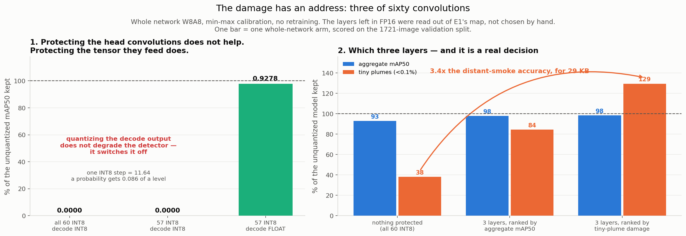

| arm | convs INT8 | decode | size | mAP50 | kept | small | tiny | kept |
|---|---:|---|---:|---:|---:|---:|---:|---:|
| unquantized FP16 | 0 | float | 14.05 MB | 0.9494 | 100% | 0.8721 | 0.3363 | 100% |
| uniform | 60 | **INT8** | 7.08 MB | **0.0000** | **0%** | 0.0000 | 0.0000 | **0%** |
| head-out | 57 | **INT8** | 7.11 MB | **0.0000** | **0%** | 0.0000 | 0.0000 | **0%** |
| **head-out + decode-out** | 57 | float | 7.11 MB | **0.9278** | **97.7%** | 0.8254 | **0.2836** | **84.3%** |

- **Quantizing the decode output does not degrade the detector — it switches it off.** Both arms
  score **exactly zero**. Measured step 11.639 here vs 11.646 in E0: a probability gets **0.086 of a
  level**, every score rounds to zero, nothing clears threshold.
- **Protecting the head convolutions does not help at all.** `head-out` is as dead as `uniform`.
  **The head convolutions were never the problem — the tensor they feed is.**
- **Against E5's `w8a8` (identical config, only those three layers differ):**

| | convs INT8 | mAP50 | kept | small | tiny | kept | size |
|---|---:|---:|---:|---:|---:|---:|---:|
| E5 `w8a8` | 60 | 0.8817 | 92.9% | 0.6955 | 0.1282 | 38.1% | 7.083 MB |
| E6 head-out + decode-out | 57 | **0.9278** | **97.7%** | **0.8254** | **0.2836** | **84.3%** | 7.112 MB |

  **2.21x the distant-smoke accuracy for 29 KB.** Residual gap to FP16: 0.0216.

> This uniform arm is a *worst case no engine here builds*. TensorRT keeps the decode out of INT8 on
> its own (E4's engines score 0.6985, not 0). Measuring it puts a number on what the default is
> protecting you from — and shows "keep the detection head in FP16" names the wrong thing.

### Which ranking to protect

E1's two orderings share **one** layer, so E6 was run twice, everything else identical.

| split chosen by | layers left FP16 | mAP50 | kept | small | tiny | kept |
|---|---|---:|---:|---:|---:|---:|
| *nothing (E5)* | none | 0.8817 | 92.9% | 0.6955 | 0.1282 | 38.1% |
| aggregate mAP50 | `24.m.2`, `24.m.0`, `17.cv3` | 0.9278 | 97.7% | 0.8254 | 0.2836 | 84.3% |
| **tiny-plume damage** | `24.m.0`, `20.cv3`, `17.m.0.cv2` | **0.9333** | **98.3%** | **0.8591** | **0.4351** | **129.4%** |

- **Ranking by the metric you care about beats ranking by the headline — on both metrics.** The
  tiny-ranked split also wins on aggregate (0.9333 vs 0.9278), so this is not a trade.
- **The 129.4% needs care.** It is **not noise** (E1's 60 weights-only cells span 1.6%, sd 0.0010;
  this is 20x that). But the slice is **127 of 1,721 images**, it is val-only, and **there is no
  verified mechanism** — the obvious one (noise pushing marginal detections over threshold) is weak,
  since mAP is a threshold-free sweep at conf 0.001.

**Conclusion.** The 58% distant-smoke loss that made INT8 look unusable for early detection was **5%
of the convolutions**, found by measurement rather than by the vocabulary of "the detection head".
**The claim made:** protecting E1's three layers recovers the loss essentially completely.
**The claim not made:** that INT8 improves small-object detection — that needs the test split and a
mechanism. Whether an engine can express this split is E4-QDQ's question.

---

## E7. PTQ vs QAT, fairly

> **Axis:** effort · **Question:** does training through the rounding beat picking good scales? ·
> **Answer:** ⏸ not run — but **costed at 9.0 h**, five times cheaper than this page estimated.

**Hypothesis.** At INT8, QAT buys little: PTQ on CNNs is already near-lossless, and if E2 found
calibration barely matters there is little left to repair. Re-ask at 4 bits.

**Method** — the fairness discipline XP6-E7 had to learn:

- **ptq** — best PTQ recipe, zero epochs.
- **ptq_recovered** — same recipe, **12 epochs** (the budget every XP6 recovery got).
- **qat** — fake-quant live from the start, 12 epochs.
- Arms 2 and 3 get identical budgets, so their difference is a *method* difference. Arm 1 is
  labelled as the zero-budget point, never silently compared against a trained arm.
- **Honest note:** with static scales from a PTQ init, arms 2 and 3 are the same computation. Two
  arms are reported, not three dressed up.
- **Guardrail:** `--prove-loop` fine-tunes the *unquantized* model and **aborts** if the round trip
  loses more than tolerance. A loop that degrades the baseline makes QAT look bad — or, from a
  degraded baseline, good — for reasons unrelated to quantization.

**Cost — measured, and it changed the plan**

| | |
|---|---:|
| forward+backward, 512 px, batch 8 | **17.16 img/s** |
| one epoch over 15,500 images | **15.1 min** |
| 12 epochs, one arm | **3.01 h** |
| E7 as specified (control + 2 arms) | **9.03 h** |

- This page previously carried **~17 h per arm**, assuming ~3 img/s. **Wrong by 5x.**
- **E7 is reachable here** — an overnight run. The "needs a desktop GPU" conclusion did not survive
  measuring it.

**Conclusion.** Not run; cost known, scripts ready. See
[`HANDOFF_TO_GPU.md`](HANDOFF_TO_GPU.md). The estimate and the measurement disagreed by 5x, which is
this series' own rule turned on itself.

---

## E8. Below 8 bits, and storage-only compression

> **Axis:** bit-width · **Question:** how small can the artifact get? · **Answer:** **3.23 MB** with
> a Huffman-coded codebook — and it is the worst trade on the page. Plain INT4 is smaller-and-better
> at 3.58 MB.

**No board claim anywhere here.** The Orin has no INT4 convolution path; these are accuracy and size
results only. Claiming a speedup would be the XP6-E4 mistake in reverse.

**Method**

- **INT4 weight-only**, group-wise `g=128` vs per-channel, round-to-nearest.
- **The same arms at W8**, because "granularity is a no-op at 8 bits" is cheap to check once the
  machinery exists, and a measured no-op beats an assumption.
- **K-means codebook** (Deep Compression): 4-bit indices into a 16-entry FP16 table per layer, plus
  Huffman. Reported as the **true Huffman code length** from the symbol histogram, not the Shannon
  entropy — quoting entropy overstates compression by a few percent.
- Activations stay **FP16** in every arm; 4-bit activations are a different experiment.

**Results** — unquantized: **0.9494**, **0.3363** tiny, **14.05 MB**.

| arm | size | scale tables | mAP50 | kept | tiny | kept |
|---|---:|---:|---:|---:|---:|---:|
| **W8, per-channel** | 7.082 MB | 38.3 KB | **0.9492** | **100.0%** | 0.3350 | 99.6% |
| W8, per-group g=128 | 7.265 MB | 220.6 KB | 0.9488 | 99.9% | 0.3372 | 100.3% |
| **W4, per-group g=128** | 3.762 MB | 220.6 KB | **0.8577** | **90.3%** | 0.2165 | 64.4% |
| W4, per-channel | 3.579 MB | 38.3 KB | 0.8447 | 89.0% | 0.1865 | 55.5% |
| codebook 4-bit + Huffman | **3.23 MB** | 1.9 KB | 0.6761 | 71.2% | 0.1304 | 38.8% |

- **Granularity inverts with bit-width.** At 8 bits per-group buys +0.0004; at 4 bits it buys
  **+0.0130** and **+0.0300 on tiny plumes**. The same 220.6 KB table is 3.0% of the model at 8 bits
  and **5.9%** at 4 — the first place on this page where scale overhead is worth arguing about.
- **INT4 costs 10% of mAP50 and 36% of distant smoke**, against 0.021% for INT8 weights (E5), to buy
  3.58 MB instead of 7.08 MB. On this board that halving purchases **nothing**.
- **The codebook is the smallest artifact and the least usable.** 14.012 MB → 3.503 MB raw indices →
  **3.230 MB** Huffman (**3.686 bits/weight**, 7.8% recovered because the cluster histogram is far
  from uniform). But it costs **29% of mAP50** and **61% of distant smoke**, and the weights no
  longer sit on a lattice, so no integer kernel can touch them.

**Conclusion.** **Deep Compression's codebook is dominated by plain 4-bit rounding here** — slightly
smaller, much less accurate, and undeployable on integer hardware. A landmark method, and on a 7 M
detector in 2026 the wrong tool. The error-compensated (GPTQ) arms did not run: 60 calibration
passes per bit-width. The implementation is validated against its own premise — matches RTN to
within 0.0% on uncorrelated inputs, cuts layer output error **67%** on correlated ones.

---

## E9. The frontier: quantization first, then everything else

> **Axis:** none — the summary · **Question:** which quantization decision matters, and then which
> technique in the series wins? · **Answer:** **calibration and *what* you quantize decide it**;
> across families there is **no outright winner**, and flame and distant smoke rank them oppositely.

Two halves. **E9a ranks the decisions inside quantization** — the question this XP is about. **E9b**
widens it to the whole compression arc, which is a different question and kept separate for that.

### E9a. Quantization on its own

**Method.** Every arm XP7 measured, tagged with the axis it moves, so the output ranks *decisions*
rather than runs. Simulated arms are **val** (baseline 0.9494); engines are **test** (0.7776). Each
block is normalised to its own baseline — a chart mixing them would invent 17 points from the split.

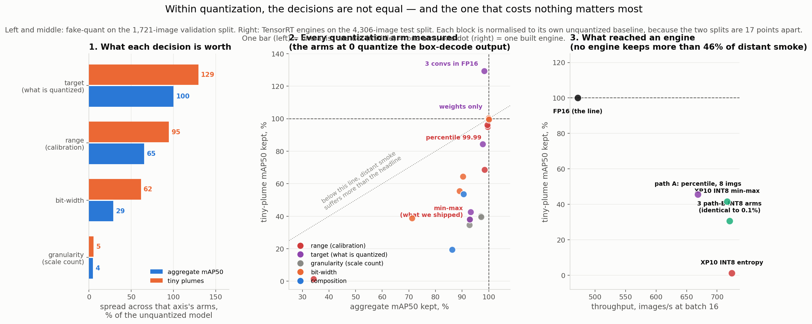

| axis | what it changes | spread, mAP50 | spread, distant smoke |
|---|---|---:|---:|
| **target** | what gets quantized | **100.0%** | **129.4%** |
| **range** | calibration | **65.4%** | **94.6%** |
| bit-width | 8 / 4 bits, codebook | 28.8% | 61.5% |
| granularity | scale count | **4.5%** | **5.4%** |

*Spread = best minus worst arm on that axis, as a share of the unquantized model.*

- **The ranking is close to the inverse of the attention these decisions get.** Granularity — where
  every tutorial starts — is worth **4.5%**, most of it the zero point rather than the scale count.
  Calibration, which most toolchains do not surface, is worth **65%**. *What* you quantize is worth
  everything: same network, same bit-width, same calibration, **0.0000 to 0.9333**.
- **The two dominant decisions cost nothing.** Percentile over min-max is a config string producing
  a byte-identical 7.08 MB model; three convolutions in FP16 costs 29 KB.
- **Almost none of it reached an engine.** **No engine built in XP7 keeps more than 46% of the
  line's distant smoke**, while simulated arms reach 95% and 84–129%. **That gap is the toolchain,
  not the hardware** — TensorRT's calibrator offers only entropy and min-max, and the layer split
  must travel through a QDQ graph that took four fixes to build.

### E9b. Every technique in the series

Four families of *compression* measured on this board: smaller images (XP2), fewer channels (XP6),
2:4 sparsity (XP6-E4), fewer bits (XP7/XP10). **XP15's cascade is deliberately absent** — a gate
changes how often the detector runs, not how fast it runs, and averaging a duty cycle onto a
kernel chart would compare different things.

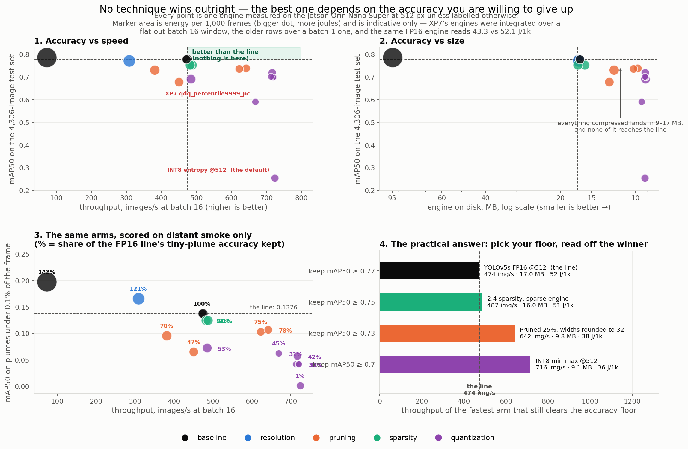

| technique | family | mAP50 | fire | tiny | MB | img/s | ms b1 | J/1k |
|---|---|---:|---:|---:|---:|---:|---:|---:|
| **YOLOv5s FP16 @512 — the line** | baseline | **0.7776** | 0.7184 | **0.1376** | 17.0 | 473.7 | 4.10 | 52.1 |
| YOLOv5l FP16 @640 | baseline | 0.7853 | 0.7215 | 0.1974 | 94.7 | 73.2 | 16.12 | 317.3 |
| YOLOv5s FP16 @640 | resolution | 0.7707 | 0.7206 | 0.1659 | 16.9 | 308.3 | 5.41 | 80.8 |
| 2:4 sparsity, sparse engine | sparsity | 0.7527 | 0.6931 | 0.1249 | 16.0 | 487.4 | 3.78 | 51.1 |
| Pruned 25%, rounded to 32 | pruning | 0.7377 | 0.6755 | 0.1072 | 9.8 | 641.9 | 3.98 | 38.0 |
| Pruned 25%, one-shot +12ep | pruning | 0.7297 | 0.6673 | 0.0960 | 12.2 | 381.1 | 4.28 | 54.3 |
| **INT8 min-max @512** | quantization | 0.7181 | 0.6573 | 0.0572 | **9.1** | **716.3** | 4.64 | **36.5** |
| INT8 entropy @512 — *default* | quantization | 0.2543 | 0.1604 | 0.0016 | 9.2 | 724.2 | 3.86 | 33.3 |

- **Nothing dominates the line** on accuracy, speed and size at once. The only thing that ever
  bought accuracy was a **bigger** model, at 6.5x the throughput cost.
- **The winner is a function of the accuracy floor — they are rungs, not competitors:**

| keep | fastest arm clearing it | cost |
|---|---|---|
| mAP50 ≥ 0.77 | **nothing beats the line** | 474 img/s, 17.0 MB, 52 J/1k |
| ≥ 0.75 | **2:4 sparsity** | 487 img/s, 16.0 MB, 51 J/1k |
| ≥ 0.73 | **pruning**, round_to=32 | 642 img/s, 9.8 MB, 38 J/1k |
| ≥ 0.70 | **INT8**, min-max | 716 img/s, 9.1 MB, 36 J/1k |

- **Two discipline notes**, both in the JSON: PyTorch and TensorRT throughput are different
  measurements (the chart uses engine rows only); and some rows had accuracy and speed measured on
  the same checkpoint in separate runs, flagged `accuracy_paired_from`.

### E9c. Flame, on its own

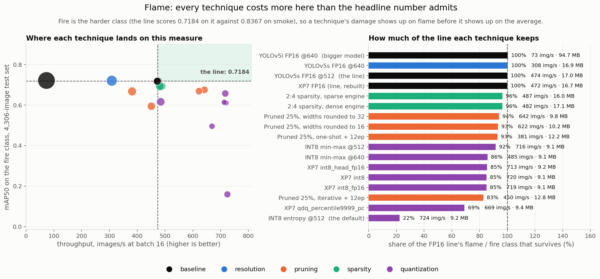

Fire is the harder class — the line scores **0.7184** on flame against **0.8367** on smoke — so
damage surfaces on flame before it surfaces on the average.

| technique | fire mAP50 | keeps | img/s | MB |
|---|---:|---:|---:|---:|
| the line | 0.7184 | 100% | 473.7 | 17.0 |
| 2:4 sparsity | 0.6931 | **96%** | 487.4 | 16.0 |
| Pruned, round_to=32 | 0.6755 | 94% | 641.9 | 9.8 |
| **INT8 min-max** | 0.6573 | **92%** | **716.3** | **9.1** |
| Pruned, iterative +12ep | 0.5945 | 83% | 450.2 | 12.8 |
| INT8 entropy — *default* | 0.1604 | 22% | 724.2 | 9.2 |

- **Every working technique lands in a 13-point band (83–96%).** Nothing is a disaster, nothing free.
- **INT8 keeps 92% at 1.51x throughput, 54% size, 70% energy** — the best trade on this class.
- **If the deployment is flame detection, the answer is INT8** — a sentence the aggregate could not
  have produced, and the opposite of the next section's.

### E9d. Distant smoke, on its own

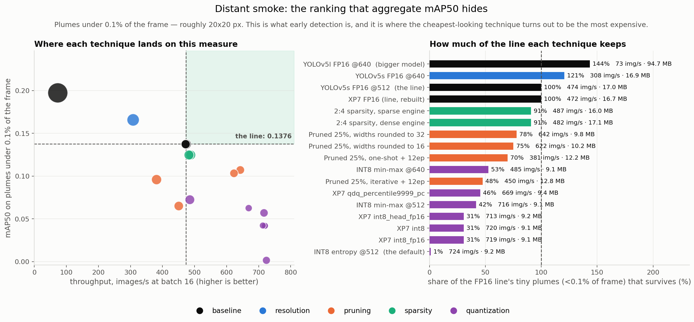

Plumes under 0.1% of the frame (~20x20 px). This is what early detection *is*.

| technique | tiny mAP50 | keeps | img/s | MB |
|---|---:|---:|---:|---:|
| YOLOv5s FP16 **@640** — *more pixels* | 0.1659 | **121%** | 308.3 | 16.9 |
| the line @512 | 0.1376 | 100% | 473.7 | 17.0 |
| 2:4 sparsity | 0.1249 | **91%** | 487.4 | 16.0 |
| Pruned, round_to=32 | 0.1072 | 78% | 641.9 | 9.8 |
| **INT8 min-max** | 0.0572 | **42%** | 716.3 | 9.1 |
| INT8 entropy — *default* | 0.0016 | **1%** | 724.2 | 9.2 |

- **The 13-point band becomes a 49-point band.** This is where compression damage lands.
- **INT8 ranks 5th of 8 on flame and 7th of 8 on distant smoke.** Same engine, same test set,
  opposite verdicts. **Invisible in every "INT8 costs 8%" claim made about this model.**
- **The cheapest fix is not a compression technique.** The only arm that *beats* the line on distant
  smoke is **640 px instead of 512** — 121%, at 308 img/s. XP2's joke survives XP7.

---

## E10. Composition: prune, then quantize

> **Axis:** composition · **Question:** do XP6's and XP7's savings stack? · **Answer:** on aggregate
> the second compression costs *less* than the first; on distant smoke they multiply and **17.2%**
> survives. Arm 2 is **unresolved** — see below.

**Hypothesis.** The two save through different mechanisms (fewer channels vs cheaper MACs on less
bandwidth), so naive arithmetic says ~1.36x × the INT8 factor. XP6's lesson says never trust that.

**Method**

- Start from XP6's best: `yolov5s_pruned25_recovered.pt` — L1, 25% cut, `round_to=32`.
- **arm 1** — quantize the recovered model.
- **arm 2** — quantize the *raw* pruned model **before** the 12-epoch recovery, so one training run
  repairs both damages.
- **Calibration re-collected on the pruned model**, never reused from dense: pruning changed the
  activation statistics, and reusing would blame INT8 for a distribution that no longer exists.
- **The pruned model is scored before quantizing**, so "damage" has a reference. Comparing against
  the dense baseline would charge quantization for pruning's damage.

**Results — arm 1**

| | mAP50 | small | tiny | tiny vs dense FP16 |
|---|---:|---:|---:|---:|
| dense FP16 | 0.9494 | 0.8721 | 0.3363 | 100% |
| XP6 pruned, FP16 | 0.8604 | 0.7379 | 0.1805 | 53.7% |
| **pruned + INT8** | **0.8186** | 0.6137 | **0.0577** | **17.2%** |

- **On aggregate the savings stack better than expected.** Quantizing the *pruned* model costs
  **4.86%**, against **7.13%** for the dense one (E5). The second compression is *cheaper* — a
  network already stripped of 25% of its channels has less redundancy left to destroy and fewer
  outlier activations for min-max to trip over.
- **On distant smoke they multiply.** Quantization costs **68.0%** of the pruned model's tiny-plume
  accuracy vs **61.9%** on the dense one — the same proportional damage applied to a number pruning
  had already halved. Composed: **0.3363 → 0.1805 → 0.0577**.

> **This arm ran twice and gave a noise floor worth having.** Two identical runs — same checkpoint,
> same frozen calibration, no training — returned mAP50 **0.8196 / 0.8186** and tiny plumes
> **0.0655 / 0.0577**. Aggregate is reproducible to **0.12%**; the tiny-plume slice moved **11.9%
> relative**. GPU float reductions and kernel selection are not bit-deterministic between runs, and
> the tiny slice is **127 of 1,721 images** with few ground-truth boxes, so small ranking changes
> swing it. **The noise is largest where the metric is smallest** — an absolute wobble of ~0.008 is
> 12% at 0.058 and under 3% at 0.28. Read every tiny-plume figure on this page with that in mind;
> the differences it is used to claim (38% → 84%, 42% vs 92%) are far outside it, and the ones it is
> not used to claim are inside it.
- **This is the clearest case on the page for not composing on aggregate mAP50.** Two compressions
  that each look like single-digit costs leave **a fifth** of the distant-smoke detection, while the
  aggregate still reads 86.3%.

**Results — arm 2: unresolved, and reported as such**

| | value |
|---|---|
| starting point | raw pruned model, mAP50 **0.0** |
| training | 12 epochs, loss **1.166 → 0.982 → 0.878 → … → 0.804** |
| wall clock | 3.0 h |
| **recovered mAP50** | **0.0001** |

- **The loss trained cleanly and the model evaluates at zero.** Those two facts do not fit.
- **Three explanations remain open**, and nothing in the run distinguishes them: (a) the fine-tune
  never recovered the network; (b) it recovered and re-calibrating afterwards broke it; (c) it
  recovered and the evaluation-time quantization broke it.
- **The run did not save the model**, so none could be tested without spending the 3 h again. The
  script now scores the trained weights **with quantization off** and **saves the checkpoint**, so a
  re-run is diagnostic rather than another ambiguous result.
- **This is XP6-E7's guardrail rule, and it was not applied here.** *Prove the loop returns a working
  model before believing any number it produces.* Arm 1 reproduced three times; arm 2 was trusted
  without its control. **No conclusion is drawn from 0.0001.**

**Conclusion.** Arm 1 is solid: the savings stack, and the aggregate hides that distant smoke does
not survive them. **Arm 2 is a null result pending a diagnosis, not evidence that quantize-then-
recover fails.** The obvious next arm — E6's three-layer split applied to the pruned model — is
cheap and unrun.

---

## What a deployer should copy

**Copy this**

- Quantize weights to INT8 **per-channel** — 0.021% of mAP50, and it delivers the whole 2x size cut.
- Calibrate activations with **percentile 99.99** or **MSE**, on **32 images** from the deployment
  distribution.
- Leave **the three layers E1 names** in FP16. 29 KB, and it more than doubles distant-smoke accuracy.
- Never quantize the **box-decode output**. TensorRT declines on its own; if you build the graph
  yourself, decline explicitly.

**Do not conclude**

- **"INT8 costs 8%."** That averages two classes and every plume size. The same engine keeps **92%
  of flame** and **42% of distant smoke**. State which you mean or the number means nothing.
- **"Per-channel is the important knob."** Worth **+0.0013** here. The asymmetric zero point is worth
  31x more — and is unreachable on this board, which is its own finding.
- **"Min-max is the safe calibration."** It clips nothing, which sounds safe; one outlier then sets
  the step size for the whole tensor. It costs **62%** of distant smoke against a free alternative.
- **Anything about throughput from these numbers on another GPU.** An engine is built for one card.

**And keep the cheap knob in view.** The only arm anywhere in this series that *beats* the line on
distant smoke is feeding the network **640 px instead of 512** — 121% of the line's tiny-plume
accuracy. Every compression here spends small-object accuracy to buy speed; resolution buys it back.

## Measurement discipline

- **Damage and recovered reported separately.** Damage alone misranks methods (XP6).
- **One decision per experiment.** Frozen calibration; class-name assert on every load.
- **Engine variance before any speed claim** — one ONNX built three times bounds tactic noise
  (**0.25%** here); warm-die control between build sessions.
- **Accuracy variance too, and its source is not yet isolated.** Re-running E10 arm 1 as a fresh
  process moved aggregate mAP50 **0.12%** and the tiny-plume slice **11.9% relative**. But
  re-running an E1 cell *within* one process — same loaded model, same frozen scales — reproduces
  **exactly** (0.0pp over five repeats). So evaluation is deterministic, and the across-process
  variation comes from somewhere upstream, most plausibly **calibration**: the GPU histogram
  reductions that pick the scales are not bit-deterministic, and different scales are a different
  quantized model. **Not yet measured**, and stated here as a hypothesis rather than a cause.
  Claims on this page clear the observed floor by an order of magnitude; where they do not, the page
  says so.
- **Per-layer precision on every INT8 engine**, read from the engine. *"INT8" is a request.*
- **Recovery loops must round-trip the baseline before their numbers count.** E10 arm 2 is what
  happens when that rule is skipped.
- **`null` means not run**, never zero. Every JSON records whether its split was subsampled; a
  published number never comes from a subsampled run.
- **Energy is comparable within a protocol, not across one.** Every row records which it used.
- **The machinery is tested** — `test_quant.py`, CPU, seconds, 8 checks. It pins three bugs that
  produced *plausible wrong output* rather than crashing: `restore()` after a fine-tune discarding
  every epoch; a zero Hessian making GPTQ zero every weight and report success; and scoring a model
  leaving it in FP16, which breaks every recovery arm. The GPTQ test asserts **both** halves — no
  gain on uncorrelated inputs, **67%** on correlated — because a passing "GPTQ is fine" test proves
  nothing on its own.

## Reproduce

Accuracy work is fake-quant and needs only a CUDA GPU. Three marked **ON THE BOARD** build engines.

```bash
python experiments/xp07_quant/e0_concepts.py               # measured inputs for the figures
python experiments/xp07_quant/e1_sensitivity.py            # per-layer INT8 map
python experiments/xp07_quant/e2_calibration.py            # methods x sizes
python experiments/xp07_quant/e3_granularity.py            # per-tensor vs per-channel
python experiments/xp07_quant/e4_engines.py                # ON THE BOARD — path B
python experiments/xp07_quant/e4_precision.py              # ON THE BOARD — what actually ran INT8
python experiments/xp07_quant/e4_qdq.py                    # ON THE BOARD — path A, E2's winner
python experiments/xp07_quant/e5_targets.py                # W8 vs W8A8
python experiments/xp07_quant/e6_mixed.py --from-e1        # uniform / head-out / decode-out
python experiments/xp07_quant/e7_cost.py                   # what 12 epochs costs, measured
python experiments/xp07_quant/e7_qat.py --prove-loop --post-epochs 12
python experiments/xp07_quant/e8_lowbit.py                 # INT4 / codebook / Huffman
python experiments/xp07_quant/e9b_quant.py --print-table   # quantization, decision by decision
python experiments/xp07_quant/e9_frontier.py --print-table # every technique vs every other
python experiments/xp07_quant/e10_compose.py               # XP6-best x XP7-best
python experiments/xp07_quant/test_quant.py                # CPU self-checks, seconds
python analysis/make_figures.py                            # every figure, from committed JSON
python analysis/xp07_tables.py                             # every table, from the same JSON
```

Every script takes `--val-images N` / `--test-images N` to subsample, and records that it did.
**The tables on this page are generated, not typed** — diff `xp07_tables.py` against this file to
check the page still matches the evidence.

### Layout

| file | what it holds |
|---|---|
| `_quant.py` | fake-quant core: observers, four range methods, three granularities, the `Quantizer` |
| `_calib.py` | the frozen 512-image calibration set, hash-pinned, plus loading and scoring |
| `_arms.py` | the shared calibrate → score → optionally recover loop (E3, E5, E6) |
| `_lowbit.py` | E8: GPTQ-style error compensation, k-means codebooks, Huffman lengths |
| `e0_concepts.py` | not an experiment — the measured numbers the explainer figures are drawn from |
| `e4_precision.py` | reads the built engines to report what precision each layer *actually* ran in |
| `e7_cost.py` | times the real QAT loop, so the 12-epoch budget is a measurement |
| `test_quant.py` | CPU self-checks for the machinery every number here comes out of |
| [`HANDOFF_TO_GPU.md`](HANDOFF_TO_GPU.md) | the arms still needing training time, what they cost, and what must not change |
