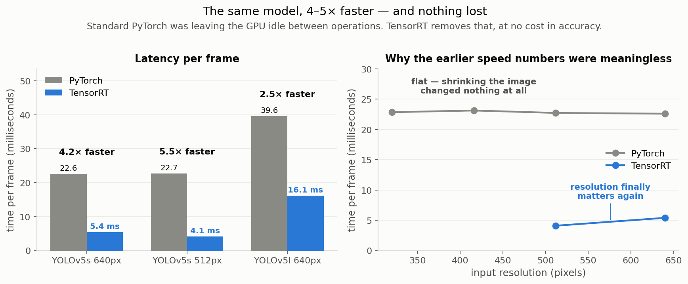

# XP9. TensorRT: making the measurements mean something

**Question:** does converting the model to NVIDIA's optimised runtime help, and at what cost
in accuracy?

**Outcome:** **up to 5× faster, 3.7× less energy, and no accuracy lost.** More importantly,
it revealed that every speed number measured before it was misleading.

## Results

Same weights, same pre- and post-processing. Only the runtime differs.

| model | runtime | time per frame | speed | energy / 1000 frames | accuracy |
|---|---|---:|---:|---:|---:|
| YOLOv5s @512 | PyTorch | 22.73 ms | 179 img/s | 193 J | 0.7775 |
| **YOLOv5s @512** | **TensorRT** | **4.10 ms** | **474 img/s** | **52 J** | 0.7776 |
| YOLOv5s @640 | PyTorch | 22.60 ms | 115 img/s | 232 J | 0.7708 |
| **YOLOv5s @640** | **TensorRT** | **5.41 ms** | **308 img/s** | **81 J** | 0.7707 |
| YOLOv5l @640 | PyTorch | 39.64 ms | 33 img/s | 761 J | 0.7847 |
| **YOLOv5l @640** | **TensorRT** | **16.12 ms** | **73 img/s** | **317 J** | 0.7853 |

> **What "plume" means here.** A plume is the visible smoke or flame region the detector has
> to find. Accuracy is reported separately for **small plumes** (under 1% of the frame) and
> **tiny plumes** (under 0.1%, roughly 20x20 pixels), which is distant smoke, and what
> early detection actually depends on.

## What this means

**The earlier speed numbers were measuring the software, not the model.** Under PyTorch,
YOLOv5s took about 22.6 ms per frame at 640 pixels, and 22.7 ms at 320 pixels. Four times fewer
pixels, no change at all. The board was spending its time dispatching ~200 separate
operations to the GPU, which sat idle in between. At 320 pixels, *eight* images cost the
same wall-clock time as one.

TensorRT fuses those operations away. The resolution effect that was invisible (1.00×)
becomes measurable (1.32×).

**Why this mattered for the project.** A later planned experiment sets out to show that
cutting a model's arithmetic doesn't translate into proportional speed gains. Run on the old
runtime it would have shown *zero* speed gain from any cut and blamed the hardware: a
plausible, publishable, and entirely wrong conclusion. This is why the runtime conversion
was done before any compression work.

**Watts go up, energy goes down.** TensorRT draws more instantaneous power (13.9 W vs
10.3 W) because the GPU is finally busy. Per frame, it uses **2.9× less energy**. Anyone
quoting watts alone would conclude it made things worse.

## Limitations

- FP16 precision only; the more aggressive INT8 compression is XP10.
- One configuration (YOLOv5l at 512) was skipped as redundant, since engine builds take
  about 45 minutes each on this board.

## Next

**The configuration to beat: YOLOv5s TensorRT @512, 0.7776 accuracy, 474 img/s, 52 J per
1000 frames, 17 MB.** Whether INT8 compression can beat it is
[XP10](../xp10_int8_slices/).
