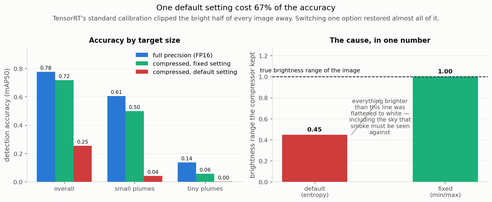

# XP10. INT8 compression, and the default setting that broke everything

**Question:** INT8 quantization halves model size and promises ~1.5× speed. What does it
cost in accuracy?

**Outcome:** with TensorRT's **default** settings, 67% of the accuracy. That turned out to
be a single wrong option rather than a property of INT8. Fixed, the real cost is about 8%.

## Results

Full 4,306-image test set, YOLOv5s at 512 pixels.

| configuration | size | accuracy | small plumes | tiny plumes | speed | power |
|---|---:|---:|---:|---:|---:|---:|
| Full precision (FP16) | 17.0 MB | **0.7776** | 0.6061 | 0.1376 | 476 img/s | 11.4 W |
| **INT8, min/max calibration** | **9.1 MB** | **0.7181** | 0.5033 | 0.0572 | **716 img/s** | **7.3 W** |
| INT8, default (entropy) calibration | 9.2 MB | 0.2543 | 0.0420 | 0.0016 | 724 img/s | 8.4 W |

> **What "plume" means here.** A plume is the visible smoke or flame region the detector has
> to find. Accuracy is reported separately for **small plumes** (under 1% of the frame) and
> **tiny plumes** (under 0.1%, roughly 20x20 pixels), which is distant smoke, and what
> early detection actually depends on.

## The cause, and how it was found

Quantization needs a "calibration" pass over sample images to learn how much numerical range
each part of the network needs. TensorRT's **default** calibrator minimises information loss
in a statistical sense, and does it by **clipping outliers**.

Reading the calibration file directly showed what it clipped. The input images are
normalised to a 0–1 brightness scale; the default calibrator decided the useful range
was **0 to 0.45**, flattening everything brighter to a single value. On a camera pointed at
the sky that is most of the frame, and the bright end is precisely where faint grey smoke
has to be distinguished.

Switching to min/max calibration, which clips nothing, changed one line of code and:

- overall accuracy **0.2543 → 0.7181**
- tiny plumes **0.0016 → 0.0572** (a 36× recovery)

## Three wrong answers first

The cause was not obvious, and three plausible hypotheses were tested and eliminated before
reading the calibration data directly:

1. **The detection head is too sensitive to quantize.** Forced it to full precision.
   Negligible change.
2. **The final coordinate maths is too sensitive.** Forced that too. No change.
3. **The calibration images are unrepresentative** (90% of them deliberately hard cases:
   night, fog, backlight). Real but small: +22% accuracy from a random sample instead.
   A genuine finding on its own: calibration data should reflect the *deployment*
   distribution, with hard cases present, not consist almost entirely of them.

None explained a 52-point drop. Guessing was the wrong method; reading the actual numbers
the tool produced was the right one.

## What this means

INT8 is now a real trade rather than a broken one: **−8% accuracy for 1.5× the speed, 36%
less power and half the file size.** Whether that trade is worth taking depends on the
deployment. For early detection of distant smoke it probably is not, since tiny-plume
accuracy still falls 58%.

**Every INT8 number anywhere should state its calibration method.** Labelled only "INT8",
these two engines differ by 36× on the metric that matters most here.

## Limitations

- Tiny-plume accuracy is still badly hurt (0.1376 → 0.0572). INT8 damages small-object
  localisation even when correctly calibrated.
- Quantization-aware training, which should close more of the gap, has not been run.
- Condition slices (night / fog / backlight) use brightness proxies, not real labels.

## Next

Quantization-aware training, and re-testing whether INT8 beats the FP16 frontier once the
remaining small-object loss is addressed.
