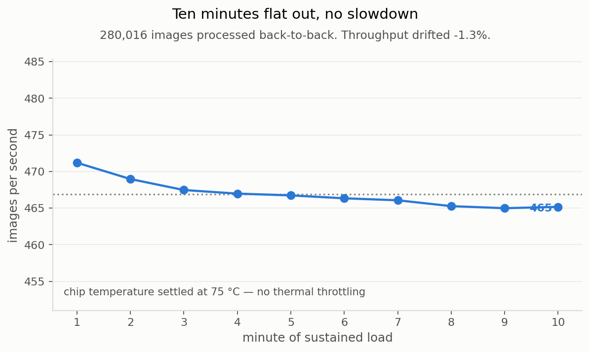

# XP12. Endurance: does it hold up for more than a benchmark?

**Question:** benchmarks run for seconds; a fire watch runs for months. Does throughput
survive sustained load, or does the board overheat and quietly slow down?

**Outcome:** **it holds.** Ten minutes flat out, 280,016 images, −1.28% drift, 74.8 °C, no
throttling.

## Results

Sustained batched inference, reported per minute so a trend is distinguishable from noise.

| engine | mean throughput | drift | peak temp | power | energy / 1000 frames |
|---|---:|---:|---:|---:|---:|
| **TensorRT FP16 @512** (deployable) | **467 img/s** | −1.28% | 74.8 °C | 21.3 W | 45.7 J |
| TensorRT INT8 @512 (see XP10) | 745 img/s | +0.24% | 72.2 °C | 19.3 W | 25.9 J |

## What this means

No thermal throttling in either case; both stay inside a ±2% band. The FP16 curve declines
gently after minute 3 and settles 2.6 °C hotter, because it is doing more work per frame,
but never falls off a cliff. In practice: **pack a cooldown between back-to-back heavy runs**,
or accumulated heat shows up as a transient slowdown in the next one.

**The second row is a trap, kept deliberately.** The INT8 engine wins every column here:
faster, cooler, 43% less energy. It is also the engine XP10 measured at less than a third of
the accuracy. An endurance table is exactly where that mistake gets made: throughput, watts
and temperature all say "ship it". **No endurance number means anything without the accuracy
it was measured at.**

## Limitations

- **The 25 W low-power mode was not tested.** It requires root access and switching power
  modes unattended, on a board that had already dropped off the network once that day,
  wasn't worth one table row. It's a ~15 minute job.
- Ten minutes, not ten hours. Enough to catch thermal throttling, not enough to catch slow
  memory leaks or day-long drift.
- Indoors on a desk. A sealed enclosure on a sunlit mast is a different thermal problem.

## Next

The endurance profile should be re-measured on whatever configuration the compression work
finally selects.
