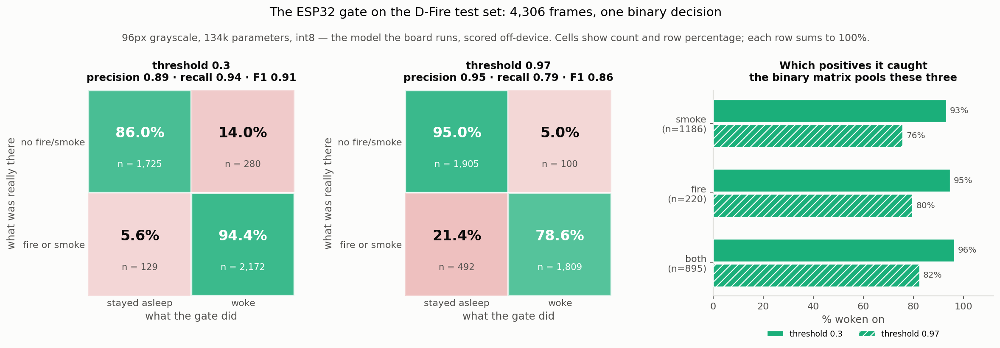

# XP15 — The 5-euro sensor: can the gate leave the Jetson entirely?

> **Axis:** where the model runs &nbsp;·&nbsp; **Asks:** can a microcontroller decide when to wake the detector? &nbsp;·&nbsp; **Answer:** yes — 340 ms per frame on a €27 board, computing exactly what the workstation computes

**Question. A fire watch stares at nothing almost all the time. [XP14](../../PLAN.md) puts a cheap
gate in front of the real detector on the same board; this asks whether the gate belongs on the
board at all, or on a €27 part that wakes an Orin only on suspicion.**

The target is a **XIAO ESP32-S3 Sense**: 240 MHz dual Xtensa LX7 with vector instructions, 8 MB
PSRAM, OV2640 camera, roughly a hundredth of an Orin's idle power.

## What was already known, before any work

[XP2](../xp02_resolution/) swept resolution with a **full** YOLOv5s:

| resolution | mAP50 | tiny plumes |
|---:|---:|---:|
| 416 px | 0.764 | 0.094 |
| 320 px | 0.725 | 0.038 |
| 256 px | 0.659 | 0.009 |
| 160 px | 0.458 | **0.0000** |

At 160 px a model orders of magnitude larger than anything that fits here already scores **exactly
zero** on tiny plumes, and this board runs at 96 px. Two consequences shaped the design:

- **Detection is off the table.** No boxes, no anchors, no NMS. The gate emits one number.
- **The premise was that distant smoke was off the table too** — and that turned out to be wrong,
  for a reason worth keeping: classification is a far easier task than detection. mAP demands the
  box be localised; the gate only has to notice that the frame is smoky.

## Method

**Stage A, on a workstation.** A depthwise-separable CNN at 96×96 grayscale, 134k parameters,
binary label from D-Fire (any box → positive, background → negative). Recall is reported
**stratified by plume size and never pooled**: a gate scoring 90% by catching every wall of flame
and no distant smoke fires when the fire is already obvious.

> **Decision rule, fixed before the run:** port to the device only if, at a false-wake rate ≤ 5%
> on background frames, recall on frames containing a **small** plume is ≥ 0.70. Tiny plumes are
> deliberately excluded — at 96 px they looked unreachable, and a bar nobody can clear proves
> nothing. They are measured anyway.

**Stage B, on the board.** The camera stays unplugged. A lens pointed out of a window sees no
fire, so it can only measure false alarms, and it tangles "can this chip run the model" together
with "does the field look like the training set". The board is fed D-Fire test frames from flash
instead, so every answer it gives has a known one to check against.

## Results — accuracy




The int8 model that actually ships, on all 4,306 test frames, at threshold 0.97:

| | stayed asleep | woke |
|---|---:|---:|
| **nothing** (n=2005) | 95.0% | **5.0%** ← false alarms |
| **smoke** (n=1186) | 24.4% | 75.6% |
| **fire** (n=220) | 20.5% | 79.5% |
| **both** (n=895) | 17.7% | 82.3% |

**5.0% false wakes, 82.8% recall on small plumes** — the rule passes. Precision 0.95, recall 0.79,
F1 0.86.

- **The premise was wrong in the useful direction.** Tiny-plume recall is 76%, not the zero XP2's
  detection numbers implied.
- **Quantization costs nothing.** float32 reaches the same operating point at threshold 0.99
  (3.4% / 77.4%); int8 arrives there at 0.97 (5.0% / 82.8%). The drift shifts the score
  distribution rather than scrambling it.
- **Threshold is the whole product decision.** At 0.30 the gate catches 93–96% of every fire class
  and cries wolf on one empty frame in seven. At 0.97 it is quiet enough to deploy and sleeps
  through a fifth of real fires.

## Results — on the board

| | measured |
|---|---|
| latency | **340.3 ms/frame**, spread under 0.1 ms |
| agreement with off-device int8 | mean 0.00066, worst 0.00354 |
| decisions changed at the shipping threshold | **0 of 8** |
| arena | 322 KB, in PSRAM |
| flash | 606 KB of 8 MB · internal RAM 18.9 KB of 320 KB |

At one frame every 5 s that is a **6.8% duty cycle**, which is what makes the architecture
arguable: the Orin sleeps and a €27 part watches.

## Making it fast: 20.5 s → 340 ms

The first working build ran at **20.5 seconds per frame**. Everything below is what it took to get
to 340 ms — a 60× speed-up, none of which came from changing the model.

| step | what changed | ms/frame |
|---|---|---:|
| stock TFLite Micro | reference C kernels | 20,533 |
| + ESP-NN for conv | `conv.cpp` dispatches to `esp_nn_conv_s8()` | 4,504 |
| + ESP-NN for depthwise | same for `depthwise_conv.cpp` | 3,487 |
| + `CONFIG_NN_OPTIMIZED` | the header stops routing everything back to ANSI | **341** |

**1. The stock library never touches the vector unit.** TensorFlow Lite Micro ships portable C
kernels. They work on any chip and use none of the S3's SIMD, which is the entire reason this
processor can do the job. The community Arduino port ships those kernels unchanged.

**2. Rewrite the conv kernel to call ESP-NN.** Espressif's `esp-nn` library has hand-written
ESP32-S3 assembly for exactly these operations. The change is in `conv.cpp`'s int8 branch:
translate TFLite's tensor shapes and quantization parameters into ESP-NN's structs, allocate its
scratch buffer, and call `esp_nn_conv_s8()` instead of `reference_integer_ops::ConvPerChannel()`.
That work is [this fork](https://github.com/MaximeCarriere/Arduino_TensorFlowLite_ESP32).
**20.5 s → 4.5 s.**

**3. Do the same for depthwise convolution.** The fork patches `conv.cpp` only, and this model is
eleven convolutions of which **five are depthwise** — sitting at the widest activations. The same
translation against `esp_nn_depthwise_conv_s8()` is applied to `depthwise_conv.cpp` by
[`patch_depthwise.py`](firmware/patch_depthwise.py), as a build hook rather than a second fork so there is
one thing to maintain. The one substantive difference is the channel multiplier: TFLite carries
`depth_multiplier`, ESP-NN wants `ch_mult` with `in_ch * ch_mult == out_ch`, and it is derived
from the tensor shapes and checked rather than assumed. **4.5 s → 3.5 s.**

**4. Turn the optimised kernels on.** This is the one that mattered and the one that looked like
nothing. `esp_nn.h` is a dispatch header: it `#define`s every public name onto either the ANSI
fallback or the S3 kernels, and the whole block is gated on **`CONFIG_NN_OPTIMIZED`**. Without it,
all the work above routes calls into a header that sends them straight back to plain C. The build
succeeds, the answers are correct, and it runs at reference speed.

> **Found with `nm`, not with a stopwatch.** Both configurations compile, link and produce the same
> scores; they differ only in the symbol table. `nm -u conv.cpp.o` showed
> `U esp_nn_conv_s8_ansi` where it should have shown `U esp_nn_conv_s8_esp32s3`. The clue was a
> rebuild that changed the binary and left the runtime at 3486.77 ms — identical to five decimal
> places, which meant nothing had changed about *which code ran*. **3.5 s → 341 ms.**

**5. And then fix what the fast kernels broke.** The S3 kernels load 128 bits at a time and require
their scratch buffer **16-byte aligned**; `heap_caps_malloc` promises 8. The kernel rounded the base
down by eight bytes — precisely onto the allocator's block header — and the next attempt to grow
the buffer aborted with `CORRUPT HEAP`, boot-looping the board. This was latent through every
earlier run because the reference kernels ignore alignment.
[`patch_scratch_align.py`](firmware/patch_scratch_align.py) rewrites both allocation sites.

**The lesson from step 5 is the general one:** a large speed-up is a reason to re-check
correctness, not a result on its own. It turned a working build into a boot loop, and it only
surfaced because the board was being scored against known answers rather than producing
plausible-looking numbers.

## One more failure worth recording

**The first inference is not like the others.** ESP-NN's scratch buffer is allocated lazily and
grown per layer *while the first inference is running*, so frame 0 is computed under conditions no
later frame sees. It returned **0.9997 for an empty scene** — a maximally confident false alarm, in
the least forgivable direction for a fire watch, and in the field it would have appeared as exactly
one inexplicable alarm per power cycle. A discarded warm-up inference at boot fixes it, which is
what any real deployment does anyway.

## Conclusion

**A microcontroller can run this gate, and it computes what the workstation computes.** The
accuracy is real but bounded: this is a *confirmation* sensor for obvious fire and near smoke, not
the early-warning detector the Orin is. Whether it is worth deploying depends on a number this
experiment has not measured — see Limitations.

## Running it

```bash
# 1. cut frames and score them off-device      (on the Jetson: needs the dataset)
python experiments/xp15_esp32_gate/export_frames.py --per-class 50 --all-test

# 2. port to int8 TFLite and prove it still works   (anywhere with tensorflow)
python experiments/xp15_esp32_gate/to_tflite.py
python experiments/xp15_esp32_gate/eval_int8_full.py

# 3. emit the C headers                             (start small: 8 frames)
python experiments/xp15_esp32_gate/make_headers.py --per-class 2

# 4. flash, capture, check
cd experiments/xp15_esp32_gate/firmware
pio run -t upload && pio device monitor | tee ../board_log.txt
python experiments/xp15_esp32_gate/check_board.py board_log.txt
```

**Two settings that waste an evening.** `board_build.arduino.memory_type = qio_opi` — on the S3,
`-DBOARD_HAS_PSRAM` only declares that PSRAM should exist, while this initialises the octal-SPI
controller the XIAO's 8 MB part is wired to; without it the arena allocation returns null. And
`board_build.partitions = huge_app.csv`, since the default table has no room for 600 KB.

**When a bad flash parks the board**, the serial bootloader becomes unreachable: a running or
crashed app keeps the USB peripheral enumerated, so the ROM never runs and `esptool` has nothing to
sync with — it reports "No serial data received", which reads as a cable fault and is not one. The
S3 exposes **JTAG on the same connector**, and OpenOCD halts the core regardless of what the
application is doing:

```bash
pio run -e recover -t upload      # no BOOT button needed
```

## Limitations

- **Power is not measured, and it is the number the architecture rests on.** The duty cycle is
  computed from latency, not from a meter. Needs a USB power meter inline.
- **D-Fire's negatives are not sky.** Its "none" frames are rooms, streets and landscapes. A fire
  watch stares at a fixed frame of sky, where **cloud, fog, haze and sunset all look like smoke** to
  a 96 px grayscale classifier. The 5% false-wake rate is measured on a distribution this sensor
  will never see, and this is the largest open risk to the whole idea.
- **`has_tiny_plume` means the frame *contains* a small box**, not that it contains only that. Many
  such frames also carry larger smoke, so 76% is recall on frames containing a tiny plume, not on
  frames where a tiny plume is all there is. A tiny-only subset has not been cut.
- **The thermal soak has not been run.** The firmware now loops for five minutes reporting latency
  beside die temperature, because every figure here comes from eight inferences in three seconds
  and this board is widely reported to run hot.
- **On-device agreement rests on 8 frames.** Enough to prove the port (0 decision flips), not an
  independent accuracy measurement — that came from 4,306 frames off-device.

## Next

- **Measure average power** over a duty cycle, against an always-on Orin at ~12 W.
- **Collect sky negatives.** Point the XIAO at a window for a day, score those frames with the
  existing checkpoint, and find out whether 5% survives contact with clouds. No training and no ML
  firmware required — the board is used as a camera, which is the cheapest way to answer the
  biggest question.
- **Run the thermal soak** and report whether 340 ms holds warm.
- **Patch depthwise upstream.** The alignment bug affects any S3 model whose scratch requirement
  grows between layers, and both patches would be better as a pinned fork than as build hooks
  rewriting a fetched dependency in place.
