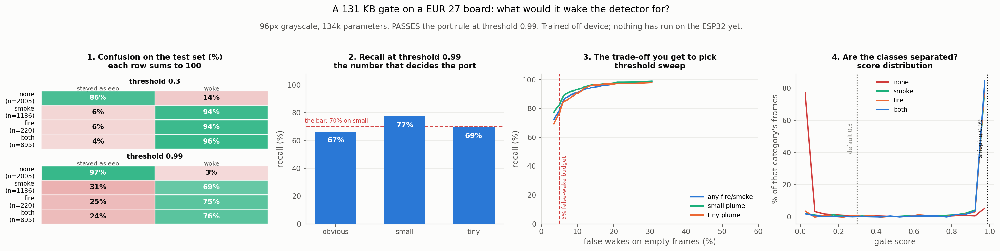

# XP15 — The 5-euro sensor: can the gate leave the Jetson entirely?

> **Status:** stages A and B done. The gate passes the port rule, and the model runs on the
> XIAO ESP32-S3 at **340 ms per frame**, reproducing the off-device scores exactly.
> The question, method and decision rule below were written *before* the run, which is the
> convention XP5 set and the reason XP6's early numbers had to be withdrawn twice.

## Why

A fire watch stares at nothing almost all the time. [XP14](../../PLAN.md) makes that observation
and puts a cheap gate in front of the real detector on the *same* board. This asks the next
question: does the gate belong on the same board at all?

The target is a **XIAO ESP32-S3 Sense** — 240 MHz dual Xtensa LX7 with vector instructions,
8 MB PSRAM, 8 MB flash, OV2640 camera, about €27 and roughly a hundredth of an Orin's idle power.
If a device like that can say "something is happening, wake up", the architecture changes: a
handful of cheap always-on eyes and one Orin that sleeps.

## The question this actually asks

**Can a model small enough for a microcontroller catch a fire early enough to be worth waking
anything for?**

Not "does a CNN fit on an ESP32" — it does, and that part is not interesting. The interesting
part is whether anything useful survives at the resolution such a device can process.

## What is already known, before any work

[XP2](../xp02_resolution/) swept resolution with a **full** YOLOv5s:

| resolution | mAP50 | tiny plumes |
|---:|---:|---:|
| 416 px | 0.764 | 0.094 |
| 320 px | 0.725 | 0.038 |
| 256 px | 0.659 | 0.009 |
| 160 px | 0.458 | **0.0000** |

At 160 px a model orders of magnitude larger than anything that fits here already scores
**exactly zero** on tiny plumes. This board would run at ~96 px.

**Two conclusions follow, and both shape the design:**

- **Detection is off the table.** No boxes, no anchors, no NMS. The gate outputs one number.
- **Distant smoke is off the table too.** Early detection of a far-away plume is what a wildfire
  system is *for*, and this device cannot do it. What may survive is "there is obvious fire or
  smoke in view", which is a legitimate but much weaker capability, and the experiment has to be
  honest that this is what it is testing.

## Stage A — train it, on a workstation

`train_gate.py`. A depthwise-separable CNN at 96×96 grayscale, binary label derived from D-Fire
(any box → positive, background → negative). `--width` sets the channel multiplier: 0.25 gives
10k parameters (~10 KB int8), 1.0 gives roughly 160k (~160 KB), and the board's 8 MB of PSRAM
means size is not the binding constraint — recall is. Start wide and shrink only if the device
complains.

**Recall is reported stratified by plume size and never pooled.** A gate scoring 90% overall by
catching every wall of flame and no distant smoke is worse than useless: it fires when the fire
is already obvious. `lib.data` carries `has_tiny_plume` and `has_small_plume` per sample, so the
breakdown is free.

**Decision rule, fixed before the run:**

> Port to the device only if, at a false-wake rate ≤ 5% on background frames, recall on frames
> containing a **small** plume is ≥ 0.70.

Tiny plumes are deliberately *not* in the rule — at 96 px they are almost certainly unreachable,
and a bar nobody can clear proves nothing. They are measured and reported anyway, because that
number is the honest limit of the whole idea.

```bash
python experiments/xp15_esp32_gate/train_gate.py --epochs 30
python experiments/xp15_esp32_gate/train_gate.py --epochs 30 --res 128   # if 96 misses
```

**Where to run it.** On the Jetson, which is the only machine here holding the D-Fire images —
`data/` is gitignored, and this repo's Mac checkout carries `data/splits/` alone. The script picks
its device automatically (`cuda` → `mps` → `cpu`), so it also runs on an Apple laptop once the
3 GB dataset is unpacked locally; the model is far too small for compute to be the constraint.
Training the whole thing on the board is fine here precisely *because* the model is tiny — unlike
[XP7b](../xp06_pruning/HANDOFF_TO_RTX3090.md), where detector training on the Orin was ten times
slower than the 3090 and not batch-comparable.

## Stage A results



**It passes, and the premise this page was built on was wrong.** I predicted distant smoke would
be unreachable, because XP2 showed a full YOLOv5s scoring 0.0000 mAP50 on tiny plumes at 160 px.
The gate reaches **96% recall on tiny-plume frames** at a loose threshold. The reason is that
classification is a far easier task than detection: mAP demands the box be localised, while the
gate only has to notice that something in the frame is smoky.

| | threshold 0.30 | **threshold 0.99** |
|---|---:|---:|
| false wakes on empty frames | 13.9% | **3.4%** |
| smoke | 93.7% | 68.9% |
| fire | 94.1% | 75.5% |
| both | 95.9% | 76.1% |
| recall, small plumes | 96.3% | **77.4%** |
| recall, tiny plumes | 96.0% | 69.5% |

**Threshold 0.99 is the shipping configuration** and clears the rule: ≤5% false wakes with ≥70%
recall on small plumes. Those are two different products and the figure shows both — one wakes on
nearly every fire and cries wolf on one empty frame in seven, the other is quiet enough to deploy
and sleeps through a quarter of real fires.

**One caveat that bounds the tiny-plume number.** `has_tiny_plume` means the frame contains at
least one box under the size threshold — it does not mean that is the *only* thing in frame. Many
of those frames also carry larger smoke, so 96% is recall on *frames containing* a tiny plume,
not on frames where a tiny plume is all there is. The honest version of that measurement needs a
tiny-only subset and has not been run.

## Stage B — put it on the device

**The camera stays unplugged.** A lens pointed out of a window sees no fire, so it
can only measure false alarms, and it tangles "can this chip run the model" together with "does
the field look like the training set". Those are different questions and the compute one comes
first. The board is fed D-Fire test frames from flash instead, so every answer it gives can be
checked against one already known.

**Toolchain: TFLite Micro, not ESP-DL** — a reversal from what this page first planned. ESP-DL
takes ONNX directly and avoids a framework hop, which is tidier, but nothing about it can be
verified before flashing. The TFLite path lets the quantized model be run and compared against
the original on a laptop, so a port that has gone wrong is caught there rather than through a
serial cable.

### The four steps

```bash
# 1. cut the frames and score them off-device        (on the Jetson: needs the dataset)
python experiments/xp15_esp32_gate/export_frames.py --per-class 50

# 2. port to int8 TFLite and prove it still works     (anywhere with tensorflow)
python experiments/xp15_esp32_gate/to_tflite.py

# 3. emit the C headers                               (anywhere)
python experiments/xp15_esp32_gate/make_headers.py --per-class 10

# 4. flash firmware/xp15_gate_bench/, save the serial output, then
python experiments/xp15_esp32_gate/check_board.py board_log.txt
```

### Flashing it with PlatformIO

`firmware/platformio.ini` is set up for this board; `src_dir` points at the Arduino sketch
folder, so there is one copy of the source and it opens in either toolchain.

```bash
cd experiments/xp15_esp32_gate/firmware
pio run -t upload && pio device monitor | tee ../board_log.txt
```

**The setting that catches people:** `board_build.arduino.memory_type = qio_opi`. On the S3,
`-DBOARD_HAS_PSRAM` only tells the sketch PSRAM ought to exist — this line is what initialises
the octal-SPI controller the XIAO's 8 MB part is actually wired to. Without it `psramFound()` is
false, the arena allocation returns null, and the sketch stops at its `FATAL` line, which reads
like a code fault and is a build-config one.

The `lib_deps` identifier is the one thing in that file written without a PlatformIO install to
check it against. If it fails to resolve, `pio pkg search tflite esp32` and substitute; nothing
else depends on which port is used.

### Flashing it from the Arduino IDE instead

Start small. Generate **8 frames**, not 200 — `make_headers.py --per-class 2`. The header is
0.4 MB instead of 11 and the Arduino IDE compiles it in a reasonable time; the point of the first
flash is to find out whether the graph lowers and the arena fits, and eight frames answers that
as well as two hundred. Scale up once it runs.

1. Plug the XIAO in over USB-C. If the port does not appear, hold **BOOT**, tap **RESET**,
   release BOOT — that forces the bootloader.
2. Arduino IDE → Boards Manager → **esp32** by Espressif. Select **XIAO_ESP32S3**.
3. Library Manager → **TensorFlowLite_ESP32**.
4. Tools → **PSRAM: OPI PSRAM**. Non-negotiable: the arena is half a megabyte and this chip has
   512 KB of internal SRAM in total, so without PSRAM the sketch stops at a `FATAL` line saying
   exactly this.
5. Tools → **Partition Scheme: Huge APP**.
6. Open `firmware/xp15_gate_bench/xp15_gate_bench.ino`, upload, then Serial Monitor at **115200**.

Copy the serial output to a file and run step 4 on it.

### Reading what comes back

The sketch prints a CSV row per frame, then a summary. The lines that matter:

- `arena used N of 512000` — the real memory figure. Trim `kArenaSize` toward it and reflash.
- `mean X ms/frame` — latency. With the Arduino library these are reference kernels, so treat it
  as an upper bound.
- `PORT OK` / `PORT MISMATCH` — whether the board reproduced the off-device scores.

**If it fails, the three likely causes in order:** `FATAL: no PSRAM` means step 4 above was
missed; a failure at `AllocateTensors` naming an op means the model gained a layer this sketch's
resolver does not list; `AllocateTensors` failing without an op name means `kArenaSize` is too
small — raise it.

### What step 2 already found

The weights port cleanly and the quantization is mild, but the operating point is fragile:

| check | result |
|---|---|
| Keras float against torch float | max diff **1.1e-05** — the weight copy is correct |
| TFLite int8 against torch float | mean **0.018**, worst 0.247 |
| **decisions changed at threshold 0.99** | **6 of 200 frames (3.0%)** |

That last row is why the check exists. A mean error of 0.018 sounds harmless, but at a threshold
of 0.99 the scores are bunched against the boundary, so small drift moves frames across it.
**The shipping threshold should probably be chosen with quantization margin in mind**, which the
sweep in stage A can do — it was picked purely on the float model.

Model size: **523 KB float32 → 180 KB int8.** With 40 embedded frames the firmware needs 540 KB
of flash, against 8 MB available.

### Stage B results — it runs, and it agrees

```
warm-up inference done (discarded)
arena used 322068 of 512000 bytes
frame,label,ref,board,abs_diff,us
0,none,0.00002,0.00004,0.00002,340328
...
mean 340.33 ms/frame over 8 frames
worst |board - reference| 0.00354, 0 frames over 0.01
PORT OK
```

| | measured on the board |
|---|---|
| latency | **340.3 ms/frame**, spread under 0.1 ms |
| agreement with off-device int8 | mean 0.00066, worst 0.00354 |
| decisions changed at threshold 0.99 | **0 of 8** |
| arena | 322 KB, in PSRAM |
| flash | 606 KB of 8 MB · RAM 18.9 KB of 320 KB internal |

At one frame every 5 s that is a **6.8% duty cycle**, which is what makes the architecture
arguable: the Orin sleeps and a €27 part watches.

**Getting there cost four bugs, and three of them only appear on hardware.**

1. **The stock TFLite library never touches the vector unit.** Reference C kernels ran the model
   at **20.5 s/frame**. A community fork dispatches int8 conv to ESP-NN.
2. **`CONFIG_NN_OPTIMIZED` is the switch that matters.** `esp_nn.h` gates its whole dispatch
   block on it; without it every call maps to the ANSI fallback whatever else is set. The build
   succeeds, the answers are right, and it runs at reference speed. **20.5 s → 3.5 s → 341 ms**
   came from finding this, and it was found with `nm` on the object file, not from timings —
   both configurations build and give correct answers, and only the symbol table distinguishes
   them.
3. **The first inference is not like the others.** ESP-NN's scratch buffer is allocated lazily
   and grown per layer *while the first inference runs*, and frame 0 came back **0.9997 for an
   empty scene**. A discarded warm-up at boot fixes it. In the field this would have been exactly
   one inexplicable alarm per power cycle.
4. **The S3 kernels need a 16-byte aligned scratch buffer.** `heap_caps_malloc` gives 8. The
   kernel rounded the base down onto the allocator's block header and corrupted the heap — but
   only once the *real* kernels started running, because the ANSI ones ignore alignment. A large
   speed-up is a reason to re-check correctness, not a result on its own.

**And a recovery lesson.** The crash loop left the board unflashable over serial: a parked or
crashing app keeps the USB peripheral enumerated, so the ROM bootloader never runs and
`esptool` has nothing to sync with. The S3 exposes **JTAG on the same connector**, and OpenOCD
halts the core regardless of what the app is doing:

```bash
pio run -e recover -t upload     # goes in over JTAG, no BOOT button needed
```

### What to measure, in this order

1. **Does it agree?** The sketch prints `PORT OK` or `PORT MISMATCH` per run, and `check_board.py`
   reports the drift and, separately, whether any decision changed. Drift is diagnostic; changed
   decisions are the result.
2. **Latency and peak RAM.** The sketch prints `arena used`, free heap and free PSRAM. RAM is the
   real risk despite 8 MB of PSRAM, since PSRAM bandwidth is well below internal SRAM and a layer
   that spills runs much slower than its op count suggests.
3. **Average power over a duty cycle.** A USB power meter inline is enough for a first number.
   This is what the whole architecture rests on — and reviews of this board note it runs hot under
   sustained load, so log temperature beside it.

### Two things that will bite

- **Which TFLite library you build against changes the timings by a large factor.** The Arduino
  `TensorFlowLite_ESP32` library ships generic reference kernels; Espressif's `esp-tflite-micro`
  under ESP-IDF carries the ESP-NN kernels that use the S3's vector instructions. Quote which one
  produced the number, and treat an Arduino-library timing as an upper bound.
- **Stale headers.** Reflashing without rerunning `make_headers.py` compares the board against
  frames it is not running. `check_board.py` checks the log's reference column against the
  compiled subset and warns when they disagree.

## What would count as a result

## What would count as a result

- **Pass, useful recall:** the architecture is validated — cheap always-on eyes, one sleeping
  Orin — and XP14's premise gets much stronger, since the gate no longer competes for the
  detector's silicon.
- **Pass on obvious fire, fail on small plumes:** the honest outcome, and probably the most
  likely one. It says this is a *confirmation* sensor, not an early-warning one, which is a
  different product and worth stating plainly rather than dressing up.
- **Fail outright:** also fine, and cheap. It bounds the whole idea with one afternoon of
  training and no firmware, which is precisely why stage A runs first.

## Notes

- The gate threshold defaults to **0.30**, deliberately low. A false wake costs one Orin
  inference; a missed fire costs the entire point of the system.
- Grayscale input, not RGB: smoke is grey by definition, and it cuts the first layer's work by
  three.
- Nothing here writes a `model_id`. This is not a detector and must not appear in the detector
  tables — the comparison that matters is against the *gate's* job, not against 0.7776 mAP50.
